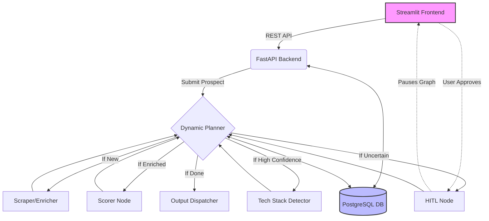

# B2B SaaS Agentic Platform (ICP Discovery)

This repository contains an autonomous agent platform built with **LangGraph** and **FastAPI** to discover, qualify, and route Ideal Customer Profiles (ICP) and Target Personas.

## Architecture



## Local Setup (Docker Compose)

1. Rename `backend/.env.example` to `backend/.env` and add your keys (e.g. `LLM_API_KEY`).
2. Run `docker-compose up --build`.
3. Open the frontend at `http://localhost:8501`.
4. The FastAPI backend is available at `http://localhost:8000/docs`.

## Production Deployment (Google Cloud)

We provide deployment scripts for GCP Cloud Run using Cloud Build and Terraform.

### 1. Build & Push Image
```bash
gcloud builds submit --config deploy/cloudbuild.yaml .
```

### 2. Provision with Terraform
```bash
cd deploy/terraform
terraform init
terraform apply -var="project_id=YOUR_PROJECT" -var="database_url=YOUR_POSTGRES_URL" -var="llm_api_key=YOUR_API_KEY"
```

> **Note on Concurrency**: The deployment defaults to a single worker (`WORKERS=1`) to preserve in-memory state and avoid rate-limiting concurrently. If scaling to multiple instances, switch the PubSub and CircuitBreaker to Redis.
