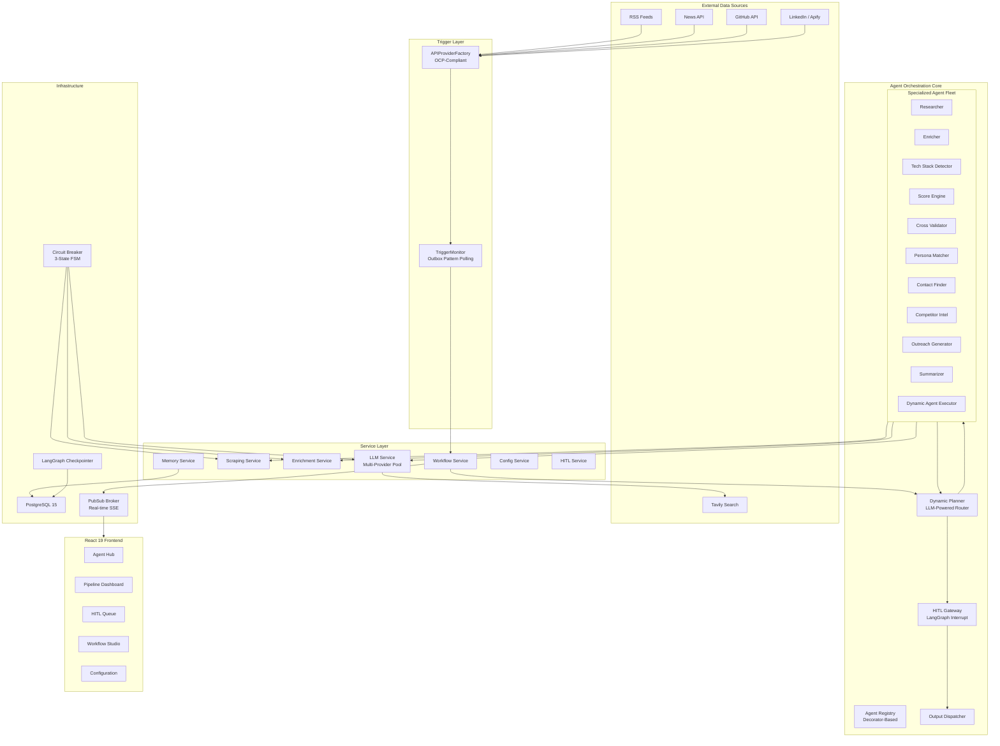
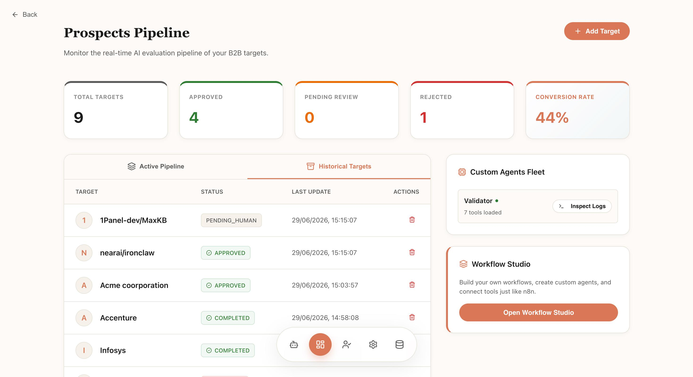
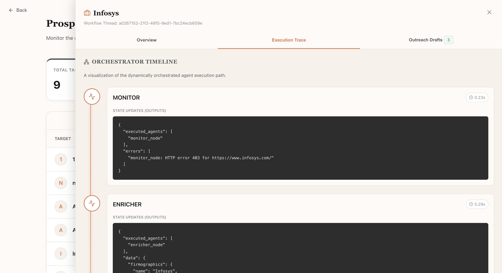
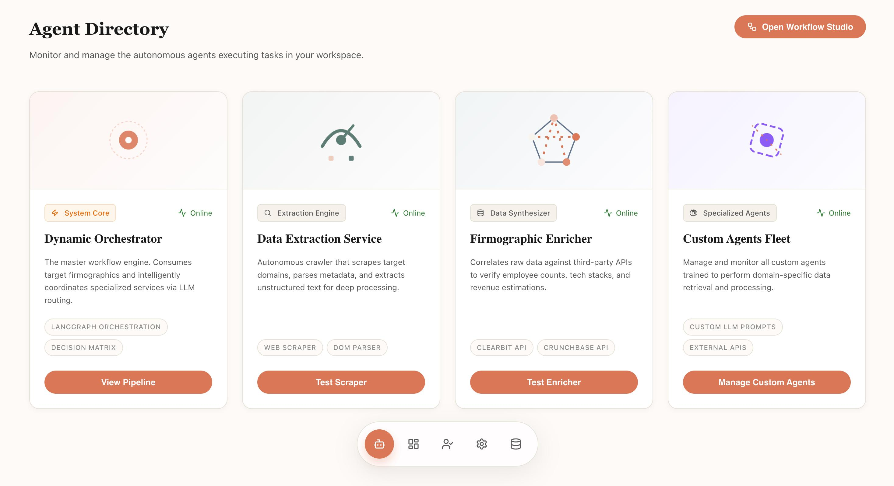
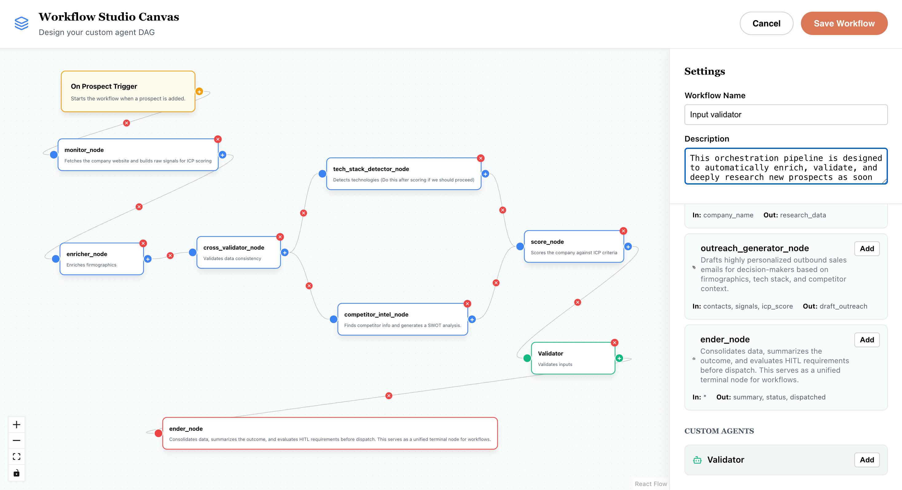
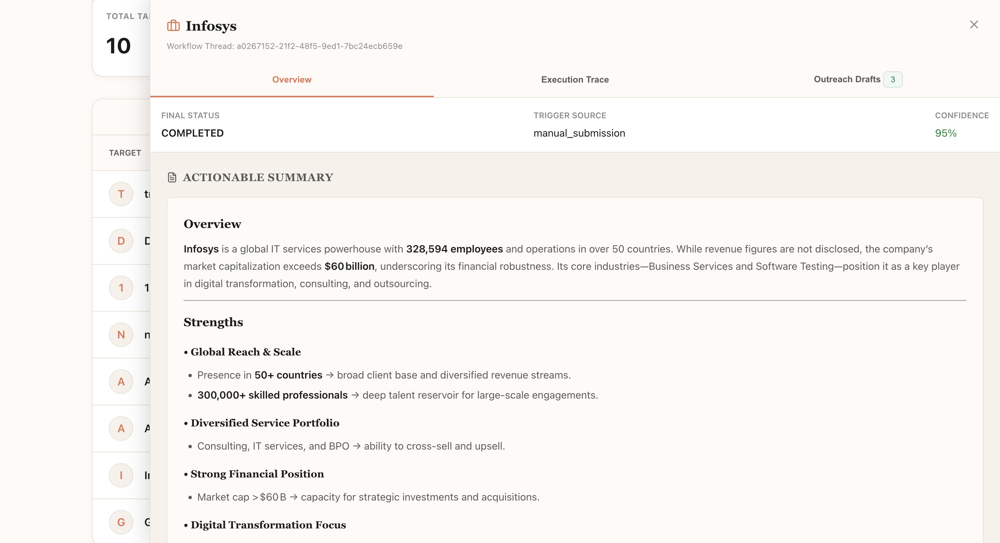
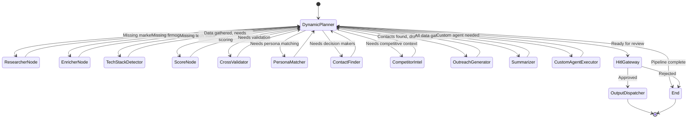
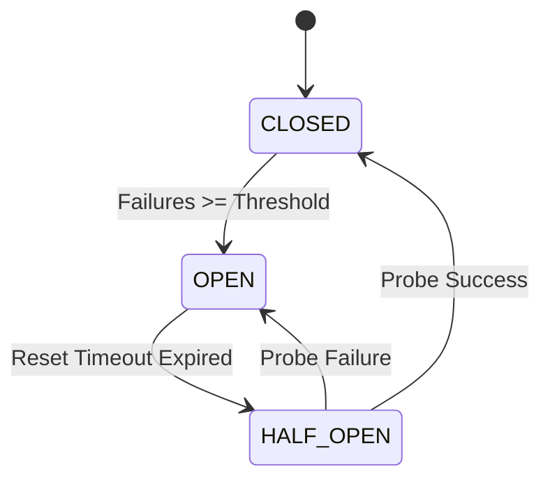

<p align="center">
  
  
  
  
  
  
</p>

<h1 align="center">B2B Agent Orchestrator</h1>

<p align="center">
  <strong>An enterprise-grade, multi-agent AI orchestration platform for autonomous B2B prospect qualification, enrichment, and outreach generation.</strong>
</p>

<p align="center">
  Built on a foundation of stateful LangGraph workflows, SOLID-compliant service architecture, and production-hardened reliability patterns including circuit breakers, outbox-pattern event processing, and human-in-the-loop governance.
</p>

---

## Table of Contents

- [Platform Overview](#platform-overview)
- [Architecture at a Glance](#architecture-at-a-glance)
- [Core Capabilities](#core-capabilities)
- [System Architecture](#system-architecture)
- [Agent Orchestration Engine](#agent-orchestration-engine)
- [Backend Engineering](#backend-engineering)
- [Frontend Application](#frontend-application)
- [Reliability Engineering](#reliability-engineering)
- [Documentation Index](#documentation-index)
- [Technology Stack](#technology-stack)
- [Getting Started](#getting-started)
- [Deployment](#deployment)
- [Project Structure](#project-structure)

---

## Platform Overview

The **B2B Agent Orchestrator** is a production-grade, multi-agent AI system that automates the entire B2B sales qualification pipeline. From the moment a trigger event is detected -- whether from an RSS feed, a GitHub repository update, a News API article, or a LinkedIn signal via Apify -- the platform autonomously orchestrates a fleet of specialized AI agents to research, enrich, score, validate, and ultimately qualify sales prospects against configurable Ideal Customer Profile criteria.

What sets this platform apart is its **dynamic orchestration layer**. Rather than relying on static, hardcoded pipelines, the system employs an LLM-powered Dynamic Planner that inspects the current workflow state and intelligently selects the next agent to execute based on accumulated data, missing signals, and configured ICP criteria. This approach enables the pipeline to adapt in real-time, re-route on failure, and even execute agents in parallel when dependency graphs allow.

The platform is designed with a **defense-in-depth reliability model**, augmented by stochastic mathematical models and heuristic optimization functions. Every agent is wrapped in a `SafeAgentWrapper` that provides fault isolation, automatic retry tracking, and execution tracing. External service calls are protected by a three-state circuit breaker (CLOSED, OPEN, HALF_OPEN) featuring heuristic decision scoring to validate state transitions. Event ingestion follows the outbox pattern with orphan cleanup to guarantee exactly-once processing semantics, while LLM outputs pass through strict regex sanitization pipelines to ensure data integrity. Human-in-the-loop governance ensures that no prospect moves to outreach without configurable approval gates.

---

## Architecture at a Glance



---

## Core Capabilities

### Intelligent Prospect Qualification

| Capability | Description | Engineering Highlight |
|:---|:---|:---|
| **Dynamic Agent Orchestration** | LLM-powered planner selects the optimal next agent based on accumulated state, missing data, and ICP criteria | Stateful graph with conditional edges and parallel dispatch |
| **Multi-Source Data Enrichment** | Aggregates firmographics, tech stack, competitor intelligence, and contact data from multiple external APIs | Tavily Search, Crunchbase enrichment, LinkedIn scraping via Apify |
| **Confidence-Based Scoring** | Scores prospects against configurable ICP criteria with keyword matching and weighted signal analysis | Deterministic scoring with LLM-augmented signal extraction |
| **Human-in-the-Loop Governance** | Configurable approval gates with auto-approve thresholds, manual review queues, and inline data editing | LangGraph `interrupt()` with `Command(resume=...)` pattern |
| **Automated Outreach Generation** | Generates personalized cold outreach emails for each decision-maker using firmographic and competitive context | Per-contact LLM generation with structured JSON output |
| **Custom Agent Framework** | Users create their own agents via the UI with custom system prompts and tool access, executed at runtime | ReAct agent pattern via LangGraph `create_react_agent` |
| **Visual Workflow Studio** | Drag-and-drop DAG builder for custom agent pipelines with parallel execution support | React Flow with dependency-aware topological dispatch |
| **Event-Driven Trigger System** | Configurable polling triggers from RSS, News API, GitHub, LinkedIn, and generic APIs | Outbox pattern with orphan cleanup and exactly-once semantics |
| **Real-Time Observability** | Live agent thought streams, execution traces, and state updates via Server-Sent Events | In-memory PubSub broker with per-prospect topic routing |

### Agent Fleet

The platform ships with **16 specialized agents**, each registered via the decorator-based `AgentRegistry` and wrapped in the `SafeAgentWrapper` for fault isolation:

| Agent | Responsibility |
|:---|:---|
| `DynamicPlannerNode` | LLM-powered orchestrator that inspects state and routes to the optimal next agent |
| `ResearcherNode` | Searches the web via Tavily API for company context, market signals, and competitor landscape |
| `EnricherNode` | Extracts firmographic data (revenue, employee count, industry) from web search results |
| `TechStackDetectorNode` | Detects technology stack from HTML source analysis and script tag inspection |
| `ScoreNode` | Scores the prospect against ICP criteria using keyword matching and signal weighting |
| `CrossValidatorNode` | Validates data consistency across enrichment sources and flags conflicts |
| `PersonaMatcherNode` | Matches discovered contacts against configurable buyer persona definitions |
| `ContactFinderNode` | Discovers decision-maker contacts (CEO, CTO, VP) with email and LinkedIn enrichment |
| `CompetitorIntelNode` | Maps competitor landscape and identifies pain points for sales positioning |
| `OutreachGeneratorNode` | Drafts personalized cold outreach emails for each qualified decision-maker |
| `SummarizerNode` | Generates a structured executive summary of all gathered prospect intelligence |
| `HitlGatewayNode` | Implements human-in-the-loop approval gates with configurable confidence thresholds |
| `OutputDispatcherNode` | Dispatches approved prospects to CRM webhooks and final output channels |
| `ConsolidationNode` | Merges and deduplicates data from parallel agent execution branches |
| `DynamicAgentExecutorNode` | Generic executor for user-created custom agents loaded from the database |
| `EnderNode` | Terminal node that performs final cleanup and state persistence |
| `MonitorNode` | Collects execution metrics and logs for observability and debugging |

---

### Platform Screenshots













---

## System Architecture

The platform follows a **clean layered architecture** with strict dependency inversion between layers:

```
+------------------------------------------------------------------+
|                        React 19 Frontend                         |
|         Agent Hub | Dashboard | HITL | Workflow Studio           |
+------------------------------------------------------------------+
                              |  REST + SSE
+------------------------------------------------------------------+
|                       FastAPI REST Layer                          |
|        /api/prospects  /api/hitl  /api/agents  /api/config       |
+------------------------------------------------------------------+
                              |  Dependency Injection
+------------------------------------------------------------------+
|                       Service Layer (DIP)                         |
|  WorkflowService | MemoryService | LLMService | ConfigService   |
|  HITLService | ScrapingService | EnrichmentService               |
+------------------------------------------------------------------+
                              |  Protocol Interfaces
+------------------------------------------------------------------+
|                  Agent Orchestration Layer                        |
|  DynamicPlanner | AgentRegistry | SafeAgentWrapper | Toolbox     |
|  GraphState (TypedDict with Annotated Reducers)                  |
+------------------------------------------------------------------+
                              |  LangGraph StateGraph
+------------------------------------------------------------------+
|                     Infrastructure Layer                          |
|  PostgreSQL | AsyncPostgresSaver | CircuitBreaker | PubSub       |
+------------------------------------------------------------------+
```

### Key Architectural Decisions

**1. Protocol-Based Dependency Inversion** -- All service contracts are defined as `typing.Protocol` interfaces (`LLMServiceProtocol`, `ScrapingServiceProtocol`, `EnrichmentServiceProtocol`). The `Toolbox` facade accepts these protocols, enabling concrete implementations to be swapped without modifying agent code. This is not theoretical -- it directly enables test mocking without subclassing.

**2. Decorator-Based Agent Registration** -- The `@register_agent` decorator automatically registers agent classes with the global `AgentRegistry` singleton. The graph builder in `graph.py` dynamically wires all registered agents into the `StateGraph`, meaning adding a new agent requires zero changes to the graph construction code (Open/Closed Principle).

**3. Annotated State Reducers** -- The `GraphState` TypedDict uses Python `Annotated` types with custom reducer functions (`add_dict`, `add_list`) to safely merge state updates from parallel agent execution branches. This eliminates race conditions in concurrent fan-out/fan-in patterns.

**4. Outbox Pattern Event Processing** -- The `TriggerMonitor` implements a two-phase event processing pattern: events are marked as `"processing"` before workflow submission and updated to `"completed"` only after successful dispatch. A background cleanup job recovers orphaned `"processing"` events, guaranteeing at-least-once delivery semantics.

---

## Agent Orchestration Engine

The heart of the platform is the **LangGraph-powered orchestration engine** that manages agent lifecycle, routing, and state management:



### Dynamic Planning Algorithm

The `DynamicPlannerNode` uses a three-tier routing strategy:

1. **Custom Workflow Enforcement** -- If a custom workflow DAG is attached to the prospect, the planner performs topological traversal of the DAG, dispatching agents whose dependencies have been satisfied. This enables parallel execution of independent branches.

2. **LLM-Powered Intelligent Routing** -- When no custom workflow is present, the planner constructs a context-aware prompt containing the current state, available (unexecuted) agents, and routing rules. The LLM returns a JSON response specifying the optimal next agent.

3. **Deterministic Fallback** -- If the LLM fails or returns an invalid response, the planner falls back to a deterministic linear sequence, ensuring the pipeline always makes forward progress.

---

## Backend Engineering

The backend is architected as a **production-grade Python service** with rigorous adherence to SOLID principles, Gang of Four design patterns, and distributed systems reliability patterns.

> **Deep-dive documentation is available in the following dedicated engineering guides:**

| Document | Description |
|:---|:---|
| [Backend README](backend/README.md) | Comprehensive backend architecture overview, module guide, and API reference |
| [Class Diagram](backend/CLASS_DIAGRAM.md) | Complete UML class diagrams with inheritance hierarchies, protocol interfaces, and composition relationships |
| [Sequence Flow](backend/SEQUENCE_FLOW.md) | End-to-end sequence diagrams for every major workflow: prospect submission, HITL review, trigger processing, and custom agent execution |
| [SOLID Principles](backend/SOLID_PRINCIPLES.md) | Detailed analysis of how each SOLID principle is implemented across the codebase with concrete code references |
| [Agentic Reliability](backend/RELIABILITY.md) | Reliability engineering deep-dive: circuit breakers, retry strategies, outbox pattern, graceful degradation, and fault isolation |
| [Agentic Flow](backend/AGENTIC_FLOW.md) | Complete agentic workflow documentation: dynamic planning algorithm, state management, parallel execution, and custom workflow DAG processing |
| [Low-Level Design](backend/LLD_ARCHITECTURE.md) | Low-level design document covering data models, state machine transitions, DTOs, schema validation, and database design |
| [Application Flow](backend/APPLICATION_FLOW.md) | End-to-end application flow from infrastructure bootstrap through request handling, agent execution, and real-time event delivery |

---

## Frontend Application

The frontend is a **React 19** single-page application built with Vite, featuring a modern glassmorphic UI with real-time agent observability.

> **Full frontend documentation:** [Frontend README](frontend/README.md)

### Key Pages

| Page | Functionality |
|:---|:---|
| **Agent Hub** | Central command center with quick-launch actions, system status, and navigation to all platform features |
| **Pipeline Dashboard** | Real-time prospect pipeline with status tracking, live agent thought streams via SSE, and detailed prospect inspection panels |
| **HITL Review Queue** | Human-in-the-loop review interface with approve/reject/edit capabilities and inline data correction |
| **Workflow Studio** | Visual drag-and-drop DAG builder using React Flow for custom agent pipeline design with parallel execution support |
| **Configuration** | ICP criteria, persona definitions, and scoring threshold configuration with real-time validation |
| **Trigger Management** | Lead generation trigger source management for RSS, News API, GitHub, LinkedIn, and custom API providers |
| **Custom Agents** | Create and manage user-defined AI agents with custom system prompts and selective tool access |
| **Sandbox Tools** | Interactive scraper and enrichment sandboxes for testing data extraction capabilities |

### Frontend Stack

| Technology | Purpose |
|:---|:---|
| React 19 | UI framework with Suspense-based code splitting |
| Vite 8 | Build tooling with HMR |
| React Router 7 | Client-side routing with nested layouts |
| React Flow (XYFlow) | Visual DAG builder for Workflow Studio |
| Axios | HTTP client with centralized API service layer |
| Lucide React | Icon library |
| React Hot Toast | Notification system |
| React Markdown | Markdown rendering for agent summaries |

---

## Reliability Engineering

The platform implements **defense-in-depth reliability** across every layer:

### Circuit Breaker Pattern

A three-state finite state machine protects all external service calls:



### Fault Isolation via SafeAgentWrapper

Every agent is wrapped in a `SafeAgentWrapper` that:
- Catches all unhandled exceptions without crashing the LangGraph workflow
- Tracks per-agent retry counts in the graph state
- Records execution duration and trace metadata
- Allows LangGraph control flow exceptions (`GraphInterrupt`, `NodeInterrupt`) to propagate

### Outbox Pattern for Event Processing

```
TriggerMonitor.poll_sources()
    |
    v
mark_event_processed(status="processing")   <-- Phase 1: Intent
    |
    v
workflow_service.submit_prospect(state)      <-- External call
    |
    v
update_event_status(status="completed")      <-- Phase 2: Confirmation
    |
    (If crash between Phase 1 and Phase 2)
    |
    v
_cleanup_orphaned_events()                   <-- Background recovery
```

### LLM Multi-Provider Failover

The `LLMService` maintains dual provider pools (Gemini + Groq) with round-robin rotation and automatic failover:

```
Request --> Groq Pool [model_1, model_2, ..., model_n]
                |
                | (all models exhausted)
                v
            Gemini Pool [model_1, model_2, ..., model_n]
                |
                | (all models exhausted)
                v
            Return Fallback Response
```

---

## Documentation Index

### Backend Documentation Suite

| Document | Lines | Focus Area |
|:---|:---:|:---|
| [Backend README](backend/README.md) | 500+ | Architecture overview, module guide, API reference, dependency injection |
| [Class Diagram](backend/CLASS_DIAGRAM.md) | 600+ | UML class diagrams, inheritance hierarchies, protocol interfaces, composition |
| [Sequence Flow](backend/SEQUENCE_FLOW.md) | 600+ | End-to-end sequence diagrams for all major workflows |
| [SOLID Principles](backend/SOLID_PRINCIPLES.md) | 600+ | Concrete SOLID implementation analysis with code references |
| [Agentic Reliability](backend/RELIABILITY.md) | 650+ | Circuit breakers, heuristic functions, stochastic models, regex sanitization, outbox pattern |
| [Agentic Flow](backend/AGENTIC_FLOW.md) | 600+ | Dynamic planning, state management, parallel execution, custom DAGs |
| [Low-Level Design](backend/LLD_ARCHITECTURE.md) | 600+ | Data models, state machines, DTOs, schema validation, database design |
| [Application Flow](backend/APPLICATION_FLOW.md) | 600+ | Bootstrap, request handling, agent execution, real-time event delivery |

### Frontend Documentation

| Document | Focus Area |
|:---|:---|
| [Frontend README](frontend/README.md) | Component architecture, state management, real-time SSE integration, routing |

---

## Technology Stack

### Backend

| Category | Technology | Purpose |
|:---|:---|:---|
| **Runtime** | Python 3.12+ | Core language |
| **API Framework** | FastAPI 0.115+ | Async REST API with automatic OpenAPI documentation |
| **Agent Framework** | LangGraph | Stateful multi-agent orchestration with checkpointing |
| **LLM Integration** | LangChain | Unified interface for Gemini, Groq, and OpenAI models |
| **Database** | PostgreSQL 15 | Persistent storage with async SQLAlchemy ORM |
| **Migrations** | Alembic | Database schema versioning |
| **Search** | Tavily API | Real-time web search for enrichment |
| **Scraping** | httpx + BeautifulSoup | Async web scraping with HTML parsing |
| **Validation** | Pydantic v2 | Schema validation for DTOs, configs, and API payloads |
| **Configuration** | pydantic-settings | Environment-based configuration with .env file support |
| **Logging** | structlog | Structured JSON logging |
| **Testing** | pytest + pytest-asyncio | Async test suite with fixtures and coverage |

### Frontend

| Category | Technology | Purpose |
|:---|:---|:---|
| **Framework** | React 19 | UI with Suspense and concurrent features |
| **Build** | Vite 8 | Fast HMR development server |
| **Routing** | React Router 7 | Client-side navigation |
| **DAG Builder** | React Flow (XYFlow) | Visual workflow editor |
| **HTTP** | Axios | API communication |
| **Icons** | Lucide React | Consistent iconography |
| **Notifications** | React Hot Toast | Toast notification system |

### Infrastructure

| Category | Technology | Purpose |
|:---|:---|:---|
| **Containerization** | Docker Compose | Multi-service orchestration |
| **Database** | PostgreSQL 15 Alpine | Lightweight production database |
| **CI/CD** | Cloud Build | Google Cloud deployment pipeline |
| **IaC** | Terraform | Infrastructure provisioning |

---

## Getting Started

### Prerequisites

- Python 3.12+
- Node.js 20+
- Docker & Docker Compose
- PostgreSQL 15+ (or use the Docker Compose stack)

### Quick Start with Docker Compose

```bash
# 1. Clone the repository
git clone https://github.com/DeviPrasad7/B2B-Agent-Orchestrator.git
cd B2B-Agent-Orchestrator

# 2. Configure environment variables
cp .env.example .env
# Edit .env with your API keys (LLM_API_KEY, TAVILY_API_KEY, etc.)

# 3. Launch the full stack
docker compose up --build

# The services will be available at:
#   Frontend:  http://localhost:5173
#   Backend:   http://localhost:8000
#   Postgres:  localhost:5432
```

### Local Development Setup

```bash
# Backend
cd backend
python -m venv venv
source venv/bin/activate  # or venv\Scripts\activate on Windows
pip install -r requirements.txt
pip install -r requirements-dev.txt

# Run database migrations
alembic upgrade head

# Start the API server
uvicorn api.main:app --reload --port 8000

# Frontend
cd frontend
npm install
npm run dev
```

### Environment Variables

| Variable | Required | Description |
|:---|:---:|:---|
| `DATABASE_URL` | Yes | PostgreSQL connection string |
| `LLM_API_KEY` | Yes | Primary LLM API key (Gemini/OpenAI) |
| `LLM_PROVIDER` | No | LLM provider (`openai`, `gemini`, `groq`). Default: `openai` |
| `LLM_MODEL` | No | LLM model name. Default: `gpt-4o` |
| `TAVILY_API_KEY` | No | Tavily Search API key for web enrichment |
| `GROQ_API_KEYS` | No | Comma-separated Groq API keys for fast routing |
| `NEWS_API_KEY` | No | News API key for trigger monitoring |
| `GITHUB_TOKEN` | No | GitHub token for repository event triggers |
| `APIFY_API_TOKEN` | No | Apify token for LinkedIn scraping |
| `LLM_API_KEY_2..5` | No | Additional API keys for round-robin pool expansion |

---

## Deployment

### Google Cloud Platform

The repository includes a complete deployment pipeline for GCP:

```
deploy/
  cloudbuild.yaml      # Cloud Build pipeline configuration
  terraform/           # Infrastructure provisioning (Cloud Run, Cloud SQL, etc.)
```

### Docker Compose (Production)

```bash
# Build and run with production configuration
docker compose -f docker-compose.yml up --build -d

# View logs
docker compose logs -f api
```

---

## Project Structure

```
B2B-Agent-Orchestrator/
|
+-- README.md                          # This file
+-- docker-compose.yml                 # Multi-service orchestration
+-- .env.example                       # Environment variable template
|
+-- backend/
|   +-- README.md                      # Backend architecture documentation
|   +-- CLASS_DIAGRAM.md               # UML class diagrams
|   +-- SEQUENCE_FLOW.md               # Sequence diagrams
|   +-- SOLID_PRINCIPLES.md            # SOLID analysis
|   +-- RELIABILITY.md                 # Reliability engineering
|   +-- AGENTIC_FLOW.md                # Agentic workflow documentation
|   +-- LLD_ARCHITECTURE.md            # Low-level design
|   +-- APPLICATION_FLOW.md            # End-to-end application flow
|   +-- Dockerfile                     # Backend container
|   +-- requirements.txt               # Python dependencies
|   +-- app.py                         # Application entry point
|   +-- alembic.ini                    # Database migration config
|   +-- migrations/                    # Alembic migration scripts
|   +-- src/
|   |   +-- agent/                     # Agent orchestration layer
|   |   |   +-- agents/               # 16+ specialized agent nodes
|   |   |   +-- base.py               # AgentNode protocol + SafeAgentWrapper
|   |   |   +-- graph.py              # LangGraph StateGraph builder
|   |   |   +-- state.py              # GraphState with annotated reducers
|   |   |   +-- registry.py           # Decorator-based agent registry
|   |   |   +-- tools.py              # LangChain StructuredTool definitions
|   |   |   +-- utils.py              # Toolbox facade
|   |   +-- api/                       # FastAPI REST layer
|   |   |   +-- main.py               # App factory with CORS and routers
|   |   |   +-- startup.py            # Lifespan manager (DI bootstrap)
|   |   |   +-- dependencies.py       # Centralized dependency factories
|   |   |   +-- routes/               # 7 route modules
|   |   +-- core/                      # Cross-cutting concerns
|   |   |   +-- settings.py           # Pydantic Settings (single source of truth)
|   |   |   +-- circuit_breaker.py    # 3-state circuit breaker FSM
|   |   |   +-- exceptions.py         # Domain exception hierarchy
|   |   |   +-- pubsub.py             # In-memory PubSub broker
|   |   |   +-- logging.py            # Structured logging setup
|   |   |   +-- auth.py               # Authentication middleware
|   |   +-- models/                    # Data layer
|   |   |   +-- database.py           # SQLAlchemy ORM models (7 tables)
|   |   |   +-- dto.py                # Pydantic DTOs for inter-layer data
|   |   |   +-- schemas.py            # API request/response schemas
|   |   +-- services/                  # Business logic layer
|   |       +-- interfaces.py         # Protocol-based service contracts
|   |       +-- llm_service.py        # Multi-provider LLM with failover
|   |       +-- enrichment_service.py # Data enrichment (Tavily + LLM)
|   |       +-- scraping_service.py   # Web scraping + tech detection
|   |       +-- memory_service.py     # Persistent state management
|   |       +-- workflow_service.py   # LangGraph workflow execution
|   |       +-- hitl_service.py       # Human-in-the-loop lifecycle
|   |       +-- config_service.py     # Runtime configuration management
|   |       +-- trigger_monitor.py    # Event-driven trigger polling
|   |       +-- api_providers/        # Pluggable API provider framework
|   +-- tests/                         # Test suite
|       +-- unit/                      # Unit tests
|       +-- integration/               # Integration tests
|       +-- fixtures/                  # Test fixtures
|
+-- frontend/
|   +-- README.md                      # Frontend architecture documentation
|   +-- Dockerfile                     # Frontend container
|   +-- package.json                   # npm dependencies
|   +-- vite.config.js                 # Vite configuration
|   +-- src/
|       +-- App.jsx                    # Root component with routing
|       +-- pages/                     # 9 page components
|       +-- components/                # Shared components
|       +-- services/                  # API service layer
|       +-- context/                   # React context providers
|
+-- deploy/
    +-- cloudbuild.yaml                # GCP Cloud Build pipeline
    +-- terraform/                     # Infrastructure as Code
```

---

<p align="center">
  <strong>Built with precision engineering and a relentless focus on reliability.</strong>
</p>

<p align="center">
  <a href="backend/README.md">Backend Docs</a> &#8226;
  <a href="frontend/README.md">Frontend Docs</a> &#8226;
  <a href="backend/CLASS_DIAGRAM.md">Class Diagrams</a> &#8226;
  <a href="backend/SEQUENCE_FLOW.md">Sequence Flows</a> &#8226;
  <a href="backend/SOLID_PRINCIPLES.md">SOLID Analysis</a> &#8226;
  <a href="backend/RELIABILITY.md">Reliability</a> &#8226;
  <a href="backend/AGENTIC_FLOW.md">Agentic Flow</a> &#8226;
  <a href="backend/LLD_ARCHITECTURE.md">LLD</a> &#8226;
  <a href="backend/APPLICATION_FLOW.md">App Flow</a>
</p>
