<h1 align="center">Agentic Flow Architecture</h1>

<p align="center">
  <strong>Complete documentation of the agentic workflow system -- from dynamic LLM-powered planning and state management through parallel agent execution, custom workflow DAG processing, and the full agent lifecycle.</strong>
</p>

<p align="center">
  
  
  
  
  
</p>

---

## Table of Contents

- [Agentic Architecture Overview](#agentic-architecture-overview)
- [The Dynamic Planner -- Brain of the System](#the-dynamic-planner----brain-of-the-system)
- [Agent Lifecycle and State Flow](#agent-lifecycle-and-state-flow)
- [GraphState -- The Shared Memory Bus](#graphstate----the-shared-memory-bus)
- [Parallel Execution and Fan-Out](#parallel-execution-and-fan-out)
- [Custom Workflow DAG Processing](#custom-workflow-dag-processing)
- [Custom Agent Creation and Execution](#custom-agent-creation-and-execution)
- [Human-in-the-Loop Interrupt Model](#human-in-the-loop-interrupt-model)
- [Agent Registration and Discovery](#agent-registration-and-discovery)
- [Standard Pipeline Sequence](#standard-pipeline-sequence)
- [Agent Communication Patterns](#agent-communication-patterns)

---

## Agentic Architecture Overview

The ICP Agent platform implements a **hub-and-spoke agent orchestration model** powered by LangGraph's `StateGraph`. At the center sits the `DynamicPlannerNode` -- an LLM-powered orchestrator that inspects the current state and decides which agent to execute next. All worker agents execute their specialized task and return to the planner for the next routing decision.

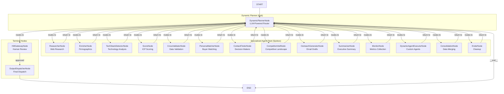

This architecture enables several critical capabilities:

- **Adaptive routing** -- The planner can choose different paths based on what data has been gathered
- **Graceful skip** -- If an agent fails, the planner can route around it
- **Dynamic ordering** -- The execution order is not hardcoded; it adapts to each prospect
- **Parallel dispatch** -- The planner can send multiple agents simultaneously when their dependencies are satisfied

---

## The Dynamic Planner -- Brain of the System

The `DynamicPlannerNode` implements a **three-tier routing strategy** that ensures the pipeline always makes forward progress:

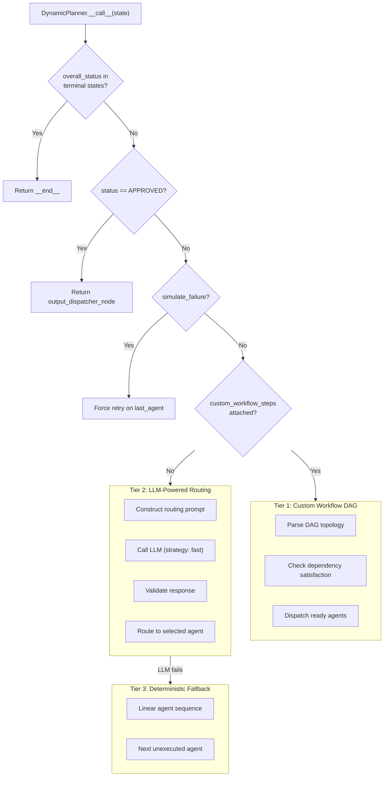

### Tier 1: Custom Workflow DAG Routing

When a custom workflow is attached, the planner performs **topological traversal** of the DAG:

1. Parse the DAG into `nodes[]` and `edges[]`
2. For each node, check if all incoming edge sources exist in `executed_agents`
3. Collect all nodes whose dependencies are satisfied
4. Dispatch them as a parallel list: `{next_node: ["agent_a", "agent_b"]}`

### Tier 2: LLM-Powered Intelligent Routing

When no custom workflow is present, the planner constructs a context-aware prompt:

```
You are a B2B sales workflow planner.
Status: PENDING
Executed: [researcher_node, enricher_node]
Data Gathered: {firmographics: {name: "Acme", ...}, tech_stack: [...]}

Agents:
[{"name": "score_node", "desc": "Scores the company against ICP..."}, ...]

Rules:
- Choose the best next agent based on missing data.
- Once firmographic & tech stack data exist, do cross_validator_node...
- Return ONLY JSON: {"reasoning": "...", "next_node": "agent_name"}
```

The response is parsed, validated against the registry, and used for routing.

### Tier 3: Deterministic Fallback

If the LLM fails or returns an invalid response, the planner falls back to a simple linear sequence of all registered agents, executing the first unexecuted one.

---

## Agent Lifecycle and State Flow

Each agent follows a standardized lifecycle:

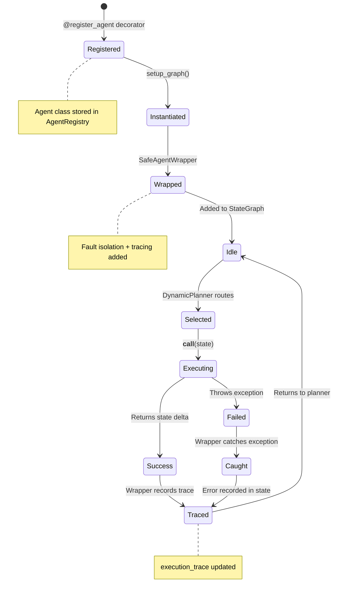

### Agent Initialization Pattern

Every agent follows a consistent constructor pattern:

```python
def __init__(self, toolbox: Toolbox, memory: MemoryService, config: dict):
    self.toolbox = toolbox
    self.memory = memory
    self.config = config
```

This uniform constructor signature is enforced by the `setup_graph()` function, which instantiates all agents with the same three dependencies.

### Agent Return Contract

Every agent returns a dictionary containing **only the state fields it wants to update**:

```python
return {
    "executed_agents": ["enricher_node"],     # Required: mark self as executed
    "data": {"firmographics": {...}},         # Optional: add data
    "confidence_score": 0.85,                 # Optional: update score
    "recent_thoughts": ["Extracted data..."]  # Optional: add thoughts
}
```

The `Annotated` reducers in `GraphState` handle merging these partial updates with the existing state.

---

## GraphState -- The Shared Memory Bus

The `GraphState` serves as the **central data bus** for the entire agentic workflow:

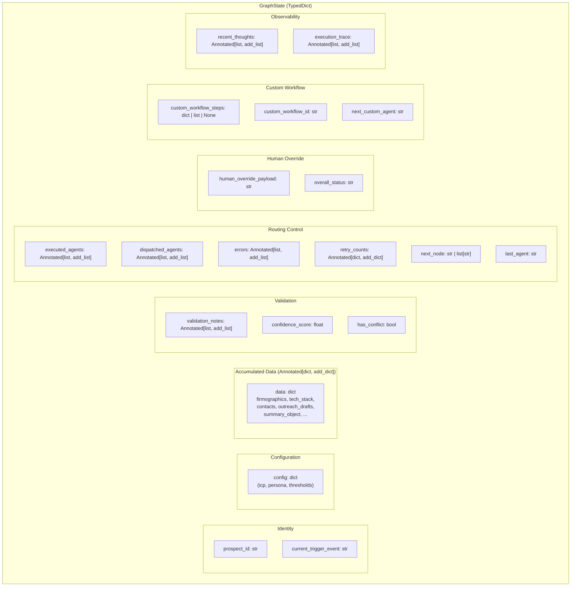

### Annotated Reducer Functions

The `Annotated` types use custom reducer functions to safely merge state updates from parallel branches:

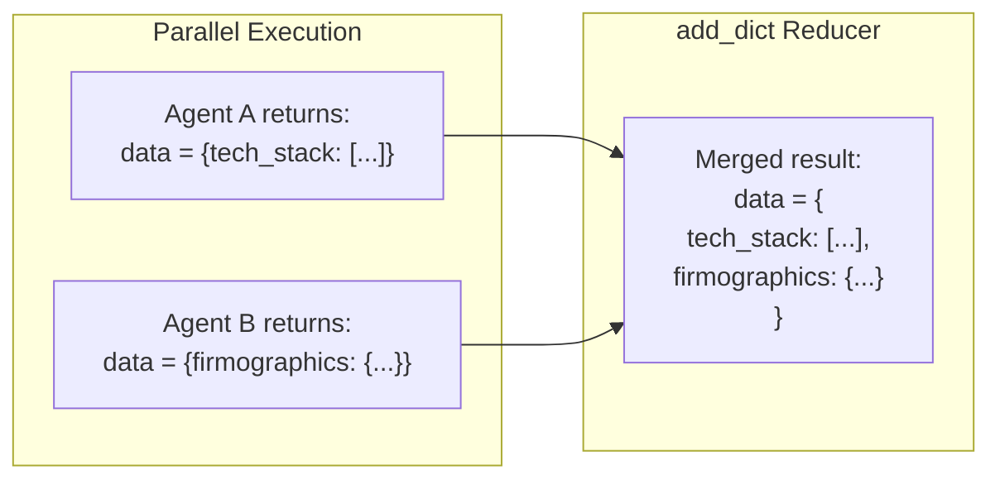

| Reducer | Behavior | Used For |
|:---|:---|:---|
| `add_dict` | Merges dictionaries (`{**left, **right}`) | `data`, `retry_counts`, `config` |
| `add_list` | Concatenates lists (`left + right`) | `executed_agents`, `errors`, `validation_notes`, `recent_thoughts`, `execution_trace` |

This eliminates race conditions when multiple agents execute concurrently.

---

## Parallel Execution and Fan-Out

The `DynamicPlannerNode` supports parallel agent dispatch when processing custom workflow DAGs:

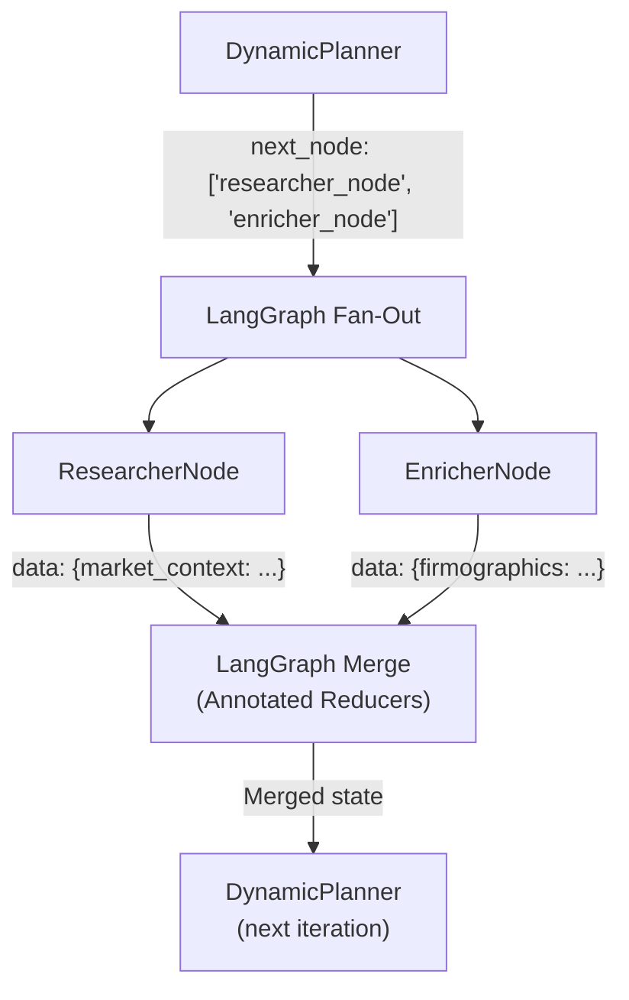

When the planner returns `next_node` as a list, LangGraph automatically:
1. Forks execution into parallel branches
2. Executes each agent concurrently
3. Merges the results using the `Annotated` reducers
4. Returns the merged state to the planner

This enables significant performance improvements for independent data gathering tasks.

---

## Custom Workflow DAG Processing

Users can design custom agent pipelines using the Workflow Studio frontend. These DAGs are stored in the `workflows` table and loaded at runtime.

### DAG Structure

```python
{
    "nodes": [
        {"id": "1", "data": {"agentId": "researcher_node"}},
        {"id": "2", "data": {"agentId": "enricher_node"}},
        {"id": "3", "data": {"agentId": "score_node"}}
    ],
    "edges": [
        {"source": "1", "target": "3"},  # researcher -> score
        {"source": "2", "target": "3"}   # enricher -> score
    ]
}
```

### Dependency Resolution Algorithm

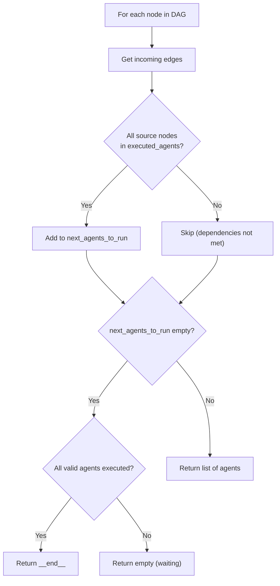

### Topological Execution Example

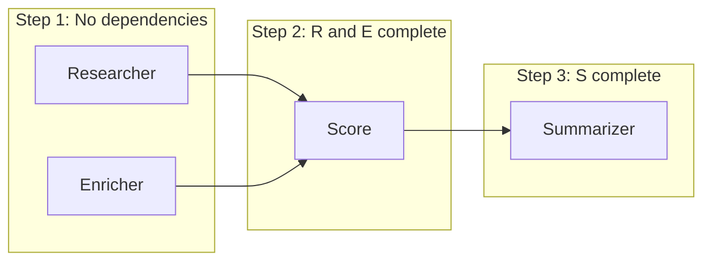

- **Step 1:** Researcher and Enricher have no incoming edges -- dispatched in parallel
- **Step 2:** Score has edges from both Researcher and Enricher -- waits until both complete
- **Step 3:** Summarizer has an edge from Score -- dispatched after Score completes

---

## Custom Agent Creation and Execution

### Agent Definition Model

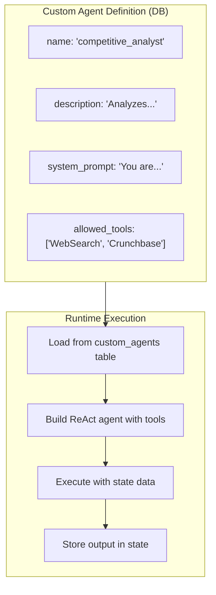

### Execution Modes

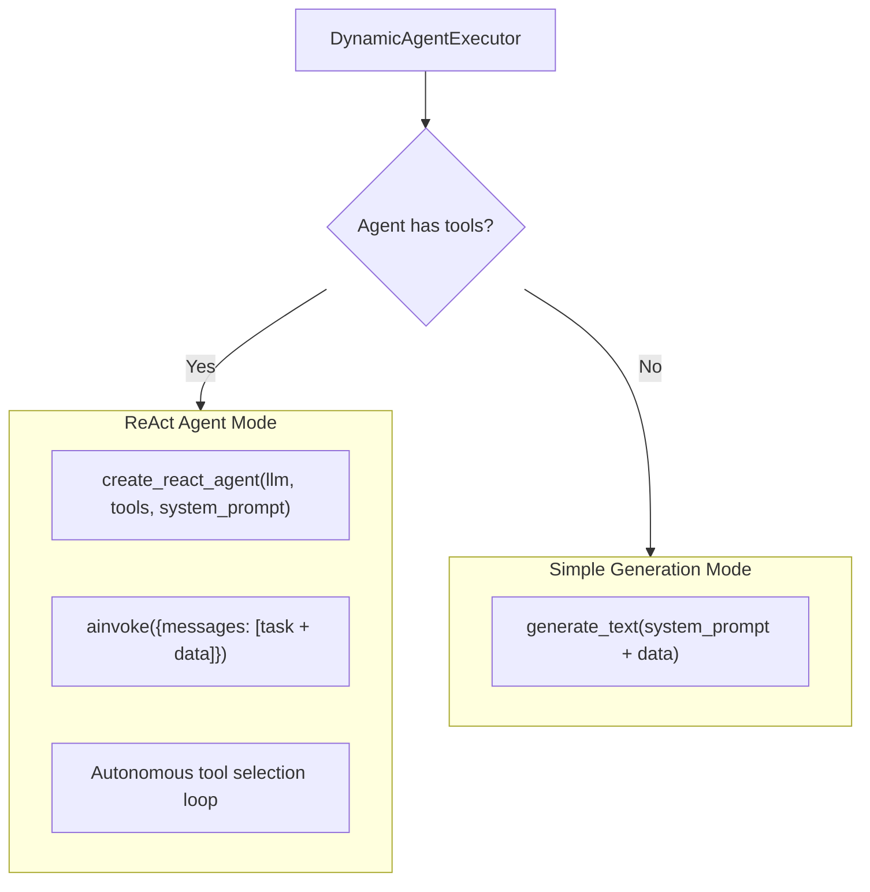

When tools are enabled, the executor builds a **ReAct agent** (Reasoning + Acting) that can autonomously decide which tools to call:

1. The LLM reads the system prompt and current state data
2. It decides which tool to call (WebSearch, Crunchbase, LinkedIn, EmployeeSearch)
3. The tool executes and returns results
4. The LLM observes the results and decides whether to call another tool or return a final answer

---

## Human-in-the-Loop Interrupt Model

### Interrupt Decision Logic

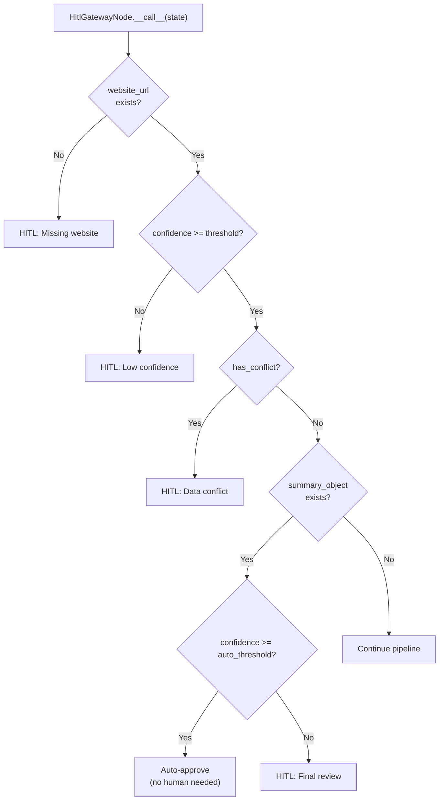

### Interrupt and Resume Mechanism

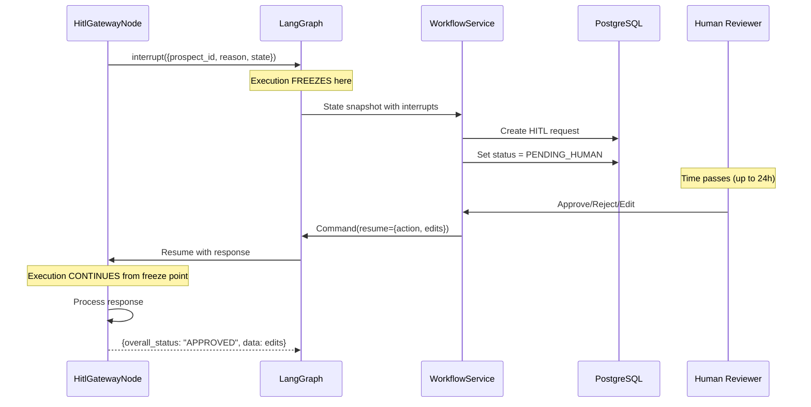

The key insight is that LangGraph's `interrupt()` function **freezes the entire execution context**, including the call stack. When resumed, execution continues from the exact line after the `interrupt()` call, with the resume payload available as the return value.

---

## Agent Registration and Discovery

### Registration Flow

```mermaid
graph LR
    subgraph Development["Development Time"]
        DEV["Write agent class"]
        DEC["Apply @register_agent decorator"]
    end

    subgraph Import["Import Time"]
        INIT["agents/__init__.py imports all agents"]
        REG["Each decorator calls registry.register()"]
        STORE["AgentRegistry stores class + description"]
    end

    subgraph Runtime["Runtime"]
        GRAPH["setup_graph() iterates registry"]
        WRAP["SafeAgentWrapper wraps each agent"]
        WIRE["Conditional edges auto-wired"]
        PLAN["Planner queries registry for available agents"]
    end

    DEV --> DEC --> INIT --> REG --> STORE --> GRAPH --> WRAP --> WIRE --> PLAN
```

The `agents/__init__.py` file imports all agent modules, triggering their `@register_agent` decorators. This is the only "manual" step -- and it's a standard Python import.

---

## Standard Pipeline Sequence

The typical execution sequence for a prospect follows this order (though the LLM planner may adapt based on data):

```mermaid
graph LR
    1["Researcher<br/>Market context"] --> 2["Enricher<br/>Firmographics"]
    2 --> 3["TechStack<br/>Technologies"]
    3 --> 4["Score<br/>ICP matching"]
    4 --> 5["CrossValidator<br/>Data integrity"]
    5 --> 6["PersonaMatcher<br/>Buyer profiles"]
    6 --> 7["ContactFinder<br/>Decision makers"]
    7 --> 8["CompetitorIntel<br/>Competitors"]
    8 --> 9["OutreachGen<br/>Email drafts"]
    9 --> 10["Summarizer<br/>Executive summary"]
    10 --> 11["HITL Gateway<br/>Human review"]
    11 --> 12["Output<br/>Final dispatch"]
```

---

## Agent Communication Patterns

Agents communicate exclusively through the shared `GraphState`. There is no direct agent-to-agent communication:

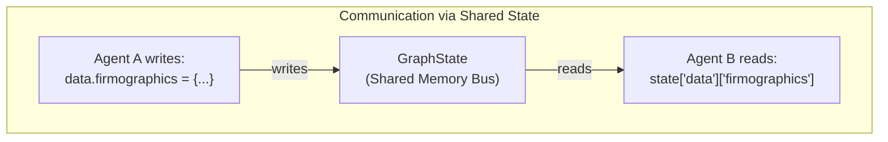

This pattern provides:
- **Loose coupling** -- Agents don't know about each other
- **Replay capability** -- The state is checkpointed, enabling replay
- **Observability** -- All agent outputs are visible in the state
- **Testability** -- Any agent can be tested with a mock state dict

---

<p align="center">
  <a href="README.md">Backend README</a> &#8226;
  <a href="CLASS_DIAGRAM.md">Class Diagrams</a> &#8226;
  <a href="SEQUENCE_FLOW.md">Sequence Flows</a> &#8226;
  <a href="SOLID_PRINCIPLES.md">SOLID</a> &#8226;
  <a href="RELIABILITY.md">Reliability</a> &#8226;
  <a href="LLD_ARCHITECTURE.md">LLD</a> &#8226;
  <a href="APPLICATION_FLOW.md">App Flow</a>
</p>