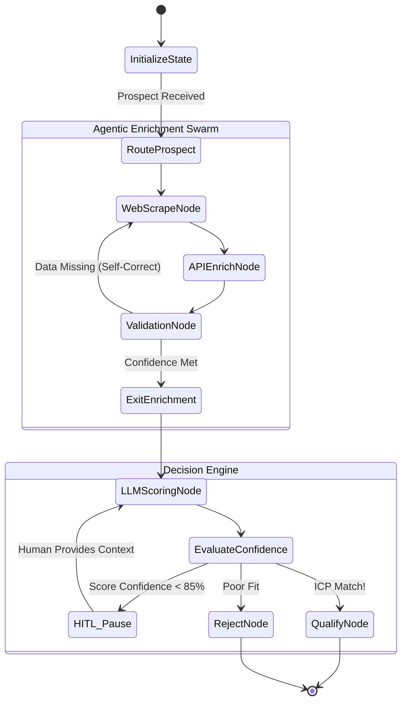

# 🧠 Dynamic Agentic Flow & LangGraph

  
  

Traditional pipelines are linear and brittle. The ICP-X backend employs a **Dynamic Agentic Flow**, utilizing LangGraph to create cyclic, self-reflecting, and autonomous state machines. 

This document explores how our agents think, route, and adapt.

---

## 🤖 The Cognitive Graph

Unlike standard DAGs (Directed Acyclic Graphs), our agentic flow contains cycles. This allows agents to critique their own work, realize they are missing data, and loop back to fetch it before proceeding.

### State Transition Diagram

---

## 🧬 Self-Correction Mechanism (The Feedback Loop)

The most powerful aspect of this flow is the **ValidationNode**. 
1. After scraping a company's website, the ValidationNode inspects the `AgentState`. 
2. If it realizes the scraper failed to find the company's pricing model, it dynamically alters the state to append a new objective: `"Search for pricing page explicitly"`.
3. It then routes execution *backward* to the `WebScrapeNode`.
4. This loop continues until a max-retry threshold is hit or the data is successfully gathered.

## ⏸️ Human-In-The-Loop (HITL) Interruption

We built true interruptibility into the graph. If the `EvaluateConfidence` node determines the LLM is hallucinating or unsure (Confidence < 85%), it returns a specific routing edge that **suspends the graph**.

The state is safely frozen in PostgreSQL. When the user reviews the prospect on the React frontend and clicks "Approve", the API fires an event that thaws the graph, injecting the human's feedback directly into the `AgentState`, and execution resumes flawlessly.

---
🔙 **[Back to Backend Hub](./README.md)**
