<h1 align="center">Application Flow Reference</h1>

<p align="center">
  <strong>End-to-end application flow documentation covering infrastructure bootstrap, request handling lifecycle, agent execution pipeline, real-time event delivery, and graceful shutdown -- from first byte to final response.</strong>
</p>

<p align="center">
  
  
  
  
</p>

---

## Table of Contents

- [Application Bootstrap Flow](#application-bootstrap-flow)
- [Request Handling Pipeline](#request-handling-pipeline)
- [Agent Execution Pipeline](#agent-execution-pipeline)
- [Real-Time Event Delivery](#real-time-event-delivery)
- [Background Task Management](#background-task-management)
- [Trigger Monitor Lifecycle](#trigger-monitor-lifecycle)
- [Graceful Shutdown Flow](#graceful-shutdown-flow)
- [Full System Interaction Map](#full-system-interaction-map)
- [Thread and Concurrency Model](#thread-and-concurrency-model)
- [Error Propagation Flow](#error-propagation-flow)

---

## Application Bootstrap Flow

The application uses FastAPI's `lifespan` context manager to bootstrap all services, establish database connections, and initialize the agent graph before accepting any requests.

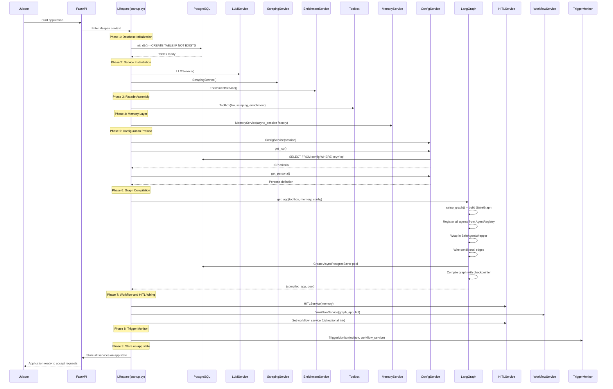

### Bootstrap Design Principles

| Principle | Implementation |
|:---|:---|
| **Explicit Dependency Graph** | Services are instantiated in dependency order -- no circular initialization |
| **No Hidden Singletons** | All services are created during lifespan and stored on `app.state` |
| **Configuration Preloading** | ICP and persona configs are loaded once at startup, not on every request |
| **Safe Re-entry** | `init_db()` uses `CREATE TABLE IF NOT EXISTS`, safe to run on every startup |
| **Conditional Initialization** | `init_db()` is skipped in test environments (`APP_ENV != "test"`) |

---

## Request Handling Pipeline

### Prospect Submission (POST /api/prospects)

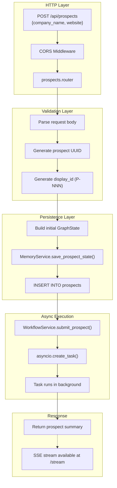

### Request-Scoped Dependencies

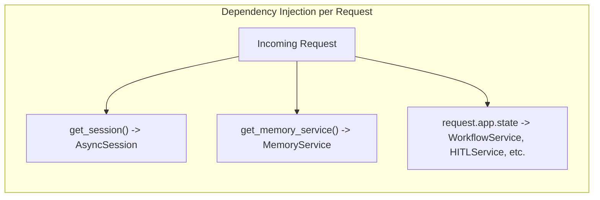

The dependency injection follows two patterns:
1. **Lifespan-scoped** -- Long-lived services (`WorkflowService`, `Toolbox`) stored on `app.state`
2. **Request-scoped** -- Short-lived resources (`AsyncSession`, `MemoryService`) created per-request via FastAPI `Depends()`

---

## Agent Execution Pipeline

### Single Agent Execution Cycle

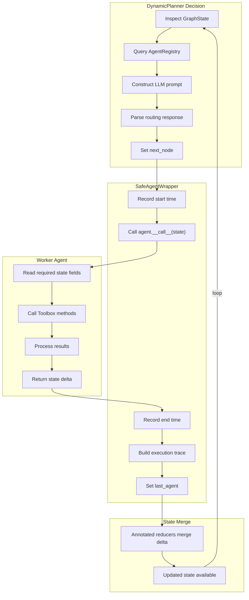

### Data Flow Through Agent Pipeline

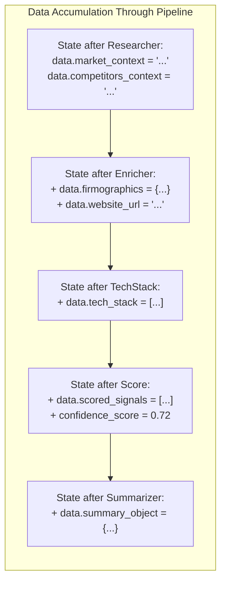

Each agent adds its output to the `data` dict, which is merged via the `add_dict` reducer. Downstream agents can read data from all upstream agents.

---

## Real-Time Event Delivery

### SSE Architecture

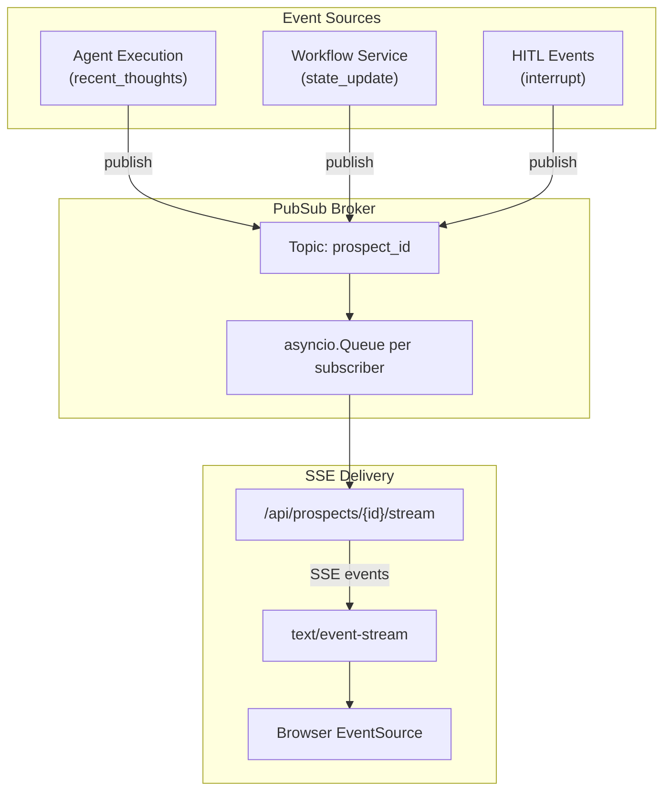

### SSE Event Types

| Event Type | Content | Trigger |
|:---|:---|:---|
| `thought` | Agent reasoning and decisions | `on_chain_end` during workflow execution |
| `action` | Agent completion notification | Detected in `recent_thoughts` list |
| `state_update` | Full state snapshot | After each agent completion |
| `interrupt` | HITL request details | When `HitlGatewayNode` triggers interrupt |

### SSE Connection Lifecycle

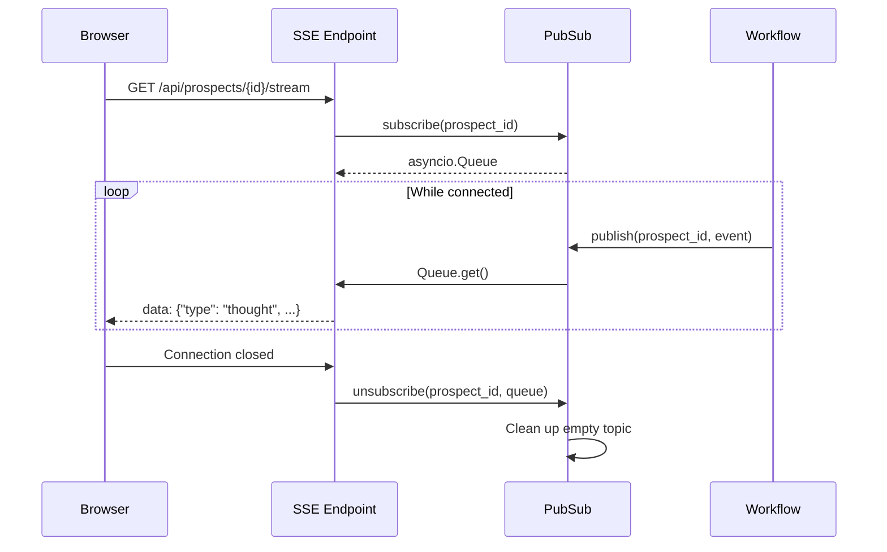

---

## Background Task Management

### Task Lifecycle

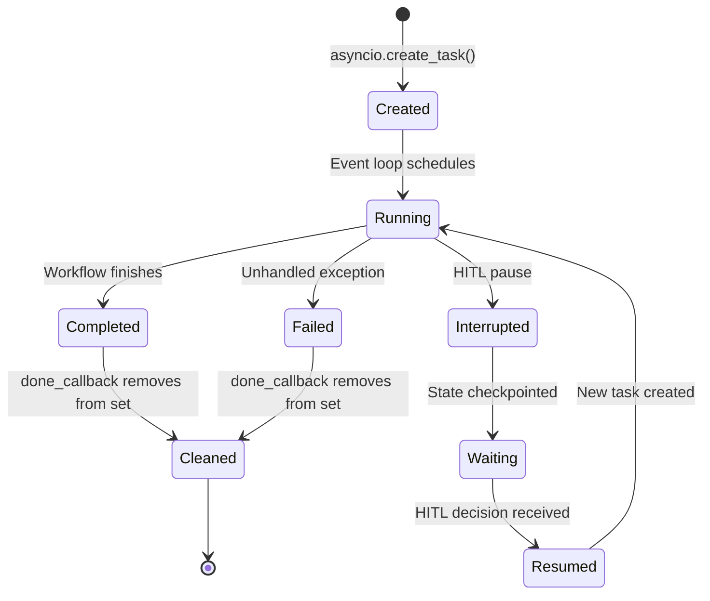

### Task Set Management

The `WorkflowService` maintains a `set[asyncio.Task]` for background workflow tasks:

```python
self._tasks: set[asyncio.Task] = set()

task = asyncio.create_task(self._run_workflow(state, config))
self._tasks.add(task)
task.add_done_callback(self._tasks.discard)
```

The `done_callback` pattern ensures tasks are automatically removed from the set when they complete, preventing memory leaks from accumulating references to finished tasks.

---

## Trigger Monitor Lifecycle

### Monitor State Machine

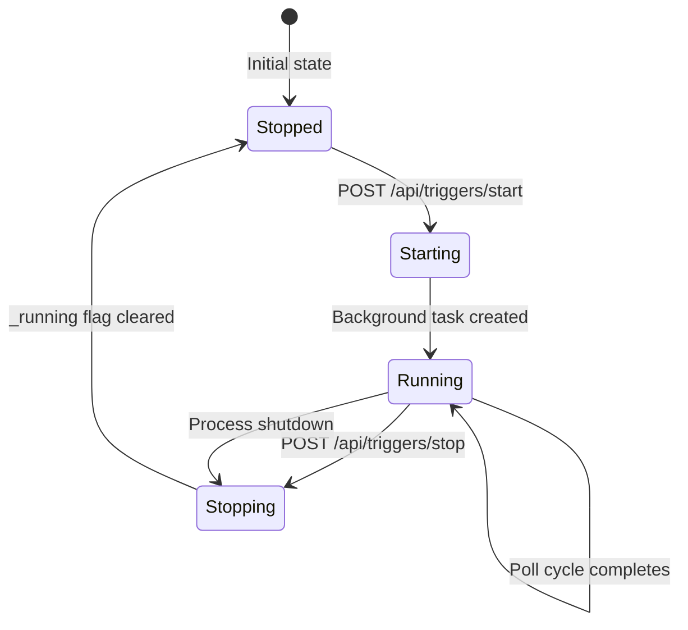

### Poll Cycle Flow

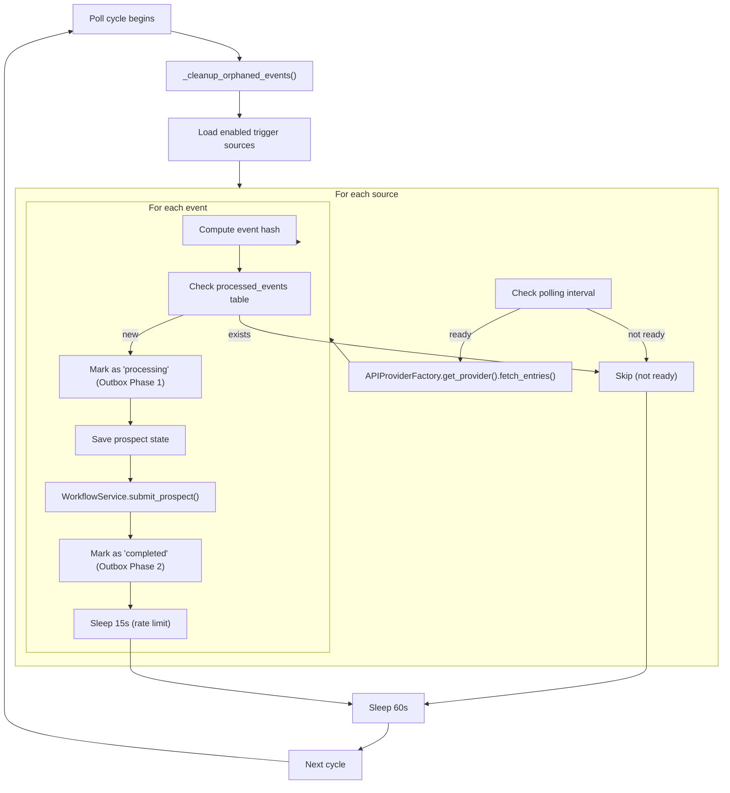

---

## Graceful Shutdown Flow

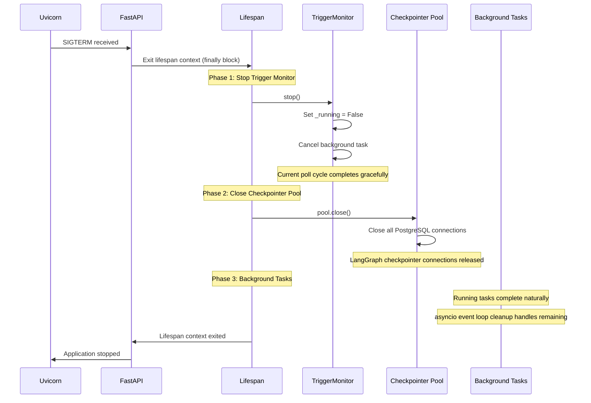

### Shutdown Guarantees

| Guarantee | Mechanism |
|:---|:---|
| No orphaned connections | `NullPool` ensures connections are not pooled |
| Trigger monitor stops cleanly | `_running` flag checked at each loop iteration |
| Checkpointer connections released | `pool.close()` called in `finally` block |
| No data loss for in-progress workflows | LangGraph checkpointer has already persisted state |

---

## Full System Interaction Map

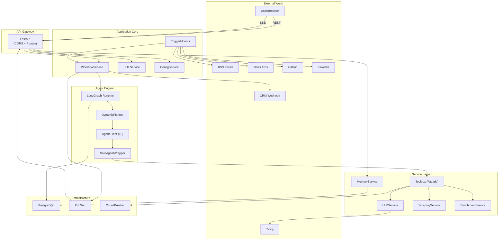

---

## Thread and Concurrency Model

### Single-Worker Architecture

The application runs with a single Uvicorn worker (`WORKERS=1`). This is an intentional design decision documented in `docker-compose.yml`:

```yaml
# Single worker required: PubSub, CircuitBreaker, and TriggerMonitor
# are all in-process. Multi-worker would cause duplicate polling and
# missing SSE events. Switch to Redis-backed variants for multi-worker.
- WORKERS=1
```

### Concurrency Within the Worker

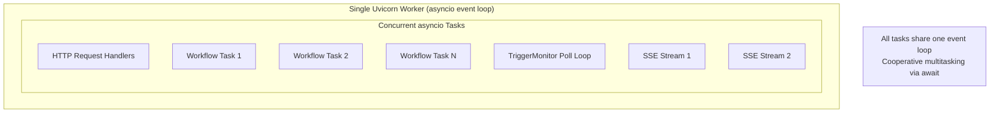

The single-worker model with asyncio provides sufficient concurrency for the target workload while avoiding the complexity of distributed state synchronization.

---

## Error Propagation Flow

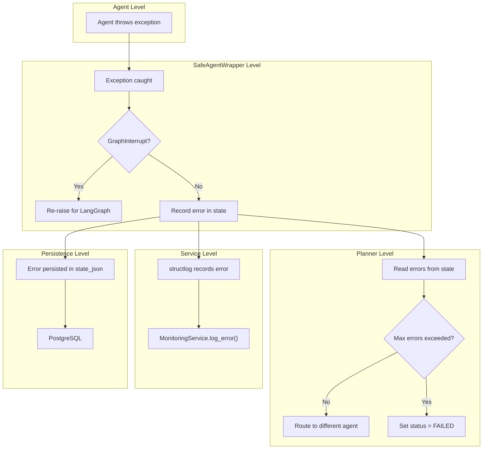

---

<p align="center">
  <a href="README.md">Backend README</a> &#8226;
  <a href="CLASS_DIAGRAM.md">Class Diagrams</a> &#8226;
  <a href="SEQUENCE_FLOW.md">Sequence Flows</a> &#8226;
  <a href="SOLID_PRINCIPLES.md">SOLID</a> &#8226;
  <a href="RELIABILITY.md">Reliability</a> &#8226;
  <a href="AGENTIC_FLOW.md">Agentic Flow</a> &#8226;
  <a href="LLD_ARCHITECTURE.md">LLD</a>
</p>
