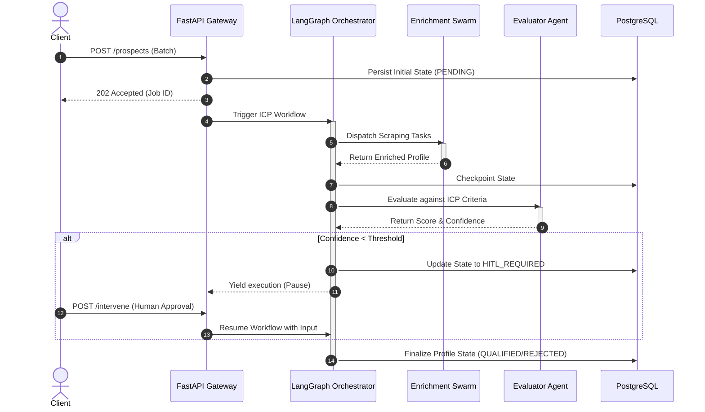
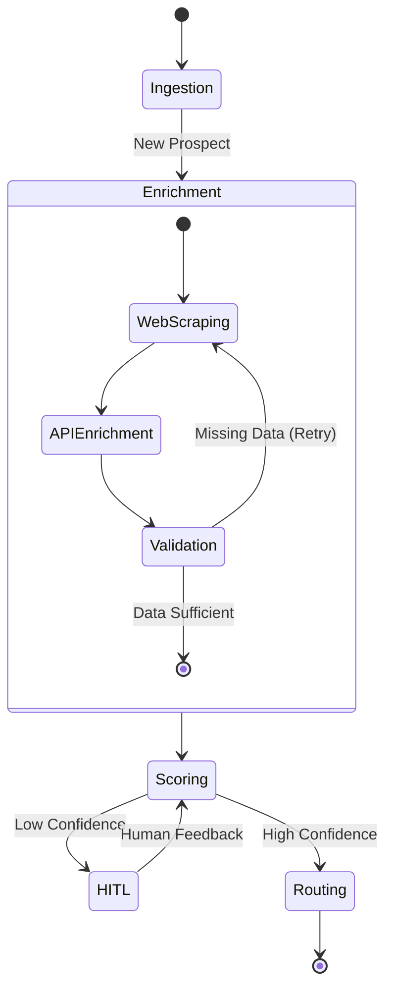

# 🏛️ System Architecture & Agentic Flow

This document details the macro-architecture of the ICP-X backend. We employ a **Reactive, Event-Driven Agentic Architecture** that redefines how background processing and AI orchestration should be built.

---

## 🌊 The Agentic Lifecycle (Sequence Diagram)

When a prospect enters the system, they don't just get saved to a database. They are pushed into an intelligent pipeline orchestrated by LangGraph.

---

## 🤖 Dynamic Graph Routing

Our agentic flow isn't a static pipeline; it's a dynamic, cyclic graph capable of self-reflection and recursive enhancement.

---

## 🛡️ Enterprise Reliability Engineering

Our architecture guarantees zero data loss and uninterrupted service:

1. **State Checkpointing**: LangGraph implicitly checkpoints state after *every* node transition to PostgreSQL. If the server crashes, the workflow resumes exactly where it left off.
2. **Circuit Breakers**: External API calls (LLMs, scrapers) are wrapped in resilient circuit breakers to prevent cascading failures.
3. **Dead Letter Queues (DLQ)**: Poison pill payloads that cause unhandled exceptions are safely routed to a DLQ for manual inspection, ensuring the main processing queue never blocks.

---
🔙 **[Back to Backend Hub](./README.md)** | 📐 **[Next: Low-Level Design (LLD)](./LLD.md)**
