<h1 align="center">Class Diagram Reference</h1>

  <strong>Complete UML class diagrams documenting inheritance hierarchies, protocol interfaces, composition relationships, and the structural backbone of the ICP Agent platform.</strong>

  
  
  

---

## Table of Contents

- [Agent Layer Class Hierarchy](#agent-layer-class-hierarchy)
- [Service Layer Class Structure](#service-layer-class-structure)
- [Data Layer and ORM Models](#data-layer-and-orm-models)
- [Core Infrastructure Classes](#core-infrastructure-classes)
- [API Provider Framework](#api-provider-framework)
- [Toolbox Facade Composition](#toolbox-facade-composition)
- [Complete System Class Map](#complete-system-class-map)

---

## Agent Layer Class Hierarchy

The agent layer is the heart of the orchestration engine. It is built around the `AgentNode` Protocol -- a formal interface contract that every agent must satisfy. The `SafeAgentWrapper` decorator provides fault isolation, execution tracing, and retry tracking without modifying agent implementation code.

### AgentNode Protocol and SafeAgentWrapper

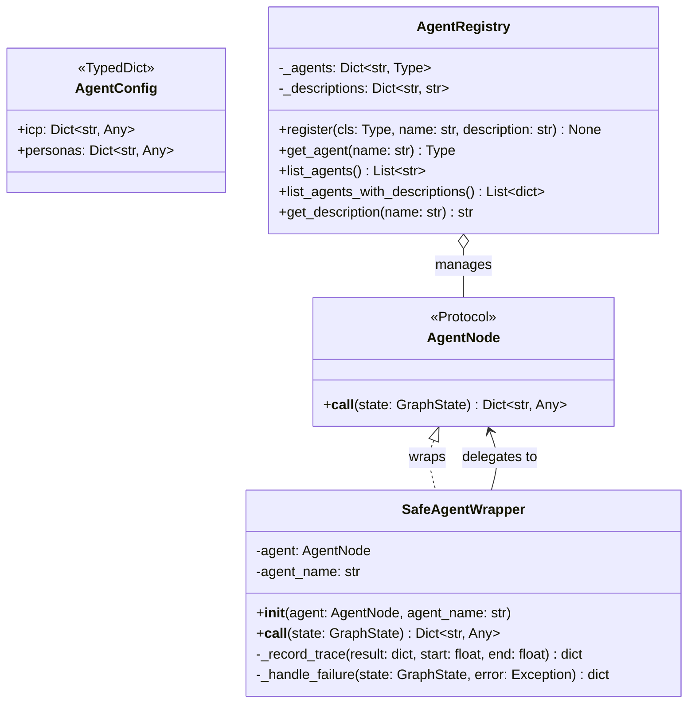

**Design Rationale:** The `AgentNode` Protocol uses Python's structural subtyping system. Any class that implements `async def __call__(self, state: GraphState) -> Dict[str, Any]` is considered a valid `AgentNode` without explicit inheritance. This enables maximum flexibility -- agents don't need to inherit from a base class, and third-party agent implementations can be integrated without modification.

The `SafeAgentWrapper` implements the **Decorator Pattern** (GoF), adding cross-cutting concerns (fault isolation, tracing, retry tracking) to any agent without modifying its source code. This is a textbook application of the Open/Closed Principle -- the wrapper is open for extension but closed for modification.

### Agent Fleet Class Diagram

```mermaid
classDiagram
    class AgentNode {
        <<Protocol>>
        +__call__(state: GraphState) Dict~str, Any~
    }

    class DynamicPlannerNode {
        -toolbox: Toolbox
        -memory: MemoryService
        -config: dict
        -registry: AgentRegistry
        +__call__(state: GraphState) Dict~str, Any~
        -_route_custom_workflow(state: GraphState) dict
        -_route_via_llm(state: GraphState) dict
        -_route_fallback(state: GraphState) dict
    }

    class ResearcherNode {
        -toolbox: Toolbox
        -memory: MemoryService
        -config: dict
        -search_client: ISearchClient
        +__call__(state: GraphState) Dict~str, Any~
    }

    class EnricherNode {
        -toolbox: Toolbox
        -memory: MemoryService
        -config: dict
        +__call__(state: GraphState) Dict~str, Any~
    }

    class TechStackDetectorNode {
        -toolbox: Toolbox
        -memory: MemoryService
        -config: dict
        +__call__(state: GraphState) Dict~str, Any~
    }

    class ScoreNode {
        -toolbox: Toolbox
        -memory: MemoryService
        -config: dict
        +__call__(state: GraphState) Dict~str, Any~
    }

    class CrossValidatorNode {
        -toolbox: Toolbox
        -memory: MemoryService
        -config: dict
        +__call__(state: GraphState) Dict~str, Any~
    }

    class PersonaMatcherNode {
        -toolbox: Toolbox
        -memory: MemoryService
        -config: dict
        +__call__(state: GraphState) Dict~str, Any~
    }

    class ContactFinderNode {
        -toolbox: Toolbox
        -memory: MemoryService
        -config: dict
        +__call__(state: GraphState) Dict~str, Any~
    }

    class CompetitorIntelNode {
        -toolbox: Toolbox
        -memory: MemoryService
        -config: dict
        +__call__(state: GraphState) Dict~str, Any~
    }

    class OutreachGeneratorNode {
        -toolbox: Toolbox
        -memory: MemoryService
        -config: dict
        +__call__(state: GraphState) Dict~str, Any~
    }

    class SummarizerNode {
        -toolbox: Toolbox
        -memory: MemoryService
        -config: dict
        +__call__(state: GraphState) Dict~str, Any~
    }

    class HitlGatewayNode {
        -toolbox: Toolbox
        -memory: MemoryService
        -config: dict
        +__call__(state: GraphState) Dict~str, Any~
    }

    class OutputDispatcherNode {
        -toolbox: Toolbox
        -memory: MemoryService
        -config: dict
        +__call__(state: GraphState) Dict~str, Any~
    }

    class DynamicAgentExecutorNode {
        -toolbox: Toolbox
        -memory: MemoryService
        -config: dict
        +__call__(state: GraphState) Dict~str, Any~
    }

    class ConsolidationNode {
        -toolbox: Toolbox
        -memory: MemoryService
        -config: dict
        +__call__(state: GraphState) Dict~str, Any~
    }

    class MonitorNode {
        -toolbox: Toolbox
        -memory: MemoryService
        -config: dict
        +__call__(state: GraphState) Dict~str, Any~
    }

    class EnderNode {
        -toolbox: Toolbox
        -memory: MemoryService
        -config: dict
        +__call__(state: GraphState) Dict~str, Any~
    }

    AgentNode <|.. DynamicPlannerNode
    AgentNode <|.. ResearcherNode
    AgentNode <|.. EnricherNode
    AgentNode <|.. TechStackDetectorNode
    AgentNode <|.. ScoreNode
    AgentNode <|.. CrossValidatorNode
    AgentNode <|.. PersonaMatcherNode
    AgentNode <|.. ContactFinderNode
    AgentNode <|.. CompetitorIntelNode
    AgentNode <|.. OutreachGeneratorNode
    AgentNode <|.. SummarizerNode
    AgentNode <|.. HitlGatewayNode
    AgentNode <|.. OutputDispatcherNode
    AgentNode <|.. DynamicAgentExecutorNode
    AgentNode <|.. ConsolidationNode
    AgentNode <|.. MonitorNode
    AgentNode <|.. EnderNode
```

### Researcher Node -- Interface Segregation

The `ResearcherNode` demonstrates the **Interface Segregation Principle** with a dedicated `ISearchClient` abstraction:

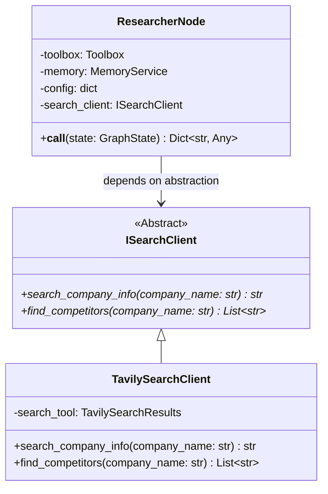

---

## Service Layer Class Structure

The service layer implements the business logic of the platform. Every service depends on abstractions (Protocols) rather than concretions, enabling seamless testing and implementation swapping.

### Service Protocol Interfaces

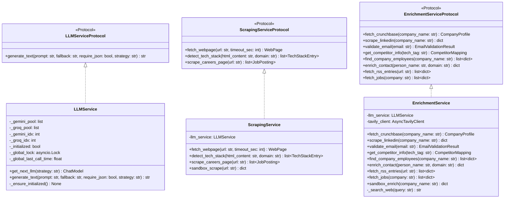

### Service Composition

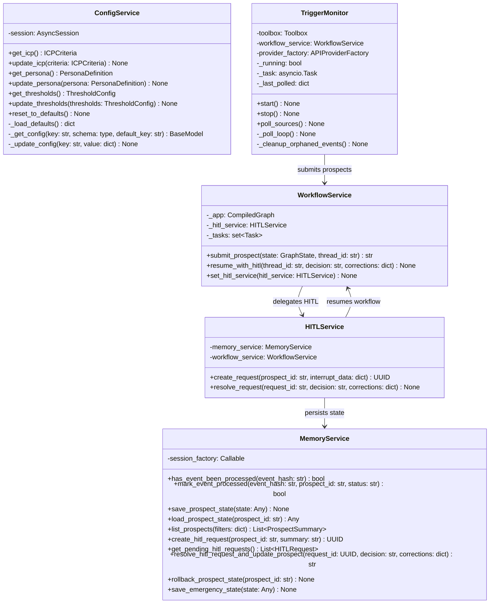

---

## Data Layer and ORM Models

### SQLAlchemy ORM Model Hierarchy

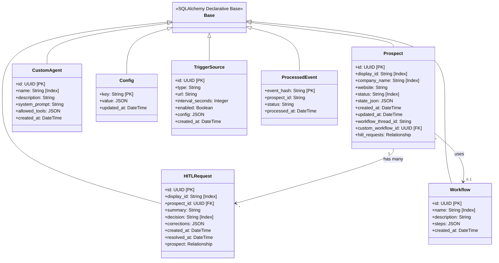

### Pydantic DTO and Schema Classes

```mermaid
classDiagram
    class BaseModel {
        <<Pydantic>>
    }

    class WebPage {
        +url: str
        +htmlContent: str
        +statusCode: int
        +fetchTimeMs: int
    }

    class CompanyProfile {
        +name: str
        +description: str
        +employeeCount: int
        +revenue: str
        +location: str
        +industries: list~str~
    }

    class TechStackEntry {
        +technology: str
        +category: str
        +confidence: float
        +source: str
    }

    class JobPosting {
        +title: str
        +department: str
        +url: str
        +postedDate: str
    }

    class EmailValidationResult {
        +email: str
        +isValid: bool
        +reason: str
    }

    class CompetitorMapping {
        +technology: str
        +competitors: list~str~
        +painPoints: dict~str, str~
    }

    class ICPCriteria {
        +industries: List~str~
        +min_revenue: int
        +max_revenue: int
        +min_employees: int
        +max_employees: int
        +locations: List~str~
        +tech_stack: List~str~
        +behaviors: List~str~
        +operator: str
        +check_ranges() ICPCriteria
    }

    class PersonaDefinition {
        +job_titles: List~str~
        +seniority_levels: List~str~
        +functions: List~str~
        +exclude_titles: List~str~
    }

    class ThresholdConfig {
        +min_confidence_score: float
        +max_errors_allowed: int
        +hitl_confidence_threshold: float
        +auto_approve_threshold: float
    }

    class ProspectSummary {
        +id: UUID
        +display_id: str
        +company_name: str
        +status: str
        +updated_at: datetime
    }

    class ProspectDetail {
        +id: UUID
        +display_id: str
        +company_name: str
        +website: str
        +status: str
        +state_json: dict
        +created_at: datetime
        +updated_at: datetime
        +workflow_thread_id: str
    }

    BaseModel <|-- WebPage
    BaseModel <|-- CompanyProfile
    BaseModel <|-- TechStackEntry
    BaseModel <|-- JobPosting
    BaseModel <|-- EmailValidationResult
    BaseModel <|-- CompetitorMapping
    BaseModel <|-- ICPCriteria
    BaseModel <|-- PersonaDefinition
    BaseModel <|-- ThresholdConfig
    BaseModel <|-- ProspectSummary
    BaseModel <|-- ProspectDetail
```

---

## Core Infrastructure Classes

### Circuit Breaker FSM

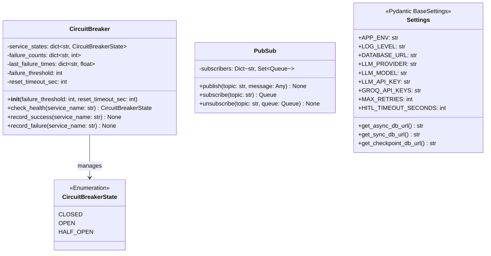

### Exception Hierarchy

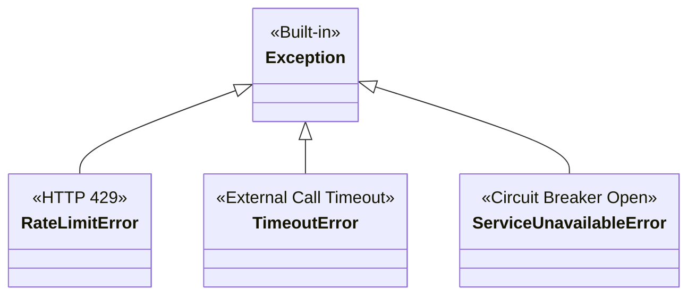

---

## API Provider Framework

The API provider framework implements the **Factory Pattern** combined with the **Strategy Pattern** to enable pluggable external API integrations:

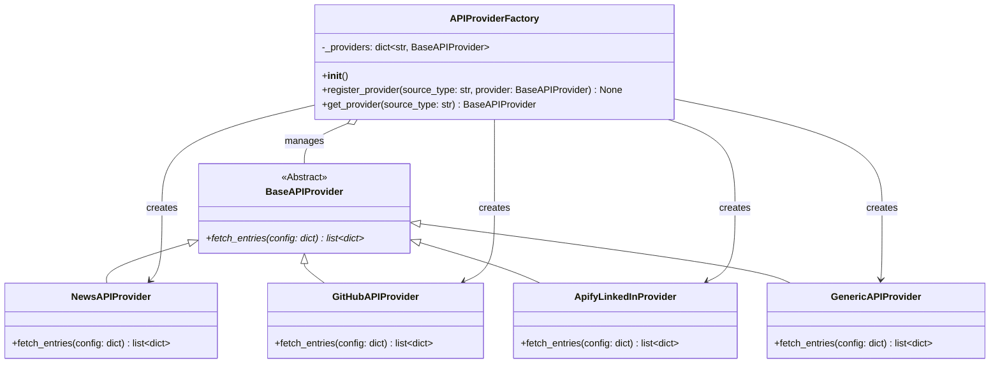

---

## Toolbox Facade Composition

The `Toolbox` is the central **Facade** (GoF) that aggregates all external service interactions into a single, unified interface for agents:

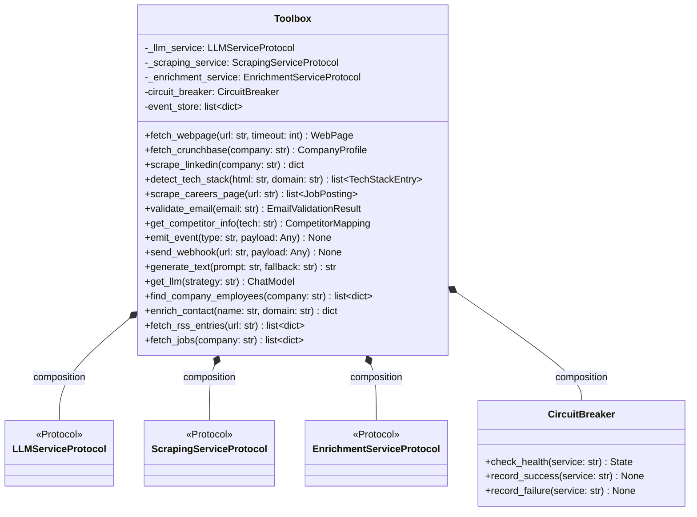

---

## Complete System Class Map

The following diagram shows the full composition of the system, illustrating how every major class relates to every other:

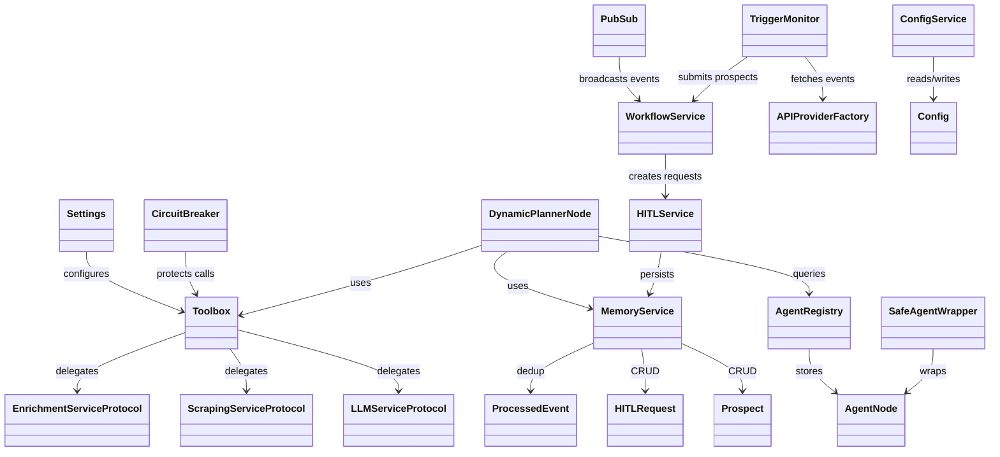

---

  <a href="README.md">Backend README</a> &#8226;
  <a href="SEQUENCE_FLOW.md">Sequence Flows</a> &#8226;
  <a href="SOLID_PRINCIPLES.md">SOLID</a> &#8226;
  <a href="RELIABILITY.md">Reliability</a> &#8226;
  <a href="AGENTIC_FLOW.md">Agentic Flow</a> &#8226;
  <a href="LLD_ARCHITECTURE.md">LLD</a> &#8226;
  <a href="APPLICATION_FLOW.md">App Flow</a>

