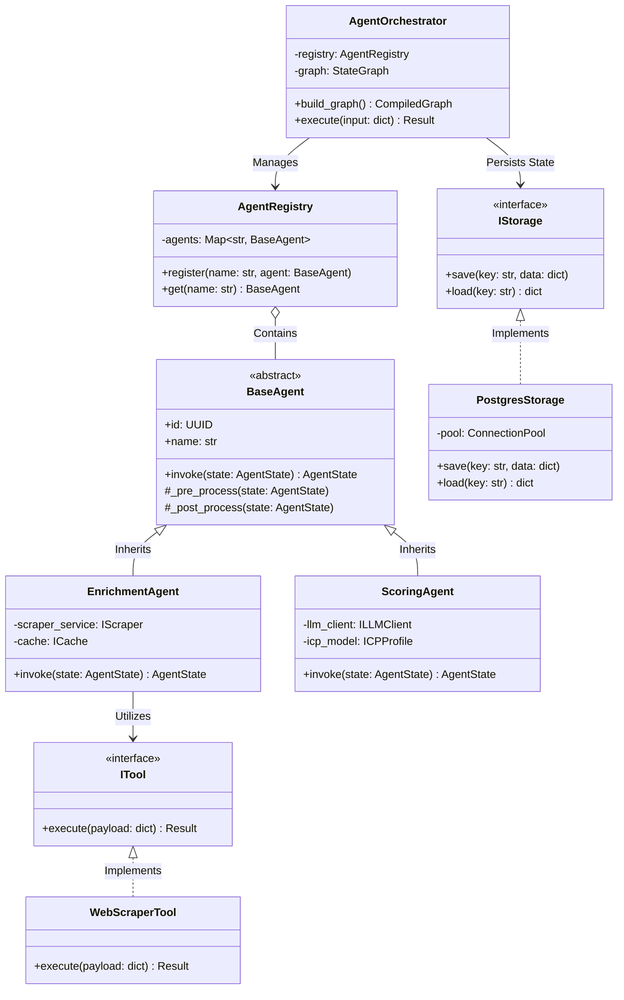

# 🧬 Enterprise Class Architecture & LLD

  
  

Welcome to the definitive guide on the Low-Level Design (LLD) and Class Architecture of the ICP-X backend. We don't just write scripts—we engineer scalable, decoupled, and highly cohesive domain models.

---

## 🏗️ The Domain Layer

Our architecture is heavily decoupled, utilizing Abstract Base Classes (ABCs) in Python and strict Dependency Injection. This ensures maximum testability, interchangeability, and absolute separation of concerns. The core of our agentic system revolves around the `BaseAgent` abstraction.

### Comprehensive Class Diagram

The following Mermaid diagram illustrates the intricate relationships, inheritance, and interfaces powering our cognitive engine.

---

## 🧩 Architectural Highlights

### 1. **Dependency Injection (DI)**
Every concrete implementation (like `PostgresStorage` or `WebScraperTool`) is injected into the high-level agents at runtime. The `EnrichmentAgent` never knows *how* data is scraped; it merely interfaces with `ITool`. This allows us to hot-swap a Puppeteer scraper for a Playwright scraper without touching the agent logic.

### 2. **State Management via `AgentState`**
Notice how `invoke()` receives and returns an `AgentState`. This is a strict, Pydantic-validated data contract. No unstructured dicts are passed around. The `AgentState` is immutable during a node's execution, guaranteeing side-effect-free transitions.

### 3. **The Orchestrator Hub**
The `AgentOrchestrator` is the central brain. It dynamically resolves dependencies via the `AgentRegistry` and compiles the LangGraph state machine. It abstracts away the complexity of the LangGraph runtime, exposing a clean `execute()` method to our FastAPI controllers.

---
🔙 **[Back to Backend Hub](./README.md)**
