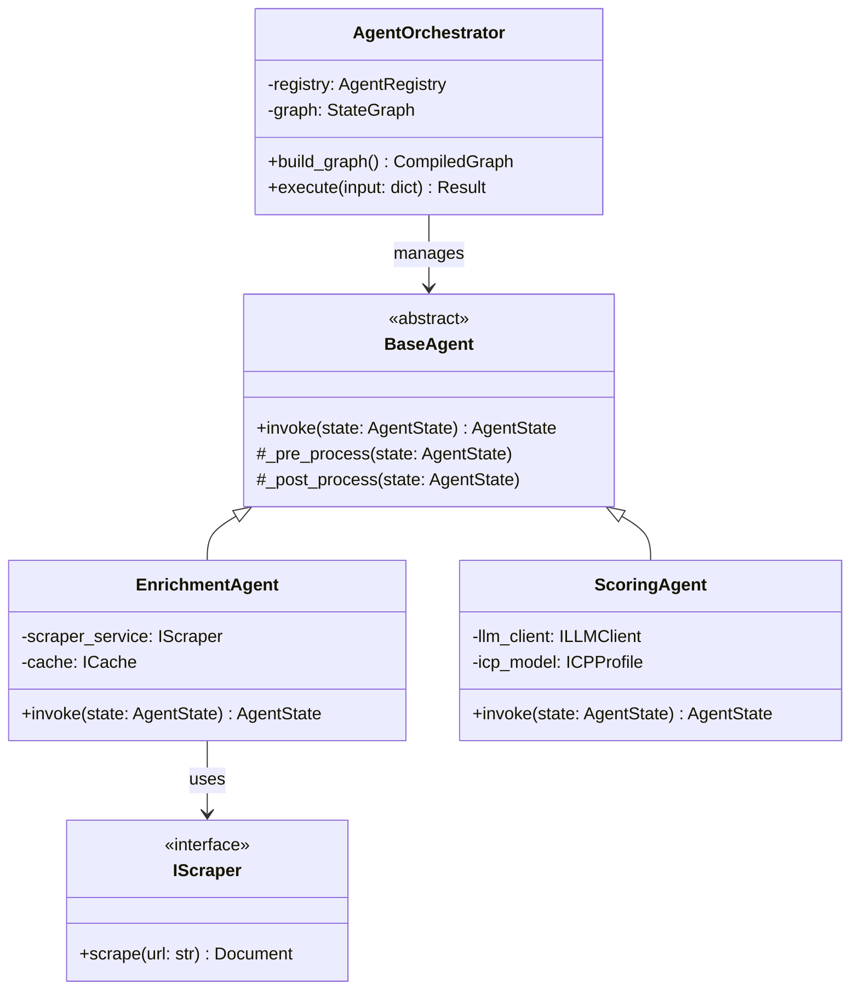

# 📐 Low-Level Design (LLD) & Engineering Practices

The ICP-X backend is a testament to rigorous software engineering. We don't write scripts; we build scalable, maintainable, and strongly-typed domain models.

---

## 🧬 Class Architecture

Our domain layer is heavily decoupled, utilizing Interfaces (ABCs in Python) and Dependency Injection to ensure maximum testability.

---

## 🧱 SOLID Principles in Action

We strictly adhere to SOLID principles to maintain a pristine codebase:

- **Single Responsibility Principle (SRP)**: Each agent node in our graph does *one* thing. The `EnrichmentAgent` only fetches data; it does not score it.
- **Open/Closed Principle (OCP)**: The `AgentRegistry` allows us to add new agent types (e.g., `SocialMediaScraperAgent`) without modifying the core orchestration logic.
- **Liskov Substitution Principle (LSP)**: Any subclass of `BaseAgent` can be seamlessly swapped into the LangGraph execution flow without breaking the pipeline.
- **Interface Segregation Principle (ISP)**: We use granular interfaces like `IDatabaseReader` and `IDatabaseWriter` rather than a monolithic `IDatabase` interface.
- **Dependency Inversion Principle (DIP)**: High-level modules (like our FastAPI routers) do not depend on low-level modules (like the specific PostgreSQL driver). They depend on abstractions (e.g., `UnitOfWork`).

---

## 🎨 Design Patterns Utilized

1. **Strategy Pattern**: Used within the `ScoringAgent` to dynamically switch between different LLM evaluation strategies (e.g., Fast vs. Deep Reasoning) based on the prospect's tier.
2. **Factory Method**: Instantiates the correct agent configurations dynamically based on the tenant's specific ICP definition.
3. **State Pattern**: Naturally implemented via LangGraph, where the `AgentState` object dictates the behavior and valid transitions of the system at any given moment.

---
🔙 **[Back to Backend Hub](./README.md)** | 🏛️ **[Back to Architecture](./ARCHITECTURE.md)**
