<h1 align="center">Low-Level Design Architecture</h1>

<p align="center">
  <strong>Detailed low-level design covering data models, state machine transitions, DTO specifications, schema validation rules, database design, and the architectural contracts that govern every layer of the ICP Agent platform.</strong>
</p>

<p align="center">
  
  
  
  
  
</p>

---

## Table of Contents

- [Database Design](#database-design)
- [Entity Relationship Diagram](#entity-relationship-diagram)
- [State Machine Definitions](#state-machine-definitions)
- [Data Transfer Object Specification](#data-transfer-object-specification)
- [Schema Validation Rules](#schema-validation-rules)
- [GraphState Contract Specification](#graphstate-contract-specification)
- [API Request/Response Contracts](#api-requestresponse-contracts)
- [Configuration Schema Design](#configuration-schema-design)
- [Index Strategy](#index-strategy)
- [Connection Pool Design](#connection-pool-design)

---

## Database Design

### Schema Overview

The database consists of 7 tables designed for the specific needs of an agentic workflow platform:

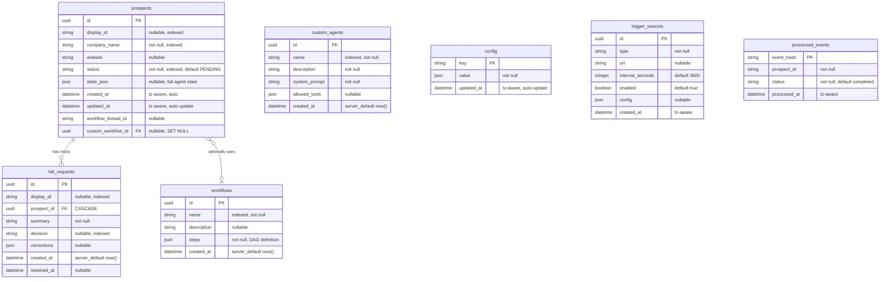

### Table Design Decisions

| Table | Design Decision | Rationale |
|:---|:---|:---|
| `prospects` | `state_json` stores the complete `GraphState` as JSON | Enables full state reconstruction without joining, critical for workflow resume |
| `prospects` | `workflow_thread_id` stored as String | LangGraph thread IDs are opaque strings, not UUIDs |
| `hitl_requests` | `CASCADE` on prospect deletion | HITL requests are meaningless without their parent prospect |
| `workflows` | `steps` stored as JSON | Workflow DAGs are complex nested structures (nodes + edges) not suitable for relational normalization |
| `config` | Key-value store with JSON values | Runtime configuration changes frequently; relational modeling would require schema migrations |
| `processed_events` | `event_hash` as PK | Content-based deduplication -- same event from different poll cycles has the same hash |
| `processed_events` | `status` column with outbox semantics | Enables two-phase commit and orphan cleanup |

---

## Entity Relationship Diagram

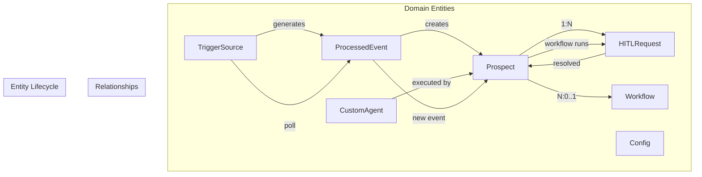

---

## State Machine Definitions

### Prospect Status State Machine

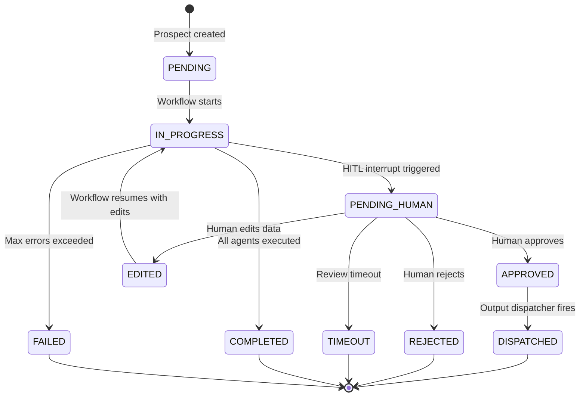

| Status | Description | Transitions To |
|:---|:---|:---|
| `PENDING` | Prospect created, waiting for workflow execution | `IN_PROGRESS` |
| `IN_PROGRESS` | Agents are executing | `PENDING_HUMAN`, `COMPLETED`, `FAILED` |
| `PENDING_HUMAN` | Waiting for human review | `APPROVED`, `REJECTED`, `EDITED`, `TIMEOUT` |
| `APPROVED` | Human approved the prospect | `DISPATCHED` |
| `REJECTED` | Human rejected the prospect | Terminal |
| `EDITED` | Human made corrections | `IN_PROGRESS` (resume) |
| `TIMEOUT` | Human review timed out | Terminal |
| `DISPATCHED` | Output sent to CRM/webhook | Terminal |
| `COMPLETED` | All agents executed successfully | Terminal |
| `FAILED` | Max error threshold exceeded | Terminal |

### HITL Request Decision State Machine

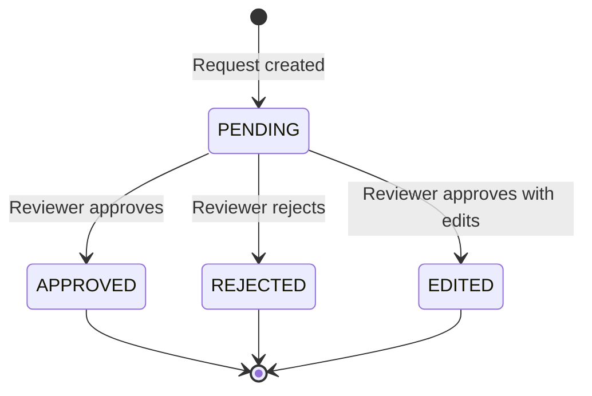

### Circuit Breaker State Machine

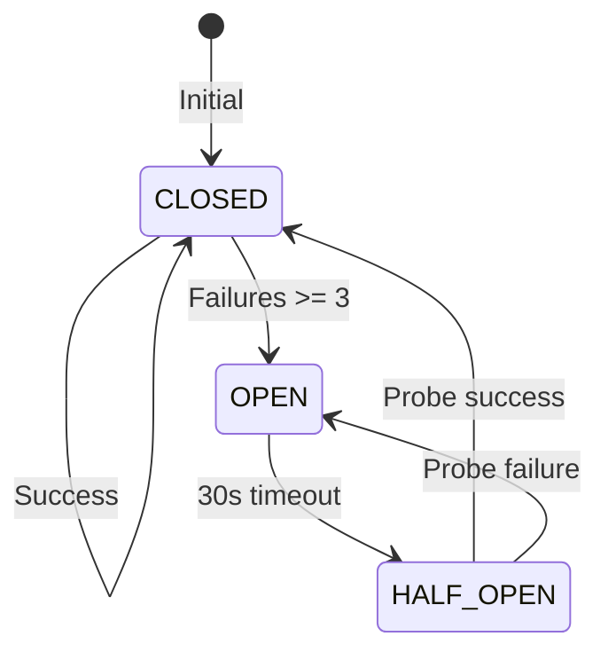

### Event Processing Status State Machine

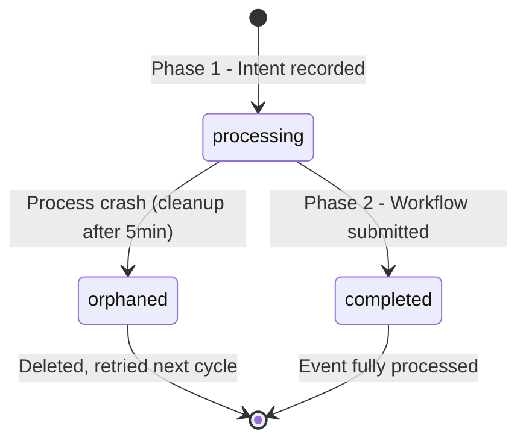

---

## Data Transfer Object Specification

DTOs define the shape of data exchanged between agents and external services. Each DTO is a Pydantic `BaseModel` with strict type enforcement.

### WebPage DTO

| Field | Type | Description |
|:---|:---|:---|
| `url` | `str` | The URL that was fetched |
| `htmlContent` | `str` | Raw HTML content of the page |
| `statusCode` | `int` | HTTP status code |
| `fetchTimeMs` | `int` | Time taken to fetch in milliseconds |

### CompanyProfile DTO

| Field | Type | Default | Description |
|:---|:---|:---:|:---|
| `name` | `str` | Required | Company name |
| `description` | `Optional[str]` | `None` | Business description |
| `employeeCount` | `Optional[int]` | `None` | Number of employees |
| `revenue` | `Optional[str]` | `None` | Revenue range or estimate |
| `location` | `Optional[str]` | `None` | Headquarters location |
| `industries` | `list[str]` | `[]` | Industry classifications |

### TechStackEntry DTO

| Field | Type | Description |
|:---|:---|:---|
| `technology` | `str` | Technology name (e.g., "React", "PostgreSQL") |
| `category` | `str` | Category (e.g., "Frontend", "Database") |
| `confidence` | `float` | Detection confidence score (0.0 - 1.0) |
| `source` | `str` | Detection method (e.g., "script_tag", "meta_tag") |

### JobPosting DTO

| Field | Type | Description |
|:---|:---|:---|
| `title` | `str` | Job title |
| `department` | `str` | Department name |
| `url` | `str` | URL to the job posting |
| `postedDate` | `str` | Date the job was posted |

### EmailValidationResult DTO

| Field | Type | Description |
|:---|:---|:---|
| `email` | `str` | The email address validated |
| `isValid` | `bool` | Whether the email is valid |
| `reason` | `str` | Validation result explanation |

### CompetitorMapping DTO

| Field | Type | Description |
|:---|:---|:---|
| `technology` | `str` | The technology being mapped |
| `competitors` | `list[str]` | List of competitor product names |
| `painPoints` | `dict[str, str]` | Pain points keyed by competitor |

---

## Schema Validation Rules

### ICPCriteria Schema

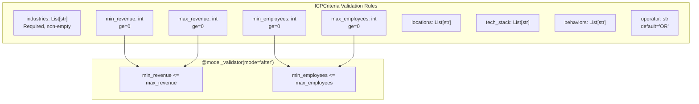

The `check_ranges` model validator ensures that minimum values never exceed maximum values, preventing nonsensical ICP criteria.

### ThresholdConfig Schema

| Field | Type | Description | Constraint |
|:---|:---|:---|:---|
| `min_confidence_score` | `float` | Minimum acceptable confidence | 0.0 - 1.0 |
| `max_errors_allowed` | `int` | Maximum errors before pipeline failure | >= 0 |
| `hitl_confidence_threshold` | `float` | Below this, HITL review triggered | 0.0 - 1.0 |
| `auto_approve_threshold` | `float` | Above this, auto-approved | 0.0 - 1.0 |

### PersonaDefinition Schema

| Field | Type | Default | Description |
|:---|:---|:---:|:---|
| `job_titles` | `List[str]` | Required | Target job titles (e.g., "CTO", "VP Engineering") |
| `seniority_levels` | `List[str]` | Required | Target seniority (e.g., "C-Level", "VP") |
| `functions` | `List[str]` | Required | Target functions (e.g., "Engineering", "Product") |
| `exclude_titles` | `List[str]` | `[]` | Titles to exclude from matching |

---

## GraphState Contract Specification

### Complete Field Reference

| Field | Type | Reducer | Default | Description |
|:---|:---|:---|:---:|:---|
| `prospect_id` | `str` | None | `""` | Unique prospect identifier |
| `current_trigger_event` | `str` | None | `""` | Event that triggered the workflow |
| `config` | `Annotated[dict, add_dict]` | `add_dict` | `{}` | Runtime configuration (ICP, persona, thresholds) |
| `data` | `Annotated[dict, add_dict]` | `add_dict` | `{}` | Accumulated agent data (firmographics, tech stack, contacts, etc.) |
| `executed_agents` | `Annotated[list, add_list]` | `add_list` | `[]` | List of agents that have executed |
| `dispatched_agents` | `Annotated[list, add_list]` | `add_list` | `[]` | Agents dispatched for parallel execution |
| `errors` | `Annotated[list, add_list]` | `add_list` | `[]` | Error messages from failed agents |
| `retry_counts` | `Annotated[dict, add_dict]` | `add_dict` | `{}` | Per-agent retry counters |
| `confidence_score` | `float` | None | `0.0` | Overall confidence score (0.0 - 1.0) |
| `has_conflict` | `bool` | None | `False` | Whether data conflicts were detected |
| `validation_notes` | `Annotated[list, add_list]` | `add_list` | `[]` | Validation notes from cross-validator |
| `recent_thoughts` | `Annotated[list, add_list]` | `add_list` | `[]` | Agent reasoning thoughts for SSE broadcast |
| `execution_trace` | `Annotated[list, add_list]` | `add_list` | `[]` | Complete execution audit trail |
| `overall_status` | `str` | None | `"PENDING"` | Current workflow status |
| `human_override_payload` | `str` | None | `""` | HITL reviewer's response payload |
| `next_node` | `str \| list[str]` | None | `""` | Planner's routing decision |
| `last_agent` | `str` | None | `""` | Most recently executed agent name |
| `custom_workflow_steps` | `dict \| list \| None` | None | `None` | Custom DAG definition |
| `custom_workflow_id` | `str` | None | `""` | UUID of attached custom workflow |
| `next_custom_agent` | `str` | None | `""` | Custom agent to execute next |
| `simulate_failure` | `bool` | None | `False` | Testing flag for failure simulation |

### ValidationNote TypedDict

| Field | Type | Description |
|:---|:---|:---|
| `level` | `str` | Severity: `"INFO"`, `"WARN"`, `"ERROR"` |
| `message` | `str` | Human-readable validation message |
| `source_agent` | `str` | Agent that generated the note |
| `timestamp` | `float` | Unix timestamp of the note |

### Reducer Function Specifications

**`add_dict(left: dict, right: dict) -> dict`**

Merges two dictionaries. Right-side values take precedence for conflicting keys:

```python
def add_dict(left: dict, right: dict) -> dict:
    return {**left, **right}
```

**`add_list(left: list, right: list) -> list`**

Concatenates two lists:

```python
def add_list(left: list, right: list) -> list:
    return left + right
```

---

## API Request/Response Contracts

### Prospect Submission

**Request:** `POST /api/prospects`
```json
{
    "company_name": "Acme Corp",
    "website": "https://acme.com"
}
```

**Response:** `200 OK`
```json
{
    "id": "550e8400-e29b-41d4-a716-446655440000",
    "display_id": "P-001",
    "company_name": "Acme Corp",
    "status": "PENDING",
    "updated_at": "2024-01-15T10:30:00Z"
}
```

### HITL Approval

**Request:** `POST /api/hitl/{id}/approve`
```json
{
    "corrections": {
        "firmographics": {
            "employeeCount": 150
        }
    }
}
```

**Response:** `200 OK`
```json
{
    "status": "ok"
}
```

### Custom Agent Creation

**Request:** `POST /api/agents`
```json
{
    "name": "competitive_analyst",
    "description": "Analyzes competitive landscape",
    "system_prompt": "You are a competitive intelligence analyst...",
    "allowed_tools": ["WebSearch", "Crunchbase"]
}
```

### Workflow Creation

**Request:** `POST /api/workflows`
```json
{
    "name": "Fast Qualification",
    "description": "Quick qualification pipeline",
    "steps": {
        "nodes": [
            {"id": "1", "data": {"agentId": "enricher_node"}},
            {"id": "2", "data": {"agentId": "score_node"}}
        ],
        "edges": [
            {"source": "1", "target": "2"}
        ]
    }
}
```

---

## Configuration Schema Design

### Default Configuration Structure

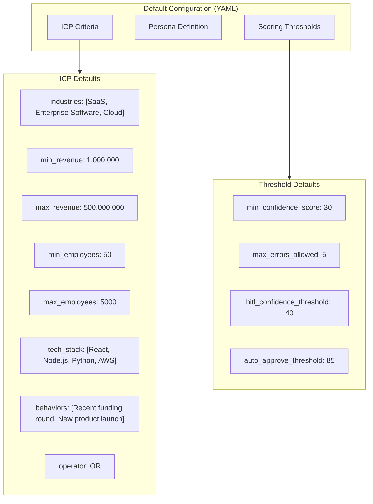

### Configuration Layering

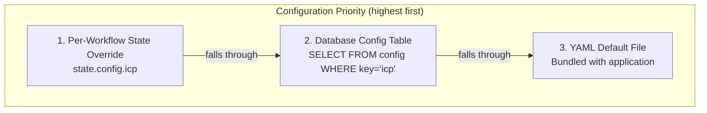

---

## Index Strategy

| Table | Column(s) | Index Type | Purpose |
|:---|:---|:---|:---|
| `prospects` | `company_name` | B-tree | Fast company name lookup |
| `prospects` | `status` | B-tree | Status-based filtering |
| `prospects` | `display_id` | B-tree | Human-readable ID lookup |
| `hitl_requests` | `decision` | B-tree | Pending request queries (WHERE decision IS NULL) |
| `hitl_requests` | `display_id` | B-tree | Human-readable ID lookup |
| `custom_agents` | `name` | B-tree | Agent name resolution |
| `workflows` | `name` | B-tree | Workflow name lookup |

---

## Connection Pool Design

### Async Engine Configuration

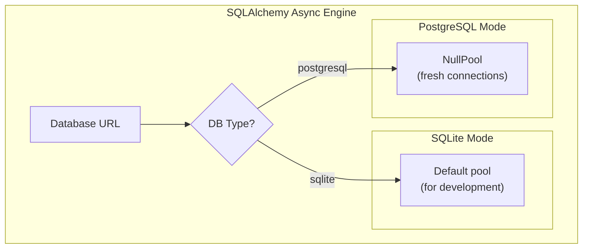

**NullPool Rationale:** In production with a single worker and multiple background tasks, `NullPool` ensures:
- No stale connections in pool
- No connection leak from orphaned checkouts
- Each operation gets a fresh connection
- Connection closure is deterministic

### Session Factory Pattern

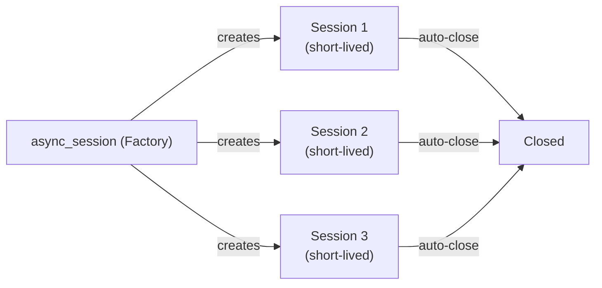

The `MemoryService` and `dependencies.py` both use the session factory pattern:

```python
async def get_session() -> AsyncSession:
    async with async_session() as session:
        yield session
```

This ensures every database operation uses a fresh, properly scoped session that is automatically closed when the operation completes.

---

<p align="center">
  <a href="README.md">Backend README</a> &#8226;
  <a href="CLASS_DIAGRAM.md">Class Diagrams</a> &#8226;
  <a href="SEQUENCE_FLOW.md">Sequence Flows</a> &#8226;
  <a href="SOLID_PRINCIPLES.md">SOLID</a> &#8226;
  <a href="RELIABILITY.md">Reliability</a> &#8226;
  <a href="AGENTIC_FLOW.md">Agentic Flow</a> &#8226;
  <a href="APPLICATION_FLOW.md">App Flow</a>
</p>
