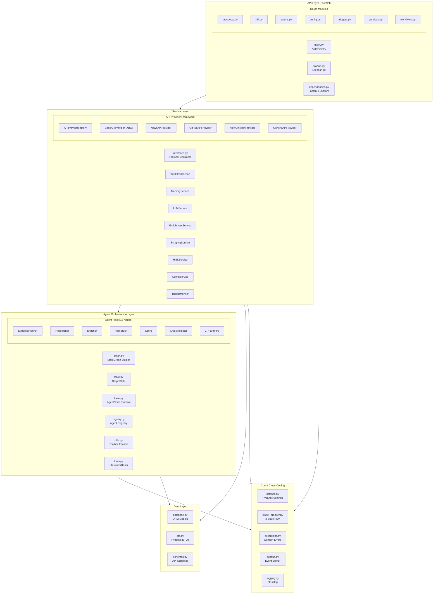
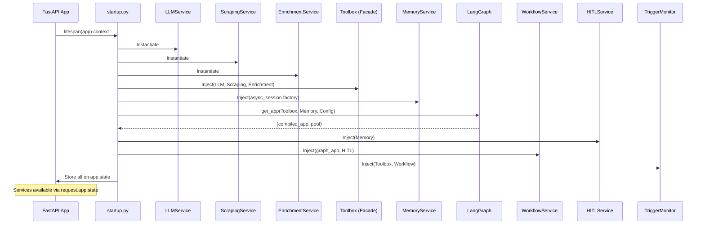

<p align="center">
  
  
  
  
  
  
</p>

<h1 align="center">Backend Architecture</h1>

<p align="center">
  <strong>A production-hardened, SOLID-compliant Python backend powering an enterprise multi-agent AI orchestration platform for B2B prospect qualification.</strong>
</p>

---

## Table of Contents

- [Architecture Overview](#architecture-overview)
- [Module Guide](#module-guide)
- [Dependency Injection Architecture](#dependency-injection-architecture)
- [API Reference](#api-reference)
- [Agent Orchestration Layer](#agent-orchestration-layer)
- [Service Layer](#service-layer)
- [Data Layer](#data-layer)
- [Configuration Management](#configuration-management)
- [Testing Strategy](#testing-strategy)
- [Engineering Documentation](#engineering-documentation)

---

## Architecture Overview

The backend is structured as a **clean layered architecture** with strict unidirectional dependencies. Each layer communicates exclusively through well-defined interfaces (Protocol types), ensuring that implementation details never leak across boundaries.



### Design Principles

The backend is built on four foundational engineering principles:

**1. Protocol-First Interface Design** -- Every service boundary is defined by a `typing.Protocol` class. The `Toolbox` facade, which is the single entry point for all agent-to-service communication, accepts protocol-typed dependencies. This means any service can be replaced with a test double, a mock, or an entirely different implementation without modifying a single line of agent code.

**2. Decorator-Driven Extensibility** -- The `@register_agent` decorator enables zero-touch graph wiring. When a developer creates a new agent class and decorates it, the `AgentRegistry` singleton automatically picks it up, and the `setup_graph()` function dynamically adds it to the `StateGraph` with appropriate edges. No configuration files, no manual wiring, no graph code changes.

**3. State-as-Data-Bus** -- The `GraphState` TypedDict serves as an immutable data contract between all agents. It uses `Annotated` types with custom reducer functions to safely merge updates from parallel execution branches, eliminating an entire class of concurrency bugs.

**4. Defense-in-Depth Reliability** -- Every external call is protected by a circuit breaker. Every agent is wrapped in fault-isolation. Event processing uses the outbox pattern. LLM calls have multi-provider failover with round-robin rotation. The system is designed to gracefully degrade rather than catastrophically fail.

---

## Module Guide

### `src/agent/` -- Agent Orchestration Layer

| File | Responsibility | Key Pattern |
|:---|:---|:---|
| `base.py` | `AgentNode` Protocol and `SafeAgentWrapper` | Protocol + Decorator |
| `graph.py` | LangGraph `StateGraph` construction and compilation | Builder Pattern |
| `state.py` | `GraphState` TypedDict with annotated reducers | Data Bus |
| `registry.py` | `AgentRegistry` singleton with `@register_agent` decorator | Registry + Decorator |
| `utils.py` | `Toolbox` facade aggregating all service interfaces | Facade Pattern |
| `tools.py` | LangChain `StructuredTool` definitions for custom agents | Strategy Pattern |
| `agents/` | 16+ specialized agent node implementations | Open/Closed Principle |

### `src/services/` -- Business Logic Layer

| File | Responsibility | Key Pattern |
|:---|:---|:---|
| `interfaces.py` | Protocol contracts for all services | Dependency Inversion |
| `llm_service.py` | Multi-provider LLM with round-robin failover | Pool + Failover |
| `enrichment_service.py` | Data enrichment via Tavily Search + LLM extraction | Strategy + Facade |
| `scraping_service.py` | Web scraping with tech stack detection | Template Method |
| `memory_service.py` | PostgreSQL-backed state persistence | Repository Pattern |
| `workflow_service.py` | LangGraph workflow execution and SSE broadcasting | Observer Pattern |
| `hitl_service.py` | Human-in-the-loop request lifecycle | State Machine |
| `config_service.py` | Runtime configuration with YAML defaults | Layered Config |
| `trigger_monitor.py` | Event-driven polling with outbox pattern | Outbox + Polling |
| `api_providers/` | Pluggable external API provider framework | Factory + Strategy |

### `src/core/` -- Cross-Cutting Concerns

| File | Responsibility | Key Pattern |
|:---|:---|:---|
| `settings.py` | Pydantic-based centralized configuration | Singleton |
| `circuit_breaker.py` | 3-state FSM for external call protection | Circuit Breaker |
| `exceptions.py` | Domain exception hierarchy | Exception Hierarchy |
| `pubsub.py` | In-memory publish/subscribe event broker | Observer Pattern |
| `logging.py` | Structured JSON logging via structlog | Cross-Cutting |
| `auth.py` | Authentication middleware | Middleware |

### `src/models/` -- Data Layer

| File | Responsibility | Key Pattern |
|:---|:---|:---|
| `database.py` | SQLAlchemy ORM models (7 tables) with async engine | Active Record |
| `dto.py` | Pydantic DTOs for inter-layer data transfer | Transfer Object |
| `schemas.py` | API request/response schemas with validation | Schema Validation |

---

## Dependency Injection Architecture

The backend uses a **lifespan-managed dependency injection** pattern that bootstraps all services during application startup and injects them into the FastAPI application state:



This architecture ensures:
- **Single instantiation** of expensive resources (LLM pools, database connections)
- **Explicit dependency graph** with no hidden singletons
- **Graceful shutdown** with proper resource cleanup (connection pools, background tasks)
- **Testability** through dependency override in the FastAPI test client

---

## API Reference

The backend exposes a comprehensive REST API across 7 route modules:

### Prospect Management

| Method | Endpoint | Description |
|:---:|:---|:---|
| `GET` | `/api/prospects` | List prospects with optional status and company name filters |
| `POST` | `/api/prospects` | Submit a new prospect for qualification |
| `GET` | `/api/prospects/{id}` | Get detailed prospect state including execution trace |
| `DELETE` | `/api/prospects/{id}` | Remove a prospect record |
| `GET` | `/api/prospects/{id}/stream` | SSE stream for real-time agent thought updates |

### Human-in-the-Loop

| Method | Endpoint | Description |
|:---:|:---|:---|
| `GET` | `/api/hitl/pending` | List all pending HITL review requests |
| `GET` | `/api/hitl/{id}` | Get HITL request details with prospect context |
| `POST` | `/api/hitl/{id}/approve` | Approve a prospect with optional corrections |
| `POST` | `/api/hitl/{id}/reject` | Reject a prospect |

### Agent Management

| Method | Endpoint | Description |
|:---:|:---|:---|
| `GET` | `/api/agents` | List custom agents |
| `GET` | `/api/agents/core` | List core (built-in) agents |
| `GET` | `/api/agents/tools` | List available tools for custom agents |
| `POST` | `/api/agents` | Create a new custom agent |
| `DELETE` | `/api/agents/{id}` | Delete a custom agent |
| `GET` | `/api/agents/{id}/logs/stream` | SSE stream for custom agent execution logs |

### Configuration

| Method | Endpoint | Description |
|:---:|:---|:---|
| `GET` | `/api/config/icp` | Get current ICP criteria |
| `PUT` | `/api/config/icp` | Update ICP criteria |
| `GET` | `/api/config/persona` | Get buyer persona definition |
| `PUT` | `/api/config/persona` | Update buyer persona |
| `GET` | `/api/config/thresholds` | Get scoring thresholds |
| `PUT` | `/api/config/thresholds` | Update scoring thresholds |
| `POST` | `/api/config/reset` | Reset all configuration to defaults |

### Triggers

| Method | Endpoint | Description |
|:---:|:---|:---|
| `GET` | `/api/triggers/sources` | List configured trigger sources |
| `POST` | `/api/triggers/sources` | Create a new trigger source |
| `DELETE` | `/api/triggers/sources/{id}` | Delete a trigger source |
| `POST` | `/api/triggers/start` | Start the background trigger monitor |
| `POST` | `/api/triggers/stop` | Stop the background trigger monitor |
| `GET` | `/api/triggers/status` | Get trigger monitor running status |

### Workflows

| Method | Endpoint | Description |
|:---:|:---|:---|
| `GET` | `/api/workflows` | List saved custom workflows |
| `POST` | `/api/workflows` | Create a new custom workflow DAG |
| `DELETE` | `/api/workflows/{id}` | Delete a custom workflow |

### Health

| Method | Endpoint | Description |
|:---:|:---|:---|
| `GET` | `/health` | Health check endpoint |

---

## Agent Orchestration Layer

### Graph Construction

The `setup_graph()` function in `graph.py` dynamically constructs the LangGraph `StateGraph`:

1. **Instantiates** the `DynamicPlannerNode` as the entry point
2. **Iterates** over all agents in the `AgentRegistry`, wrapping each in a `SafeAgentWrapper`
3. **Wires** conditional edges from the planner to all registered agents based on the `next_node` state field
4. **Connects** all worker agents back to the planner (hub-and-spoke topology)
5. **Special-cases** the `OutputDispatcherNode` to route directly to `END`

This construction is fully dynamic -- adding a new `@register_agent`-decorated class automatically integrates it into the graph.

### State Management

The `GraphState` TypedDict uses `Annotated` types with custom reducers:

```python
data: Annotated[dict[str, Any], add_dict]          # Merges dicts from parallel branches
executed_agents: Annotated[list[str], add_list]     # Appends agent names
errors: Annotated[list[str], add_list]              # Collects errors across branches
validation_notes: Annotated[list[ValidationNote], add_list]  # Aggregates validation
```

This ensures safe state merging when multiple agents execute in parallel via the planner's fan-out dispatch.

---

## Service Layer

### LLM Service -- Multi-Provider Failover Pool

The `LLMService` maintains two independent model pools:

- **Groq Pool** -- High-throughput models (Llama 3.3 70B, Llama 3.1 8B, GPT-OSS) for fast routing decisions
- **Gemini Pool** -- Google Gemini models (3.1 Flash Lite, 2.5 Flash Lite, 3.5 Flash, 2.5 Flash) for heavy generation tasks

Each pool supports multiple API keys for capacity multiplication. Round-robin rotation ensures even load distribution, and automatic failover cascades from Groq to Gemini when all models in a pool are exhausted. A global async lock enforces a minimum 2.5-second interval between LLM calls to respect rate limits.

### Memory Service -- Repository Pattern

The `MemoryService` implements the Repository pattern with `AsyncSession` factories for short-lived database sessions. Each operation opens and closes its own session, preventing connection leaks and ensuring proper transaction isolation. Key operations include prospect CRUD, HITL request lifecycle, event deduplication, and state persistence.

### Workflow Service -- Async Execution with Real-Time Broadcasting

The `WorkflowService` wraps the compiled LangGraph application and provides:
- **Async task management** -- workflows run as background `asyncio.Task` objects
- **Real-time SSE broadcasting** -- agent thoughts and state updates are published via the `PubSub` broker
- **Interrupt handling** -- detects LangGraph interrupts and delegates to `HITLService` for human review
- **State persistence** -- persists intermediate state after each agent execution for crash recovery

---

## Data Layer

### Database Schema (7 Tables)

| Table | Purpose | Key Columns |
|:---|:---|:---|
| `prospects` | Prospect records with full state JSON | `id`, `company_name`, `status`, `state_json`, `workflow_thread_id` |
| `hitl_requests` | Human review requests linked to prospects | `id`, `prospect_id`, `summary`, `decision`, `corrections` |
| `custom_agents` | User-defined agent definitions | `id`, `name`, `system_prompt`, `allowed_tools` |
| `workflows` | Custom workflow DAG definitions | `id`, `name`, `steps` (JSON DAG) |
| `config` | Runtime configuration key-value store | `key`, `value` (JSON) |
| `trigger_sources` | External event source configurations | `id`, `type`, `url`, `interval_seconds`, `config` |
| `processed_events` | Event deduplication with outbox status tracking | `event_hash`, `status`, `prospect_id` |

---

## Configuration Management

The `Settings` class in `core/settings.py` is the **single source of truth** for all runtime configuration. It uses `pydantic-settings` to load values from environment variables and `.env` files with automatic type coercion and validation. The class provides specialized URL helpers:

- `get_async_db_url()` -- Returns the database URL with the `asyncpg` driver for SQLAlchemy async
- `get_sync_db_url()` -- Returns a synchronous URL for Alembic migrations
- `get_checkpoint_db_url()` -- Returns a raw `postgresql://` URL for LangGraph's checkpointer

---

## Testing Strategy

The test suite is organized into three tiers:

```
tests/
  conftest.py                  # Shared fixtures (test DB, mock services, etc.)
  fixtures/                    # Test data and fixtures
  unit/                        # Unit tests for individual components
  integration/                 # Integration tests for service interactions
  test_e2e.py                 # End-to-end workflow tests
  test_requirements_coverage.py  # Requirement traceability tests
```

Tests are written using `pytest` with `pytest-asyncio` for async test support. The `conftest.py` provides fixtures for mock services, test database sessions, and pre-configured agent instances.

---

## Engineering Documentation

For detailed engineering analysis, refer to the dedicated documentation:

| Document | Focus |
|:---|:---|
| [Class Diagram](CLASS_DIAGRAM.md) | UML class diagrams with full inheritance hierarchies and composition relationships |
| [Sequence Flow](SEQUENCE_FLOW.md) | Sequence diagrams for prospect submission, HITL review, trigger processing, and custom agent execution |
| [SOLID Principles](SOLID_PRINCIPLES.md) | Concrete SOLID implementation analysis with code-level references |
| [Agentic Reliability](RELIABILITY.md) | Circuit breakers, retry logic, outbox pattern, graceful degradation, and fault isolation |
| [Agentic Flow](AGENTIC_FLOW.md) | Dynamic planning algorithm, state management, parallel execution, and custom workflow DAG processing |
| [Low-Level Design](LLD_ARCHITECTURE.md) | Data models, state machines, DTOs, schema validation, and database design |
| [Application Flow](APPLICATION_FLOW.md) | End-to-end application flow from bootstrap through agent execution to real-time event delivery |

---

<p align="center">
  <a href="../README.md">Main README</a> &#8226;
  <a href="CLASS_DIAGRAM.md">Class Diagrams</a> &#8226;
  <a href="SEQUENCE_FLOW.md">Sequence Flows</a> &#8226;
  <a href="SOLID_PRINCIPLES.md">SOLID</a> &#8226;
  <a href="RELIABILITY.md">Reliability</a> &#8226;
  <a href="AGENTIC_FLOW.md">Agentic Flow</a> &#8226;
  <a href="LLD_ARCHITECTURE.md">LLD</a> &#8226;
  <a href="APPLICATION_FLOW.md">App Flow</a>
</p>