<h1 align="center">Agentic Reliability Engineering</h1>

<p align="center">
  <strong>A deep-dive into the reliability engineering practices that make the ICP Agent platform production-grade -- covering circuit breakers, retry strategies, fault isolation, outbox-pattern event processing, graceful degradation, and multi-provider LLM failover.</strong>
</p>

<p align="center">
  
  
  
  
  
</p>

---

## Table of Contents

- [Reliability Architecture Overview](#reliability-architecture-overview)
- [Circuit Breaker Pattern](#circuit-breaker-pattern)
- [Fault Isolation via SafeAgentWrapper](#fault-isolation-via-safeagentwrapper)
- [Outbox Pattern for Event Processing](#outbox-pattern-for-event-processing)
- [LLM Multi-Provider Failover](#llm-multi-provider-failover)
- [Retry Strategies and Error Budgets](#retry-strategies-and-error-budgets)
- [Graceful Degradation Hierarchy](#graceful-degradation-hierarchy)
- [State Durability and Crash Recovery](#state-durability-and-crash-recovery)
- [Rate Limiting and Throttling](#rate-limiting-and-throttling)
- [Observability and Monitoring](#observability-and-monitoring)
- [Failure Scenario Analysis](#failure-scenario-analysis)

---

## Reliability Architecture Overview

The ICP Agent platform implements a **defense-in-depth reliability model** where every layer of the stack has independent failure handling:

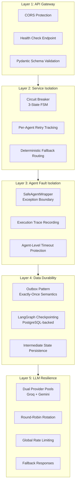

The guiding principle is: **the system should always make forward progress, even when individual components fail.** An LLM timeout doesn't crash the pipeline -- it falls back to the next model. An agent exception doesn't terminate the workflow -- it's caught by the wrapper and recorded in the state. An event processing failure doesn't lose the event -- it's retried on the next poll cycle.

---

## Circuit Breaker Pattern

### Three-State Finite State Machine

The `CircuitBreaker` class implements the classic three-state FSM to protect external service calls:

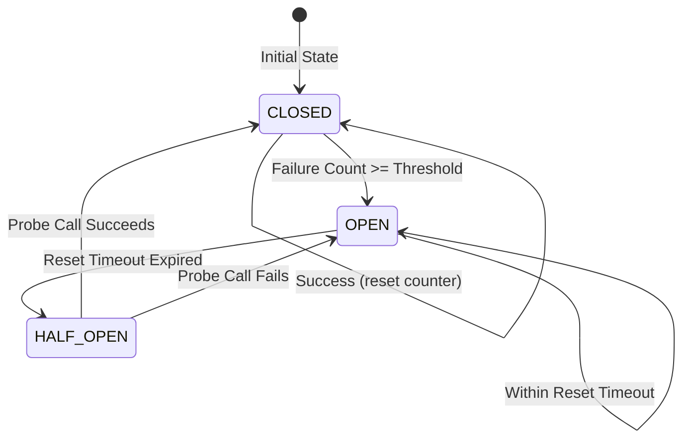

### State Transition Rules

| Current State | Event | Next State | Action |
|:---|:---|:---|:---|
| `CLOSED` | Success | `CLOSED` | Reset failure counter to 0 |
| `CLOSED` | Failure (count < threshold) | `CLOSED` | Increment failure counter |
| `CLOSED` | Failure (count >= threshold) | `OPEN` | Trip breaker, record timestamp |
| `OPEN` | Any call (within timeout) | `OPEN` | Reject immediately (fast-fail) |
| `OPEN` | Timeout expired | `HALF_OPEN` | Allow a single probe call |
| `HALF_OPEN` | Probe success | `CLOSED` | Reset counter, resume normal operation |
| `HALF_OPEN` | Probe failure | `OPEN` | Re-trip breaker, reset timeout |

### Configuration

| Parameter | Default | Purpose |
|:---|:---:|:---|
| `failure_threshold` | 3 | Number of consecutive failures before tripping |
| `reset_timeout_sec` | 30 | Seconds to wait before allowing a probe call |

### Per-Service State Tracking

The circuit breaker tracks state independently for each external service:

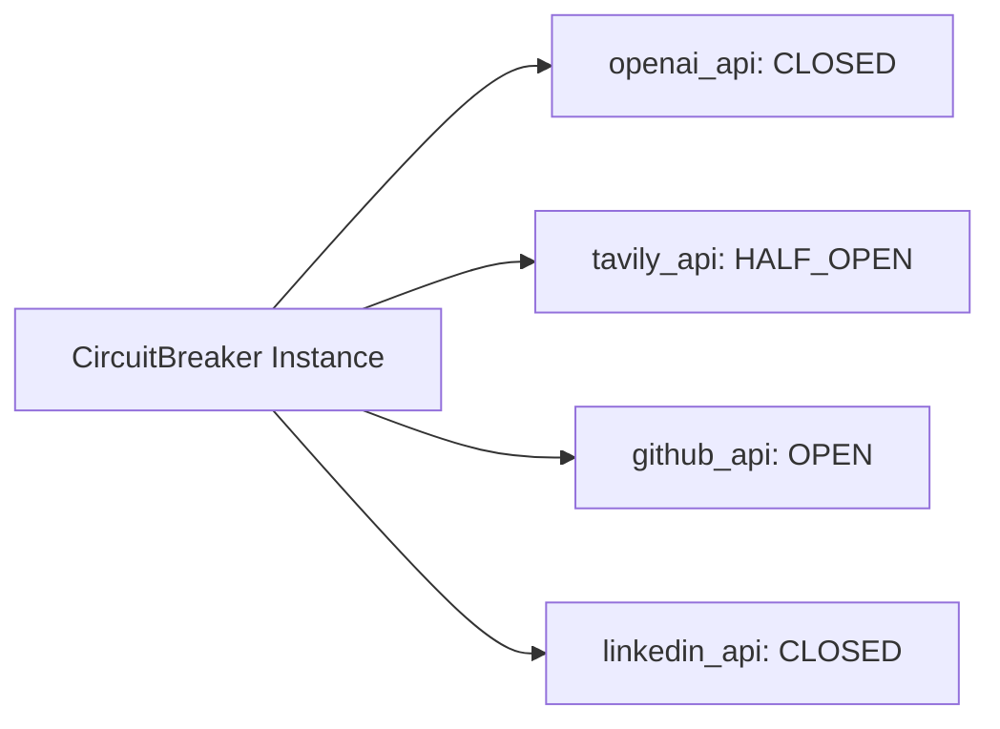

This means a failure in the GitHub API won't block calls to Tavily or LinkedIn. Each service degrades independently.

### Integration Point

The circuit breaker is integrated into the `Toolbox` facade, which is the single point of contact between agents and external services:

```python
class Toolbox:
    def __init__(self, llm_service, scraping_service, enrichment_service):
        self.circuit_breaker = CircuitBreaker()
        # ...
```

### Production Scaling Note

The current implementation is in-memory, suitable for single-worker deployments. The codebase includes an explicit note for production scaling:

> *"In a multi-worker cluster, replace CircuitBreaker with a Redis-backed implementation so all workers share failure counts."*

---

## Fault Isolation via SafeAgentWrapper

### The SafeAgentWrapper Pattern

Every agent in the LangGraph workflow is wrapped in a `SafeAgentWrapper` that provides a **hard exception boundary**:

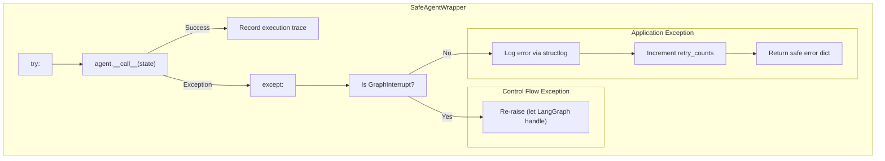

### What the Wrapper Provides

| Capability | Description |
|:---|:---|
| **Exception Isolation** | Unhandled exceptions in any agent are caught and converted to safe state updates, preventing workflow crashes |
| **Execution Tracing** | Every agent execution records its name, timestamp, duration, thoughts, and updates in the `execution_trace` list |
| **Retry Tracking** | The wrapper maintains per-agent retry counts in the graph state, enabling the planner to make informed retry/skip decisions |
| **Control Flow Preservation** | LangGraph control flow exceptions (`GraphInterrupt`, `NodeInterrupt`) are explicitly re-raised, ensuring HITL interrupts work correctly |
| **Agent Identity** | The wrapper sets `last_agent` in the state, allowing the planner to know which agent just executed |

### Execution Trace Record

Each agent execution produces a trace record:

```python
trace_record = {
    "agent": "enricher_node",
    "timestamp": 1719648000.0,
    "duration_seconds": 2.3,
    "recent_thoughts": ["Extracted firmographic data for Acme Corp"],
    "updates": {"data": {"firmographics": {...}}}
}
```

This creates a complete audit trail of the pipeline execution, invaluable for debugging and observability.

---

## Outbox Pattern for Event Processing

### The Problem

When processing external events (RSS feeds, GitHub webhooks, News API articles), the system must guarantee that each event is processed **exactly once**, even in the face of process crashes.

### The Solution: Two-Phase Outbox

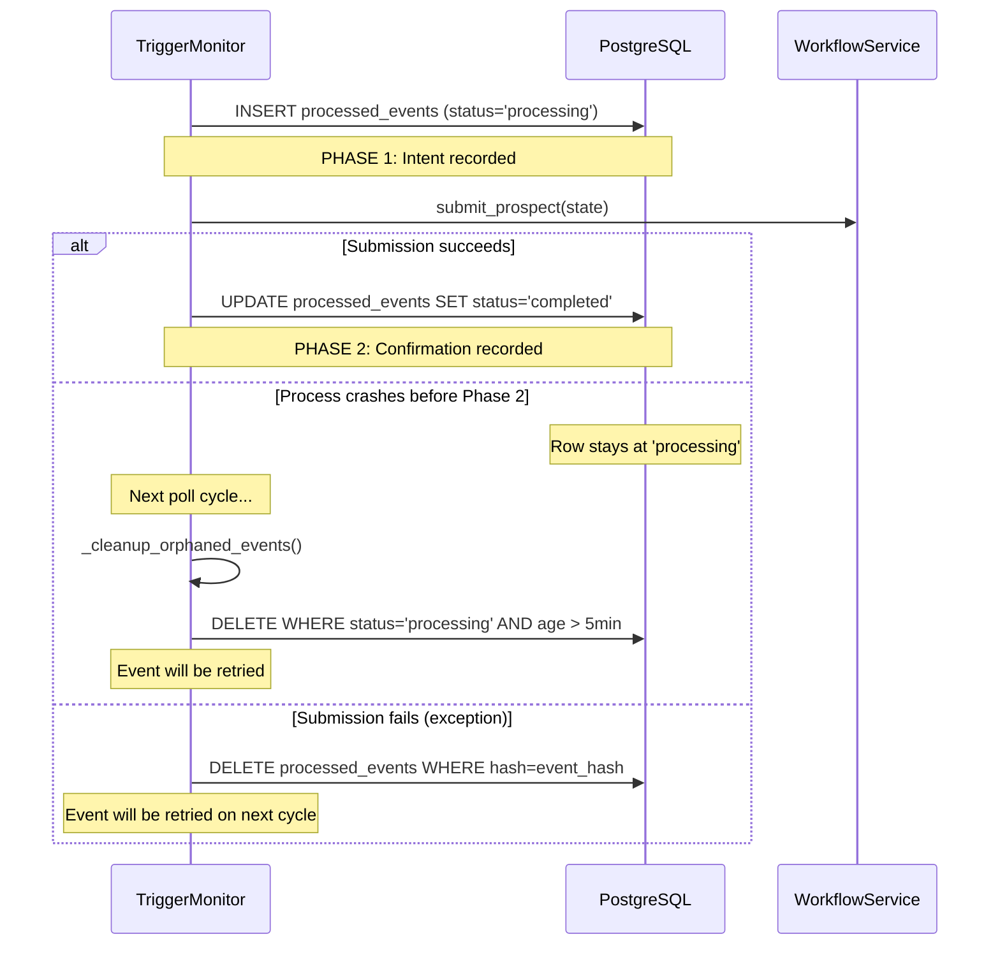

### Orphan Cleanup

The `_cleanup_orphaned_events()` method runs at the start of every poll cycle:

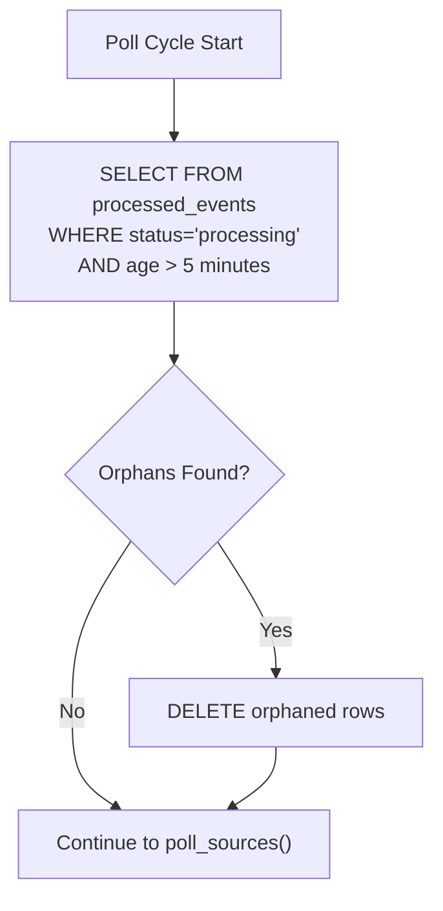

### Concurrency Protection

The `mark_event_processed()` method uses database-level `IntegrityError` handling:

```python
async def mark_event_processed(self, event_hash: str, prospect_id: str, status: str) -> bool:
    try:
        event = ProcessedEvent(event_hash=event_hash, ...)
        session.add(event)
        await session.commit()
        return True
    except IntegrityError:
        await session.rollback()
        return False  # Another worker already claimed this event
```

If two workers attempt to process the same event simultaneously, only one will succeed -- the other will receive `False` and skip the event.

---

## LLM Multi-Provider Failover

### Dual-Pool Architecture

The `LLMService` maintains two independent model pools for maximum resilience:

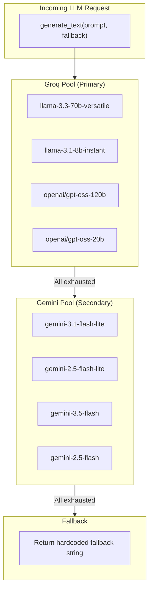

### Failover Cascade

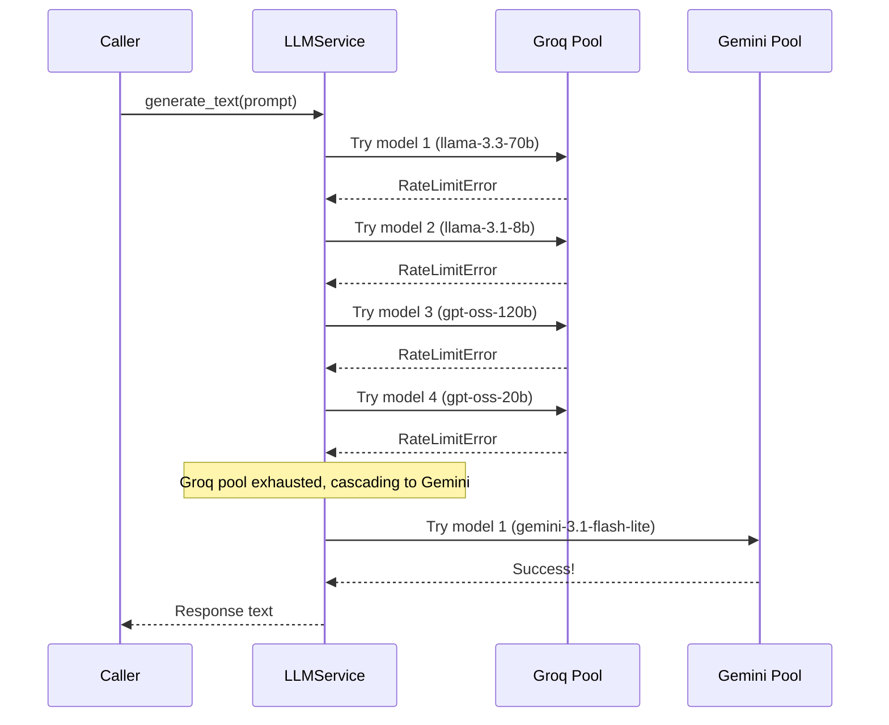

### Key-Multiplication Strategy

Multiple API keys per provider create a multiplicative pool size:

```
Groq: 2 keys x 4 models = 8 model instances
Gemini: 5 keys x 4 models = 20 model instances
Total: 28 model instances in the failover chain
```

This means the system can absorb up to 27 consecutive failures before falling back to the hardcoded response.

### Round-Robin Rotation

Each successful or failed call rotates the model to the end of the pool, ensuring even load distribution and preventing a single failing model from being hammered repeatedly.

---

## Retry Strategies and Error Budgets

### Per-Agent Retry Tracking

Retry counts are tracked per-agent in the `GraphState`:

```python
retry_counts: Annotated[dict[str, int], add_dict]
```

The `SafeAgentWrapper` increments the count on failure:

```python
retry_counts = state.get("retry_counts", {})
current_retries = retry_counts.get(self.agent_name, 0)
return {
    "retry_counts": {self.agent_name: current_retries + 1}
}
```

### Simulate Failure Toggle

The `DynamicPlannerNode` includes a built-in failure simulation mode for testing:

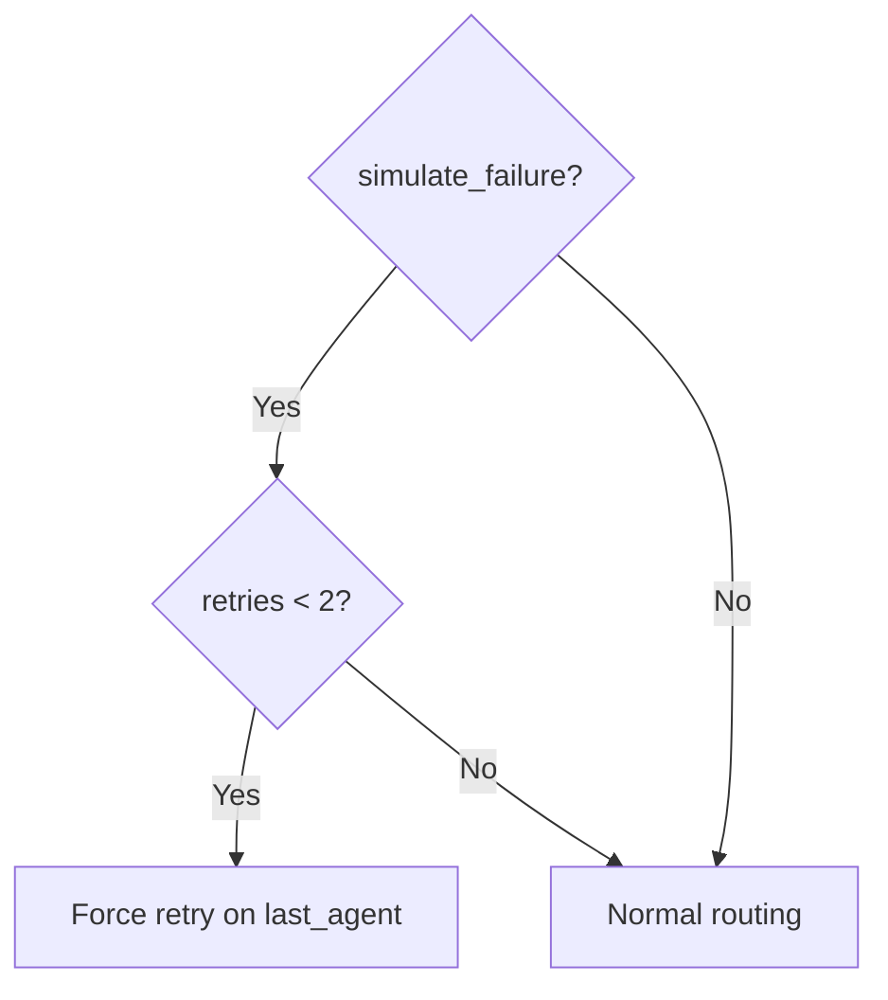

This allows the system to be tested under failure conditions without actually breaking external services.

### Recursion Limit

The LangGraph workflow is compiled with `recursion_limit=100`, providing an absolute ceiling on the number of planner-agent cycles. This prevents infinite loops in pathological cases.

---

## Graceful Degradation Hierarchy

The platform implements a multi-level graceful degradation strategy:

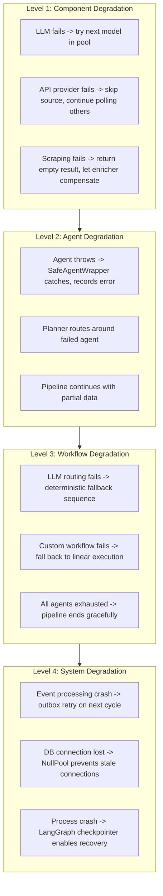

### Fallback Response Strategy

Every `generate_text()` call includes a hardcoded `fallback` parameter. If all LLM models are exhausted, the system returns a safe, parseable fallback rather than crashing:

```python
await self.llm_service.generate_text(
    prompt=prompt,
    fallback='{"next_node": "fallback", "reasoning": "fallback"}',  # Valid JSON
    require_json=True,
    strategy="fast"
)
```

---

## State Durability and Crash Recovery

### LangGraph Checkpointing

The entire workflow state is checkpointed to PostgreSQL via `AsyncPostgresSaver`:

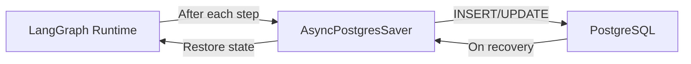

If the process crashes mid-workflow, the state can be recovered from the last checkpoint, and the workflow can be resumed from where it left off.

### Intermediate State Persistence

Beyond checkpointing, the `WorkflowService` explicitly persists the current state to the `prospects` table after every agent execution:

```python
# After each on_chain_end event:
current_state = await self._app.aget_state(config)
async with async_session() as persist_session:
    ms = MemoryService(lambda s=persist_session: s)
    await ms.save_prospect_state(current_state.values)
```

This means the UI always reflects the latest state, even if the workflow is still running.

### Connection Pool Strategy

The database uses `NullPool` for the async engine, ensuring that every connection is created fresh and closed immediately:

```python
if not db_url.startswith("sqlite"):
    from sqlalchemy.pool import NullPool
    engine_kwargs["poolclass"] = NullPool
```

This prevents stale connections, connection leaks, and pool exhaustion in long-running processes -- a critical reliability measure for production deployments.

---

## Rate Limiting and Throttling

### Global LLM Rate Limiting

A global async lock enforces a minimum interval between LLM calls:

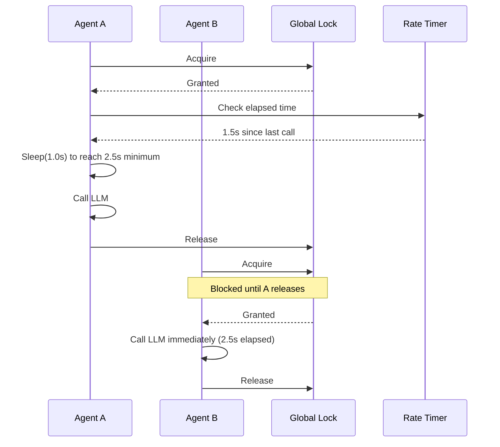

### Trigger Monitor Throttling

The trigger monitor implements two levels of throttling:

| Throttle | Duration | Purpose |
|:---|:---:|:---|
| Per-source interval | Configurable (default 3600s) | Respects configured polling frequency |
| Inter-provider sleep | 0.5s | Prevents burst rate limits across API providers |
| Inter-submission sleep | 15s | Protects free-tier LLM rate limits from pipeline floods |

---

## Observability and Monitoring

### Structured Logging

All logging uses `structlog` for machine-parseable structured output:

```python
logger.info("DynamicPlanner: LLM selected next node",
    prospect_id=prospect_id,
    next_node=next_node,
    reasoning=parsed.get("reasoning"))
```

### Execution Trace

The `execution_trace` in `GraphState` provides a complete audit trail:

```python
execution_trace: Annotated[list[dict], add_list]
```

Each trace record includes the agent name, timestamp, duration, thoughts, and state updates.

### PubSub Event Broadcasting

Real-time events are broadcast to connected SSE clients:

| Event Type | Content |
|:---|:---|
| `thought` | Agent reasoning and decisions |
| `action` | Agent completion notifications |
| `state_update` | Full state snapshot after each agent |

---

## Failure Scenario Analysis

| Scenario | Impact | Recovery Mechanism |
|:---|:---|:---|
| Single LLM model rate limited | None visible | Automatic rotation to next model in pool |
| All Groq models exhausted | Increased latency | Cascade to Gemini pool |
| All LLM models exhausted | Agent uses fallback response | Hardcoded fallback string |
| Agent throws unhandled exception | Agent skipped, error recorded | SafeAgentWrapper catches, planner routes around |
| LLM routing fails | Slightly suboptimal order | Deterministic fallback sequence |
| Database connection lost | Request fails | NullPool creates fresh connection on retry |
| Process crash during event processing | Event appears lost | Outbox cleanup retries on next poll cycle |
| Process crash during workflow | Workflow paused | LangGraph checkpointer enables resume |
| External API returns 429 | Call blocked temporarily | Circuit breaker trips, auto-recovers after timeout |
| External API goes down permanently | Service degraded | Circuit breaker stays OPEN, system works without that data |

---

<p align="center">
  <a href="README.md">Backend README</a> &#8226;
  <a href="CLASS_DIAGRAM.md">Class Diagrams</a> &#8226;
  <a href="SEQUENCE_FLOW.md">Sequence Flows</a> &#8226;
  <a href="SOLID_PRINCIPLES.md">SOLID</a> &#8226;
  <a href="AGENTIC_FLOW.md">Agentic Flow</a> &#8226;
  <a href="LLD_ARCHITECTURE.md">LLD</a> &#8226;
  <a href="APPLICATION_FLOW.md">App Flow</a>
</p>