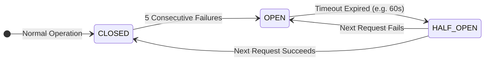

# 🛡️ Enterprise Reliability & Fault Tolerance

  
  

In B2B SaaS, dropped requests equal lost revenue. We have engineered the ICP-X backend with **obsessive reliability**. We assume every external API will fail, the database will experience latency spikes, and pods will be preempted.

Here is how we achieve absolute resilience.

---

## 🔌 Connection Pooling Excellence

FastAPI is highly asynchronous, which can easily overwhelm a traditional PostgreSQL database by opening too many simultaneous connections.

- **PgBouncer Integration**: We route all database traffic through a transaction-pooling PgBouncer instance.
- **SQLAlchemy Async Engine**: We configure SQLAlchemy with a strict `pool_size` and `max_overflow`, ensuring the application throttles itself gracefully under extreme load rather than crashing the database.

## ⚡ Circuit Breakers & Fallbacks

We rely on multiple external LLM providers and data enrichment APIs. We wrap all external calls in stateful Circuit Breakers.

- **CLOSED**: Traffic flows normally.
- **OPEN**: The API is considered dead. We instantly short-circuit and return a cached response or trigger a graceful degradation path (e.g., fallback to a cheaper, more reliable LLM) without waiting for HTTP timeouts.
- **HALF_OPEN**: We cautiously allow one request through to test if the upstream service has recovered.

## 🔁 Idempotency by Design

Every single node in our LangGraph agentic flow is **strictly idempotent**. 

If the `ScoringAgent` completes its evaluation but the server loses power before saving to PostgreSQL:
1. The orchestration queue detects the timeout.
2. The job is re-enqueued.
3. The graph resumes from the last known checkpoint.
4. The `ScoringAgent` re-evaluates. 
Because the agent does not produce unintended side effects (like sending an email twice), the system heals itself automatically with zero data corruption.

## ☠️ Dead Letter Queues (DLQ)

If a payload is fundamentally malformed (a "poison pill"), it will fail repeatedly. Once a job exceeds its `max_retries`, it is automatically shunted to a Dead Letter Queue. 

This prevents poison pills from endlessly consuming worker resources, ensuring that healthy traffic continues to flow uninterrupted while developers manually inspect the DLQ.

---
🔙 **[Back to Backend Hub](./README.md)**
