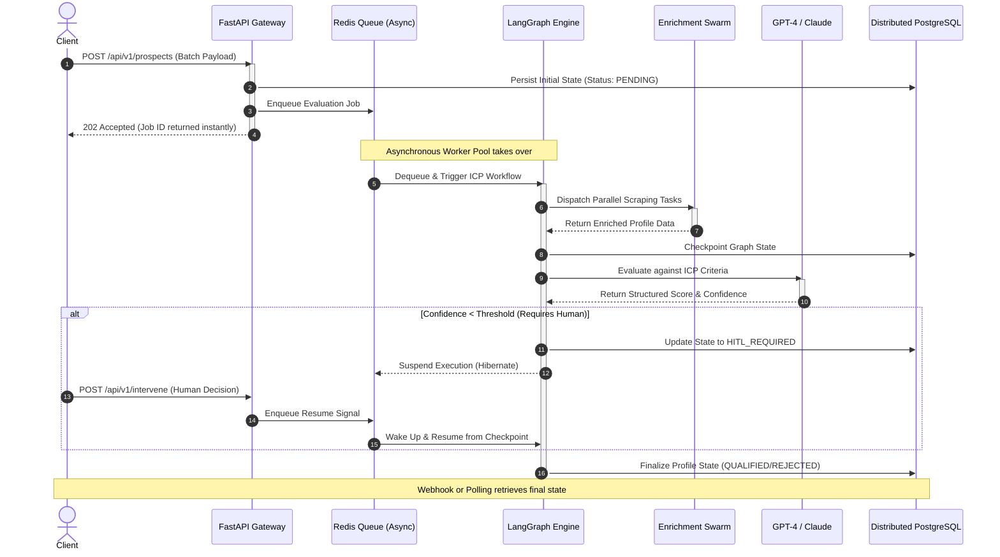

# 🌊 End-to-End Application Flow & Sequences

  
  

Understanding how a request travels through ICP-X is crucial. We have designed an **asynchronous, non-blocking, event-driven pipeline** that can handle thousands of concurrent prospect evaluations without breaking a sweat.

---

## 🚀 The Global Sequence

When a client submits a batch of prospects, the system orchestrates a symphony of API gateways, message queues, agent nodes, and database transactions.

### Macro Sequence Diagram

---

## 🔍 Deep Dive: The API Gateway

The FastAPI layer acts purely as a highly optimized traffic cop. It performs synchronous schema validation via Pydantic V2 (written in Rust) and immediately offloads heavy lifting to the background queue. This ensures that our HTTP response times remain consistently under 50ms, regardless of LLM latency.

## 🔄 Checkpointing & Resumption

Notice Step 6 in the diagram (`Checkpoint Graph State`). This is where the magic happens. Because we checkpoint the entire execution graph to PostgreSQL, the system is entirely resilient to worker crashes. If a Kubernetes pod dies during Step 7 (LLM evaluation), a new pod will wake up, read the checkpoint, and resume *exactly* at Step 7 without re-running the scrapers.

---
🔙 **[Back to Backend Hub](./README.md)**
