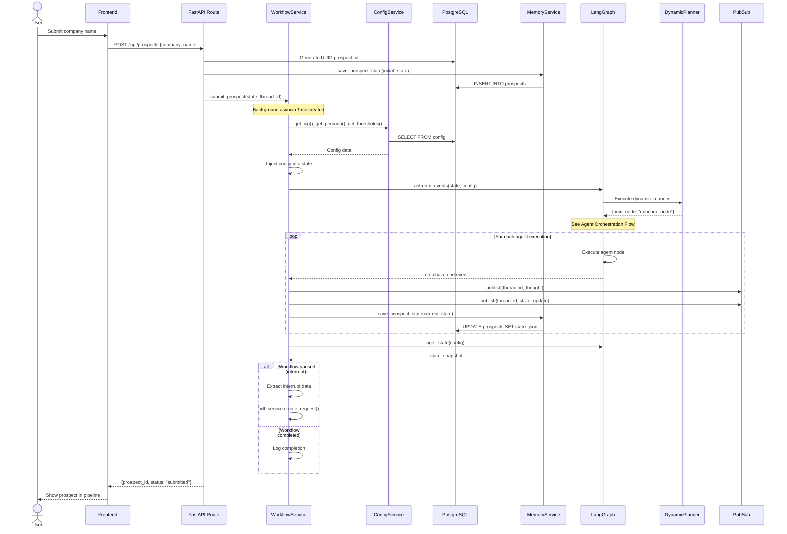
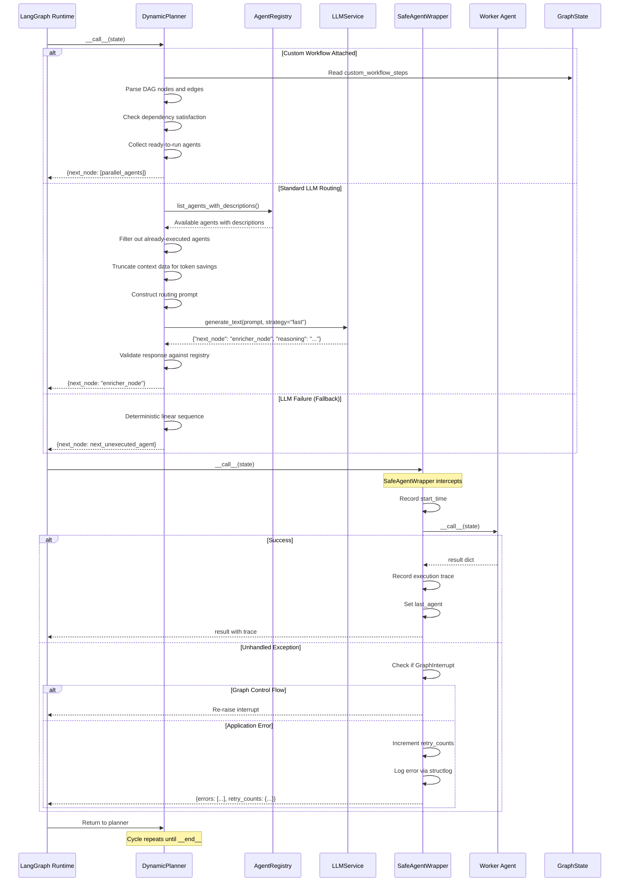
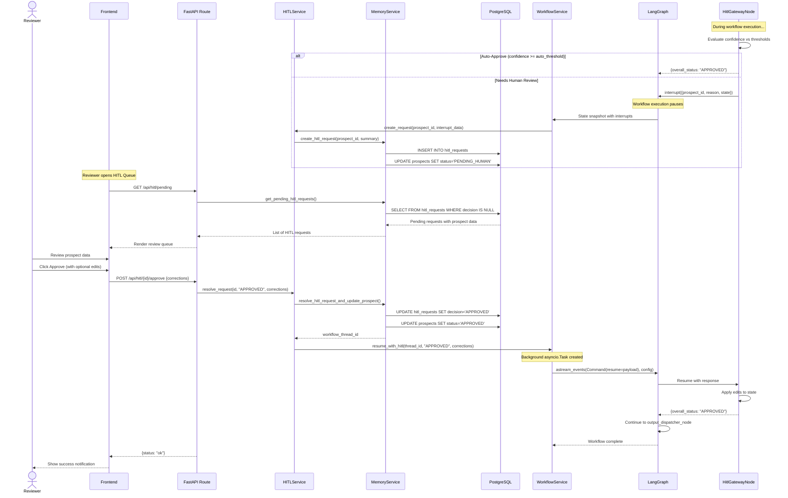
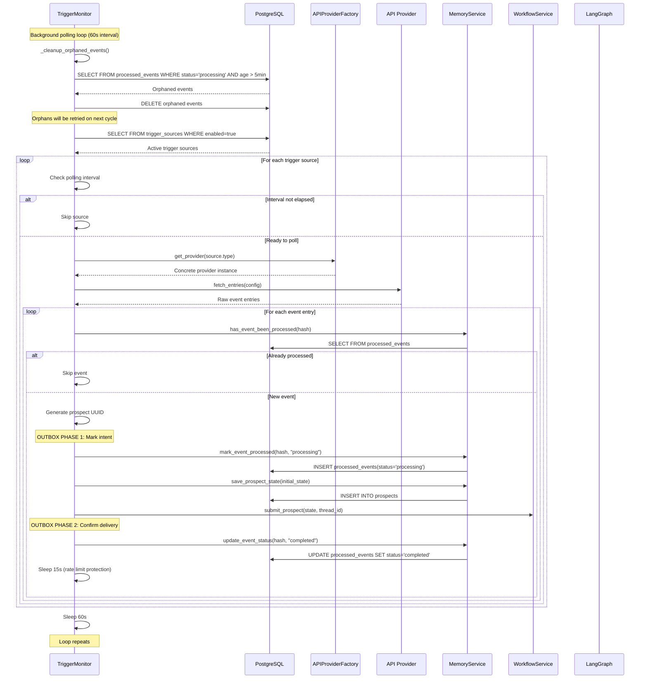
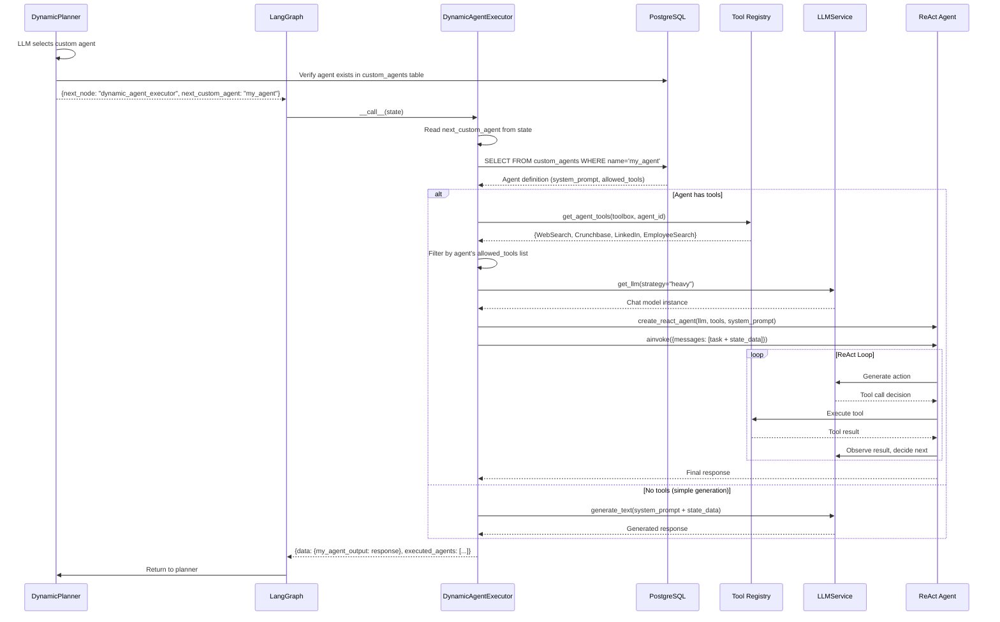
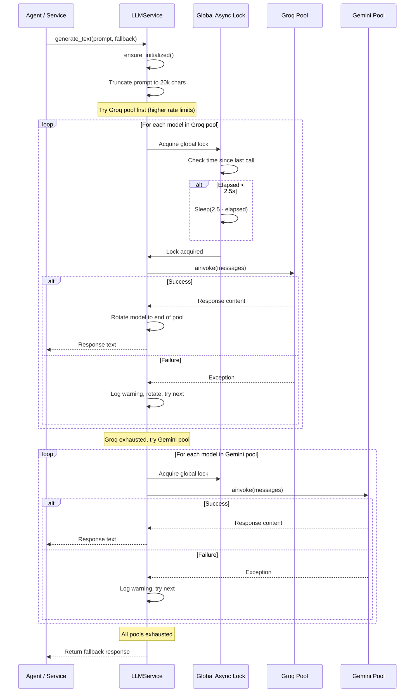
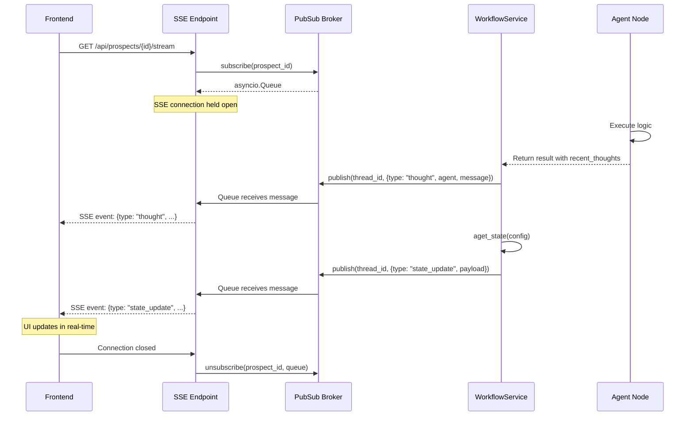
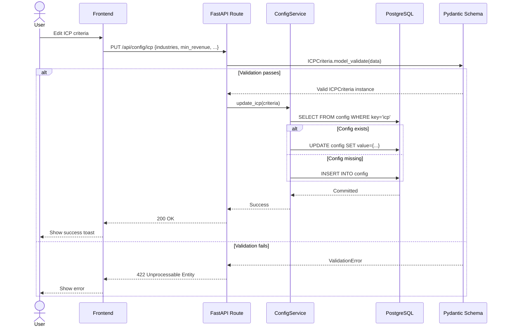
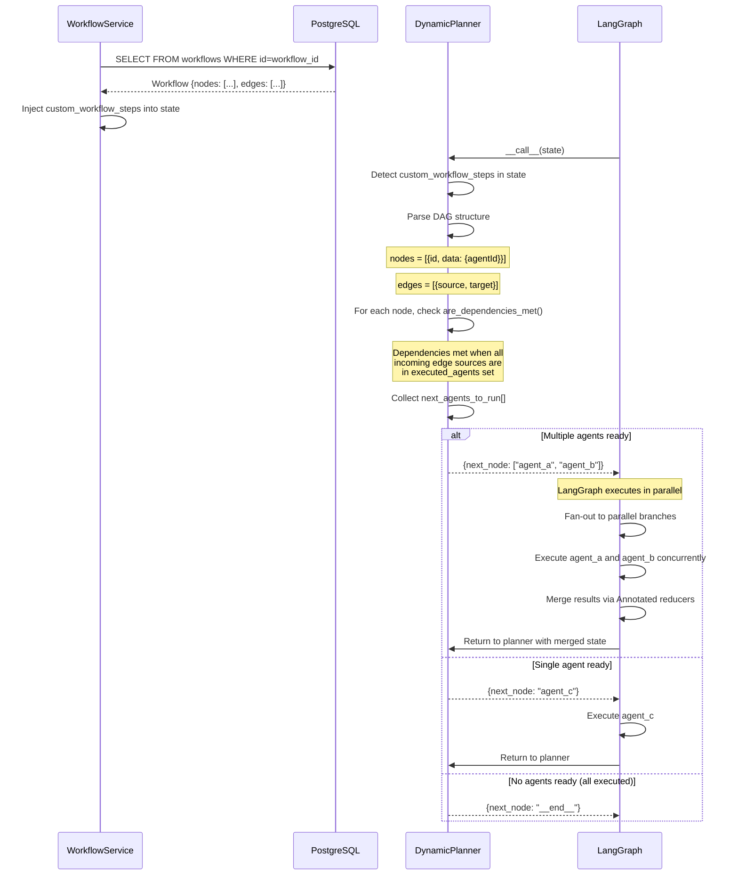

<h1 align="center">Sequence Flow Reference</h1>

  <strong>End-to-end sequence diagrams for every major workflow in the ICP Agent platform -- from prospect submission through agent orchestration, human review, trigger processing, and custom agent execution.</strong>

  
  
  

---

## Table of Contents

- [Prospect Submission Flow](#prospect-submission-flow)
- [Agent Orchestration Flow](#agent-orchestration-flow)
- [Human-in-the-Loop Review Flow](#human-in-the-loop-review-flow)
- [Trigger Monitor Event Processing](#trigger-monitor-event-processing)
- [Custom Agent Execution Flow](#custom-agent-execution-flow)
- [LLM Multi-Provider Failover](#llm-multi-provider-failover)
- [Real-Time SSE Event Delivery](#real-time-sse-event-delivery)
- [Configuration Update Flow](#configuration-update-flow)
- [Custom Workflow DAG Execution](#custom-workflow-dag-execution)

---

## Prospect Submission Flow

This sequence captures the complete lifecycle of a prospect from API submission through workflow execution, agent processing, and state persistence.

**Key Engineering Details:**
- The workflow runs as a detached `asyncio.Task`, allowing the API to return immediately with a 202 Accepted-style response
- Each agent execution triggers an intermediate state persistence to PostgreSQL, enabling crash recovery
- The `PubSub` broker broadcasts real-time thoughts and state updates to any connected SSE subscribers
- The `WorkflowService` stores all background tasks in a `set()` with done callbacks for proper garbage collection

---

## Agent Orchestration Flow

This sequence details how the `DynamicPlannerNode` orchestrates the agent fleet using its three-tier routing strategy.

**Key Engineering Details:**
- The planner constructs a token-optimized prompt by truncating context data to 150 characters per field and limiting list items to 3
- Agent descriptions are capped at 80 characters in the routing prompt to reduce token consumption
- The `SafeAgentWrapper` explicitly checks for `GraphInterrupt` and `NodeInterrupt` exceptions, allowing LangGraph control flow to propagate while catching all application-level errors
- Retry counts are tracked per-agent in the graph state, enabling the planner to make informed retry/skip decisions

---

## Human-in-the-Loop Review Flow

This sequence captures the complete HITL lifecycle from interrupt creation through human review and workflow resumption.

**Key Engineering Details:**
- The HITL gateway supports three confidence tiers: auto-approve (above threshold), human review (below threshold), and auto-reject (missing critical data)
- All DB operations in `resolve_request` execute in a single `AsyncSession` block with `selectinload` to prevent detached-ORM errors
- The workflow resumes **after** the database commit is durable, ensuring data consistency
- Corrections from the reviewer are merged into the graph state via the `data` field, allowing downstream agents to work with human-corrected data

---

## Trigger Monitor Event Processing

This sequence shows the event-driven trigger system with its outbox pattern for guaranteed delivery.

**Key Engineering Details:**
- The outbox pattern ensures exactly-once processing: events are marked `"processing"` before submission and `"completed"` after successful dispatch
- If the process crashes between Phase 1 and Phase 2, the orphan cleanup job deletes stale `"processing"` rows after 5 minutes, allowing retry on the next poll cycle
- A 15-second sleep between prospect submissions protects free-tier LLM rate limits from burst traffic
- A 0.5-second global safety sleep between provider calls prevents burst rate limiting across API providers
- The `mark_event_processed` method uses database-level `IntegrityError` handling to prevent duplicate processing by concurrent workers

---

## Custom Agent Execution Flow

This sequence details how user-created custom agents are executed through the `DynamicAgentExecutorNode`.

**Key Engineering Details:**
- Custom agents are defined in the database with a system prompt and an allowed tools list, making them fully user-configurable at runtime
- When tools are enabled, the executor builds a LangChain ReAct agent that autonomously decides which tools to call based on its system prompt
- Tool execution includes real-time log emission via `Toolbox.emit_event()`, enabling the frontend to display custom agent execution logs in real-time
- The output is stored under `data[<agent_name>_output]` in the graph state, making it accessible to all downstream agents

---

## LLM Multi-Provider Failover

This sequence shows the resilient LLM call path with dual-pool failover and global rate limiting.

---

## Real-Time SSE Event Delivery

---

## Configuration Update Flow

---

## Custom Workflow DAG Execution

This sequence details how custom workflows with parallel execution branches are processed by the Dynamic Planner.

---

  <a href="README.md">Backend README</a> &#8226;
  <a href="CLASS_DIAGRAM.md">Class Diagrams</a> &#8226;
  <a href="SOLID_PRINCIPLES.md">SOLID</a> &#8226;
  <a href="RELIABILITY.md">Reliability</a> &#8226;
  <a href="AGENTIC_FLOW.md">Agentic Flow</a> &#8226;
  <a href="LLD_ARCHITECTURE.md">LLD</a> &#8226;
  <a href="APPLICATION_FLOW.md">App Flow</a>

