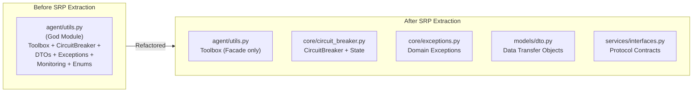
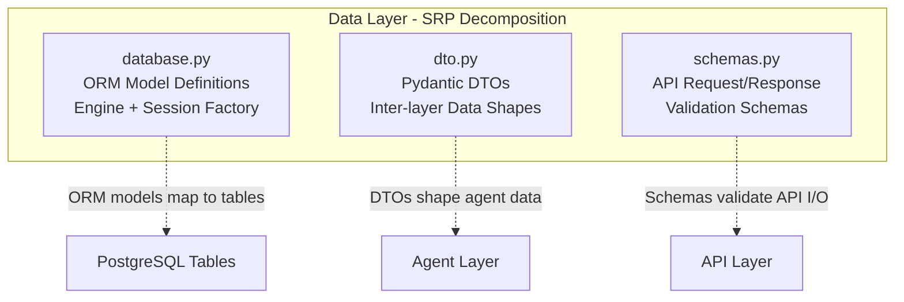
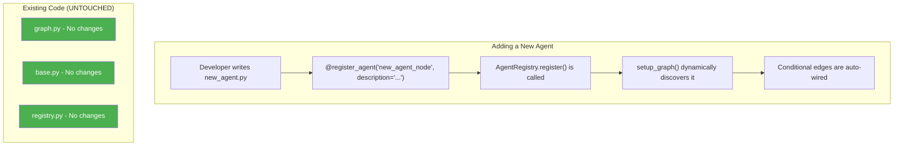
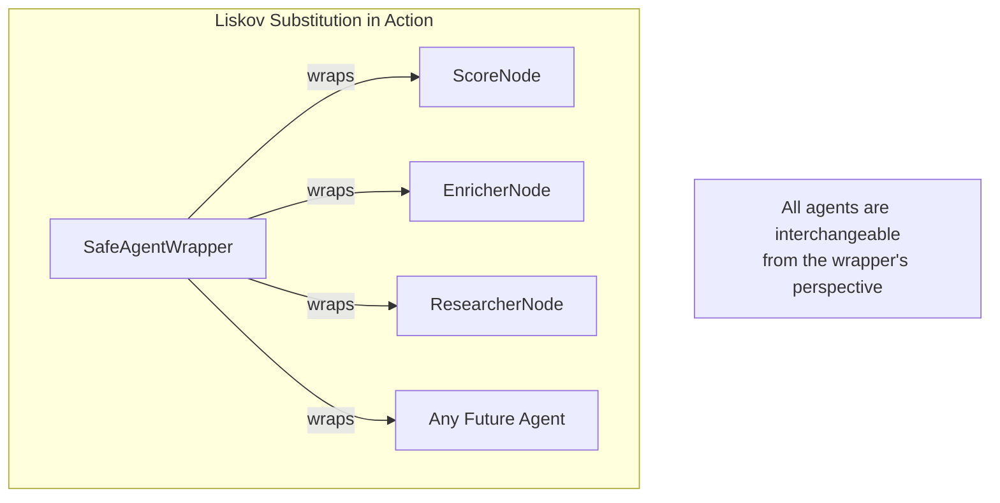
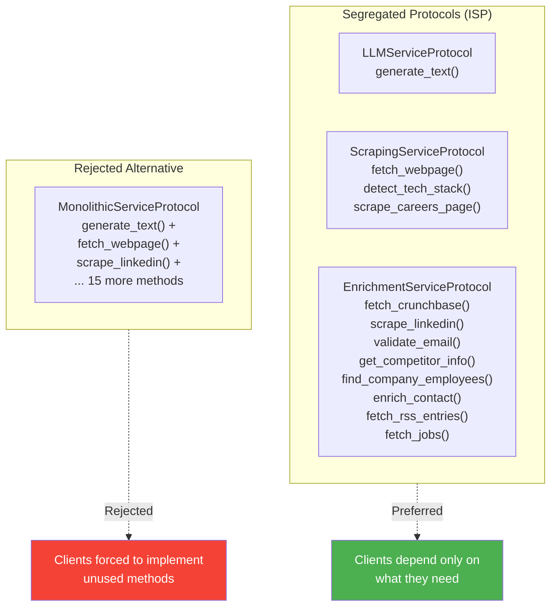
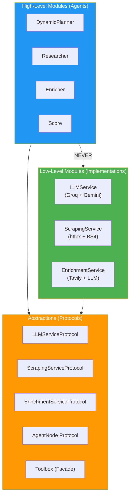
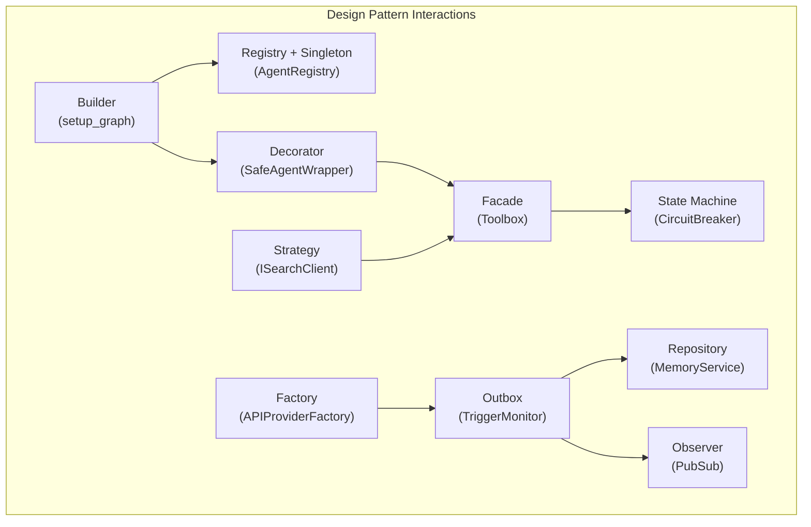

<h1 align="center">SOLID Principles and Design Patterns</h1>

<p align="center">
  <strong>A rigorous analysis of how the ICP Agent platform implements SOLID principles and Gang of Four design patterns across every architectural layer -- with concrete code references and Mermaid diagrams.</strong>
</p>

<p align="center">
  
  
  
  
  
</p>

---

## Table of Contents

- [Single Responsibility Principle (SRP)](#single-responsibility-principle-srp)
- [Open/Closed Principle (OCP)](#openclosed-principle-ocp)
- [Liskov Substitution Principle (LSP)](#liskov-substitution-principle-lsp)
- [Interface Segregation Principle (ISP)](#interface-segregation-principle-isp)
- [Dependency Inversion Principle (DIP)](#dependency-inversion-principle-dip)
- [Design Patterns Catalog](#design-patterns-catalog)
- [Anti-Patterns Avoided](#anti-patterns-avoided)

---

## Single Responsibility Principle (SRP)

> *"A class should have one, and only one, reason to change."*

The ICP Agent platform enforces SRP through deliberate module decomposition. Every class has a clearly defined boundary of responsibility, and cross-cutting concerns are extracted into dedicated modules.

### SRP in the Agent Layer



| Class | Single Responsibility | File |
|:---|:---|:---|
| `Toolbox` | Facade for external service interactions | `agent/utils.py` |
| `CircuitBreaker` | External call protection via FSM | `core/circuit_breaker.py` |
| `SafeAgentWrapper` | Fault isolation and execution tracing | `agent/base.py` |
| `AgentRegistry` | Agent registration and discovery | `agent/registry.py` |
| `GraphState` | Workflow state contract definition | `agent/state.py` |
| `Settings` | Runtime configuration loading | `core/settings.py` |
| `PubSub` | In-memory event broadcasting | `core/pubsub.py` |

**Evidence from the codebase:** The docstring in `agent/utils.py` explicitly documents the SRP extraction:

```
This module retains only the Toolbox class. The other utilities that
previously lived here have been extracted to focused modules:
  - core.circuit_breaker  – CircuitBreaker, CircuitBreakerState
  - core.exceptions       – RateLimitError, TimeoutError, ServiceUnavailableError
  - models.dto            – WebPage, CompanyProfile, TechStackEntry, etc.
```

The extraction also includes backward-compatible re-exports to avoid breaking existing imports during migration, demonstrating thoughtful refactoring discipline.

### SRP in the Service Layer

Each service has exactly one reason to change:

| Service | Responsibility | Changes When |
|:---|:---|:---|
| `LLMService` | LLM provider pool management and text generation | LLM providers or rate limits change |
| `ScrapingService` | Web page fetching and HTML parsing | Scraping strategies or parsers change |
| `EnrichmentService` | Data enrichment via search + LLM extraction | Enrichment sources or extraction logic changes |
| `MemoryService` | PostgreSQL-backed state persistence | Database schema or persistence logic changes |
| `WorkflowService` | LangGraph execution and SSE broadcasting | Workflow lifecycle or event format changes |
| `HITLService` | Human review request lifecycle | Review process or approval logic changes |
| `ConfigService` | Runtime configuration CRUD | Configuration schema or defaults change |
| `TriggerMonitor` | Event polling and prospect submission | Trigger sources or polling logic changes |

### SRP in the Data Layer



---

## Open/Closed Principle (OCP)

> *"Software entities should be open for extension, but closed for modification."*

The OCP is the most visibly enforced principle in the ICP Agent platform. The entire agent system and API provider framework are designed so that new functionality can be added without modifying existing code.

### OCP in Agent Registration

Adding a new agent to the platform requires **zero changes to the graph construction code**:



**The mechanism in `graph.py`:**

```python
# All registered agents are discovered dynamically -- no hardcoded list
for name in registry.list_agents():
    agent_cls = registry.get_agent(name)
    agent_instance = agent_cls(toolbox, memory_service, config)
    safe_agent = SafeAgentWrapper(agent_instance, name)
    workflow.add_node(name, safe_agent)

# The path map is also built dynamically
path_map = {name: name for name in registry.list_agents()}
path_map["__end__"] = END
```

The comment in the source code explicitly calls out the OCP motivation:

> *"Build the path_map dynamically -- adding a new @register_agent agent automatically wires it into the graph without touching this file (OCP)."*

### OCP in the API Provider Framework

```mermaid
graph TB
    subgraph Framework["OCP-Compliant Provider Framework"]
        BASE["BaseAPIProvider (ABC)<br/>Abstract fetch_entries()"]
        FACTORY["APIProviderFactory<br/>register_provider() + get_provider()"]
    end

    subgraph Existing["Existing Providers (Closed)"]
        NEWS["NewsAPIProvider"]
        GH["GitHubAPIProvider"]
        APIFY["ApifyLinkedInProvider"]
        GEN["GenericAPIProvider"]
    end

    subgraph Extension["New Provider (Open)"]
        NEW["SlackProvider<br/>No factory code changes needed"]
    end

    BASE <|-- NEWS
    BASE <|-- GH
    BASE <|-- APIFY
    BASE <|-- GEN
    BASE <|-- NEW

    FACTORY --> BASE : manages

    style NEW fill:#FF9800,color:#fff
```

Adding a new API provider requires:
1. Create a new class extending `BaseAPIProvider`
2. Implement `fetch_entries(config: dict) -> list[dict]`
3. Register it: `factory.register_provider("slack", SlackProvider())`

No changes to `APIProviderFactory`, `TriggerMonitor`, or any existing provider.

### OCP in Custom Agents

The `DynamicAgentExecutorNode` enables users to create entirely new agents at runtime through the UI, without deploying code:

1. User defines a system prompt and selects tools via the frontend
2. Agent definition is stored in the `custom_agents` database table
3. The `DynamicPlannerNode` discovers custom agents alongside core agents
4. The executor loads the definition and builds a ReAct agent dynamically

This is OCP taken to its logical extreme -- the system is extended by end users, not just developers.

---

## Liskov Substitution Principle (LSP)

> *"Objects of a supertype shall be replaceable with objects of its subtypes without altering the correctness of the program."*

### LSP in the Agent Protocol

Every agent implements the `AgentNode` Protocol, which defines a single method signature:

```python
async def __call__(self, state: GraphState) -> Dict[str, Any]
```

The `SafeAgentWrapper` wraps any `AgentNode` without knowing its concrete type. The `setup_graph()` function iterates over all registered agents and wraps them identically. Substituting one agent for another has zero impact on the wrapper, the graph, or the planner.



### LSP in Service Protocols

The `Toolbox` constructor accepts `LLMServiceProtocol`, `ScrapingServiceProtocol`, and `EnrichmentServiceProtocol`. Any class that structurally satisfies these protocols can be substituted:

```python
class Toolbox:
    def __init__(
        self,
        llm_service: LLMServiceProtocol,       # Any compatible implementation
        scraping_service: ScrapingServiceProtocol,
        enrichment_service: EnrichmentServiceProtocol,
    ):
```

In tests, mock implementations are substituted for real services without modifying the `Toolbox` or any agent code. The protocols are marked `@runtime_checkable`, enabling `isinstance()` validation at runtime.

### LSP in API Providers

All API providers are substitutable in the `APIProviderFactory`:

```python
provider = self.provider_factory.get_provider(source.type)
entries = await provider.fetch_entries(config)  # Works for any provider
```

Whether `provider` is a `NewsAPIProvider`, `GitHubAPIProvider`, or a future `SlackProvider`, the calling code in `TriggerMonitor` remains unchanged. Each provider returns the same contract: `list[dict[str, Any]]` with `title`, `summary`, and `link` keys.

---

## Interface Segregation Principle (ISP)

> *"Clients should not be forced to depend on interfaces they do not use."*

### ISP in Service Protocols

The service layer defines three separate protocols instead of a single monolithic service interface:



An agent that only needs LLM access depends solely on `LLMServiceProtocol`. A test mock for the scraping service doesn't need to implement LLM methods. Each protocol is independently mockable and independently testable.

### ISP in Agent Search Abstraction

The `ResearcherNode` defines a focused `ISearchClient` interface with only the methods it needs:

```python
class ISearchClient(ABC):
    @abstractmethod
    async def search_company_info(self, company_name: str) -> str: ...
    
    @abstractmethod
    async def find_competitors(self, company_name: str) -> List[str]: ...
```

This interface doesn't include email validation, tech stack detection, or any other enrichment concern. The researcher depends only on search capabilities, nothing more.

---

## Dependency Inversion Principle (DIP)

> *"Depend upon abstractions, not concretions."*

The DIP is the architectural backbone of the entire platform. Every inter-layer communication flows through abstractions.

### DIP Architecture Diagram



### DIP in the Toolbox Facade

The `Toolbox` explicitly accepts protocol-typed dependencies, not concrete classes:

```python
class Toolbox:
    """Accepts service instances typed against Protocol interfaces so that
    concrete implementations can be swapped freely (Dependency Inversion)."""

    def __init__(
        self,
        llm_service: LLMServiceProtocol,
        scraping_service: ScrapingServiceProtocol,
        enrichment_service: EnrichmentServiceProtocol,
    ):
```

This enables:
- **Production:** Pass `LLMService`, `ScrapingService`, `EnrichmentService`
- **Testing:** Pass mock implementations that satisfy the same protocols
- **Future:** Swap to a different LLM provider without changing agents

### DIP in Configuration

The `ConfigService` depends on SQLAlchemy's `AsyncSession` abstraction, not on a specific database implementation. The `MemoryService` depends on a session factory callable, not on a concrete session manager. The `Settings` class uses `pydantic-settings` for environment-based configuration, decoupling the application from its deployment environment.

---

## Design Patterns Catalog

The following Gang of Four and enterprise patterns are implemented across the platform:

### Structural Patterns

| Pattern | Implementation | Location |
|:---|:---|:---|
| **Facade** | `Toolbox` aggregates LLM, scraping, and enrichment services into a single unified interface | `agent/utils.py` |
| **Decorator** | `SafeAgentWrapper` adds fault isolation, tracing, and retry tracking to any `AgentNode` | `agent/base.py` |
| **Proxy** | The `Toolbox` acts as a transparent proxy, delegating calls to underlying service implementations | `agent/utils.py` |

### Creational Patterns

| Pattern | Implementation | Location |
|:---|:---|:---|
| **Factory Method** | `APIProviderFactory` creates the appropriate provider based on source type | `services/api_providers/factory.py` |
| **Singleton** | `AgentRegistry` global instance, `Settings` global instance, `PubSub` broker | `agent/registry.py`, `core/settings.py`, `core/pubsub.py` |
| **Builder** | `setup_graph()` incrementally constructs the LangGraph `StateGraph` | `agent/graph.py` |

### Behavioral Patterns

| Pattern | Implementation | Location |
|:---|:---|:---|
| **Strategy** | `ISearchClient` abstraction with `TavilySearchClient` concrete strategy | `agent/agents/researcher.py` |
| **Observer** | `PubSub` broker with topic-based publish/subscribe for real-time SSE events | `core/pubsub.py` |
| **State Machine** | `CircuitBreaker` with CLOSED/OPEN/HALF_OPEN state transitions | `core/circuit_breaker.py` |
| **Template Method** | `BaseAPIProvider` defines the `fetch_entries` contract, subclasses fill in details | `services/api_providers/base.py` |
| **Chain of Responsibility** | LLM failover chain: Groq pool -> Gemini pool -> Fallback | `services/llm_service.py` |
| **Command** | LangGraph `Command(resume=payload)` for HITL workflow resumption | `services/workflow_service.py` |

### Enterprise Patterns

| Pattern | Implementation | Location |
|:---|:---|:---|
| **Repository** | `MemoryService` encapsulates all database access logic | `services/memory_service.py` |
| **Data Transfer Object** | Pydantic DTOs (`WebPage`, `CompanyProfile`, `TechStackEntry`, etc.) | `models/dto.py` |
| **Outbox** | Two-phase event processing in `TriggerMonitor` | `services/trigger_monitor.py` |
| **Circuit Breaker** | `CircuitBreaker` FSM protecting external service calls | `core/circuit_breaker.py` |

### Pattern Interaction Diagram



---

## Anti-Patterns Avoided

The codebase deliberately avoids several common anti-patterns:

| Anti-Pattern | How It's Avoided |
|:---|:---|
| **God Object** | The original `utils.py` was refactored into 5 focused modules (SRP extraction documented in docstring) |
| **Shotgun Surgery** | Adding a new agent requires changes to exactly one file (the new agent file), not scattered changes across the graph, router, and registry |
| **Service Locator** | Dependencies are explicitly injected via constructor parameters, not fetched from a global container |
| **Tight Coupling** | All inter-layer communication uses Protocol interfaces, not concrete implementations |
| **Magic Numbers** | Thresholds, timeouts, and retry limits are configured via `Settings` and `ConfigService`, not hardcoded |
| **Primitive Obsession** | Rich domain types (DTOs) are used instead of raw dictionaries for data exchange between services |

---

<p align="center">
  <a href="README.md">Backend README</a> &#8226;
  <a href="CLASS_DIAGRAM.md">Class Diagrams</a> &#8226;
  <a href="SEQUENCE_FLOW.md">Sequence Flows</a> &#8226;
  <a href="RELIABILITY.md">Reliability</a> &#8226;
  <a href="AGENTIC_FLOW.md">Agentic Flow</a> &#8226;
  <a href="LLD_ARCHITECTURE.md">LLD</a> &#8226;
  <a href="APPLICATION_FLOW.md">App Flow</a>
</p>