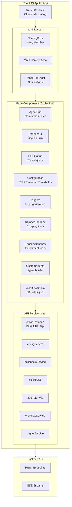
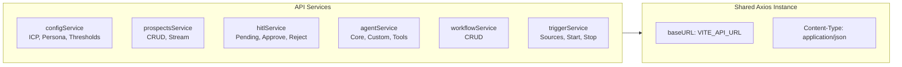
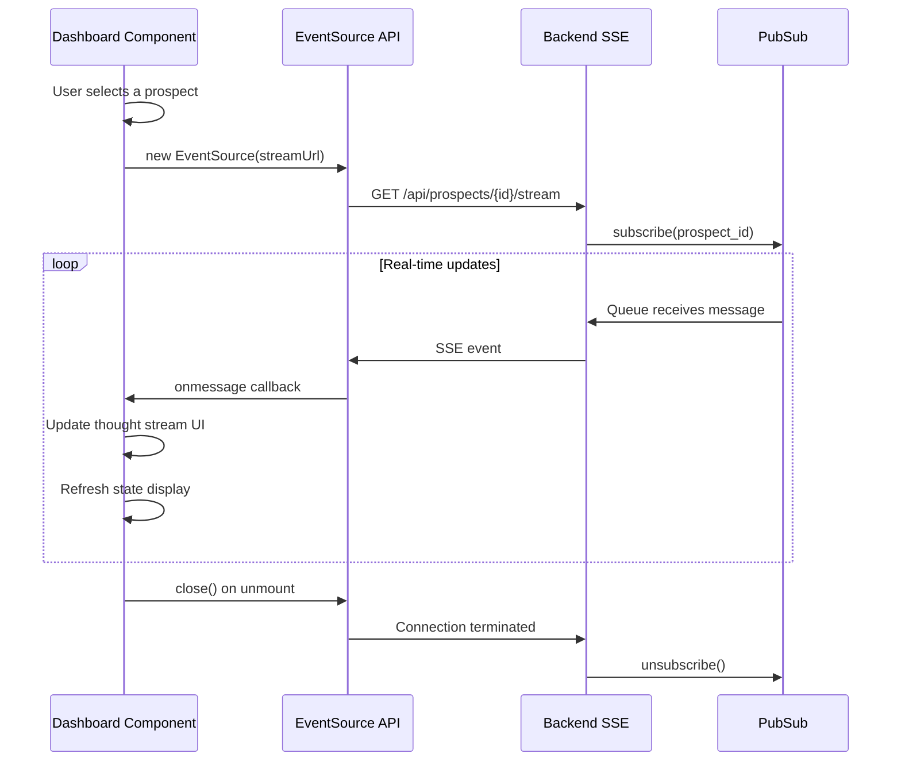
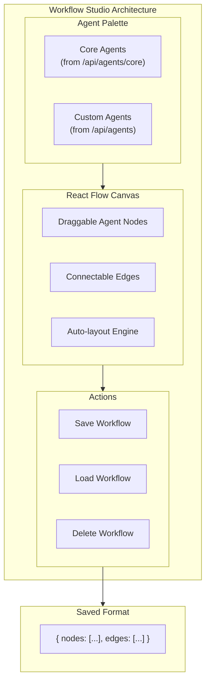
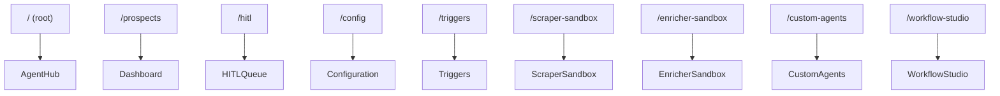

<p align="center">
  
  
  
  
  
</p>

<h1 align="center">Frontend Application</h1>

<p align="center">
  <strong>A modern React 19 single-page application with real-time agent observability, visual workflow design, and a glassmorphic UI for managing the ICP Agent platform.</strong>
</p>

---

## Table of Contents

- [Architecture Overview](#architecture-overview)
- [Page Components](#page-components)
- [API Service Layer](#api-service-layer)
- [Real-Time SSE Integration](#real-time-sse-integration)
- [Workflow Studio](#workflow-studio)
- [Routing and Navigation](#routing-and-navigation)
- [Technology Stack](#technology-stack)
- [Development Setup](#development-setup)

---

## Architecture Overview



### Key Architectural Decisions

**1. Suspense-Based Code Splitting** -- Every page component is loaded via `React.lazy()`, reducing the initial bundle size and enabling progressive loading. The `Suspense` fallback renders a spinner during chunk loading.

**2. Centralized API Service Layer** -- All HTTP communication flows through a single Axios instance with centralized configuration (base URL, headers, interceptors). This prevents URL duplication and enables global error handling.

**3. Floating Dock Navigation** -- The navigation bar is implemented as a floating dock that persists across all routes, providing one-click access to all platform features without page reloads.

**4. Real-Time Data via SSE** -- The pipeline dashboard connects to Server-Sent Events endpoints for live agent thought streams, enabling users to observe AI decision-making in real-time.

---

## Page Components

### Agent Hub

The central command center of the platform. Displays:
- Quick-launch actions for common tasks (submit prospect, manage triggers, configure ICP)
- Navigation cards to all platform features
- System status indicators

### Pipeline Dashboard

Real-time prospect pipeline management:
- Prospect list with status badges and filtering
- Prospect detail panel with full state inspection
- Live agent thought stream via SSE connection
- Prospect submission form

### HITL Review Queue

Human-in-the-loop review interface:
- Pending review request list
- Detailed prospect data display
- Approve/Reject action buttons
- Inline data correction fields
- Corrections are submitted with approval

### Configuration

Three-tab configuration interface:
- **ICP Criteria** -- Industries, revenue ranges, employee counts, tech stack, behaviors, matching operator
- **Persona Definition** -- Job titles, seniority levels, functions, excluded titles
- **Scoring Thresholds** -- Confidence thresholds, error limits, HITL triggers, auto-approve levels
- Real-time validation with error feedback
- Reset to defaults capability

### Trigger Management

Lead generation trigger source management:
- Source list with type, URL, interval, and status
- Create new trigger sources (RSS, News API, GitHub, LinkedIn, Generic API)
- Enable/disable individual sources
- Start/Stop the background trigger monitor
- Monitor status indicator

### Workflow Studio

Visual DAG builder using React Flow:
- Drag-and-drop agent nodes from a palette
- Connect agents with edges to define dependencies
- Visual representation of parallel execution branches
- Save workflows for reuse with prospects
- Load and edit existing workflows

### Custom Agents

User-defined AI agent management:
- Create agents with custom system prompts
- Select from available tools (WebSearch, Crunchbase, LinkedIn, EmployeeSearch)
- View and manage existing custom agents
- Delete unused agents

### Sandbox Tools

Interactive testing tools:
- **Scraper Sandbox** -- Test web scraping against any URL, view extracted HTML and tech stack
- **Enricher Sandbox** -- Test company enrichment by name, view firmographic data and signals

---

## API Service Layer

The API layer is organized as a collection of service modules, each responsible for a specific domain:



### Service Method Reference

| Service | Method | HTTP | Endpoint |
|:---|:---|:---:|:---|
| `configService` | `getICP()` | GET | `/api/config/icp` |
| `configService` | `updateICP(data)` | PUT | `/api/config/icp` |
| `configService` | `getPersona()` | GET | `/api/config/persona` |
| `configService` | `updatePersona(data)` | PUT | `/api/config/persona` |
| `configService` | `getThresholds()` | GET | `/api/config/thresholds` |
| `configService` | `updateThresholds(data)` | PUT | `/api/config/thresholds` |
| `configService` | `resetConfig()` | POST | `/api/config/reset` |
| `prospectsService` | `getProspects(params)` | GET | `/api/prospects` |
| `prospectsService` | `createProspect(data)` | POST | `/api/prospects` |
| `prospectsService` | `getProspectDetail(id)` | GET | `/api/prospects/{id}` |
| `prospectsService` | `deleteProspect(id)` | DELETE | `/api/prospects/{id}` |
| `prospectsService` | `getProspectStreamUrl(id)` | -- | Returns SSE URL |
| `hitlService` | `getPendingRequests()` | GET | `/api/hitl/pending` |
| `hitlService` | `getRequestDetail(id)` | GET | `/api/hitl/{id}` |
| `hitlService` | `approveRequest(id, corrections)` | POST | `/api/hitl/{id}/approve` |
| `hitlService` | `rejectRequest(id)` | POST | `/api/hitl/{id}/reject` |
| `agentService` | `getAgents()` | GET | `/api/agents` |
| `agentService` | `getCoreAgents()` | GET | `/api/agents/core` |
| `agentService` | `getTools()` | GET | `/api/agents/tools` |
| `agentService` | `createAgent(data)` | POST | `/api/agents` |
| `agentService` | `deleteAgent(id)` | DELETE | `/api/agents/{id}` |
| `workflowService` | `getWorkflows()` | GET | `/api/workflows` |
| `workflowService` | `createWorkflow(data)` | POST | `/api/workflows` |
| `workflowService` | `deleteWorkflow(id)` | DELETE | `/api/workflows/{id}` |
| `triggerService` | `getSources()` | GET | `/api/triggers/sources` |
| `triggerService` | `createSource(data)` | POST | `/api/triggers/sources` |
| `triggerService` | `deleteSource(id)` | DELETE | `/api/triggers/sources/{id}` |
| `triggerService` | `start()` | POST | `/api/triggers/start` |
| `triggerService` | `stop()` | POST | `/api/triggers/stop` |
| `triggerService` | `getStatus()` | GET | `/api/triggers/status` |

---

## Real-Time SSE Integration

The Pipeline Dashboard uses Server-Sent Events to display live agent activity:



### Event Handling

```javascript
const eventSource = new EventSource(prospectsService.getProspectStreamUrl(id));

eventSource.onmessage = (event) => {
    const data = JSON.parse(event.data);
    
    if (data.type === 'thought') {
        // Append to thought stream
        setThoughts(prev => [...prev, data]);
    } else if (data.type === 'state_update') {
        // Refresh prospect state
        setProspectState(data.payload);
    }
};
```

---

## Workflow Studio

The Workflow Studio uses React Flow (XYFlow) to provide a visual DAG builder:



### Workflow Data Format

```json
{
    "name": "Fast Qualification",
    "description": "Parallel enrichment with sequential scoring",
    "steps": {
        "nodes": [
            { "id": "1", "position": { "x": 100, "y": 100 }, "data": { "agentId": "researcher_node", "label": "Researcher" } },
            { "id": "2", "position": { "x": 300, "y": 100 }, "data": { "agentId": "enricher_node", "label": "Enricher" } },
            { "id": "3", "position": { "x": 200, "y": 300 }, "data": { "agentId": "score_node", "label": "Score" } }
        ],
        "edges": [
            { "id": "e1-3", "source": "1", "target": "3" },
            { "id": "e2-3", "source": "2", "target": "3" }
        ]
    }
}
```

---

## Routing and Navigation

### Route Configuration



### Floating Dock Navigation

| Icon | Label | Route | Page |
|:---:|:---|:---|:---|
| Bot | Agents | `/` | AgentHub |
| LayoutDashboard | Pipeline | `/prospects` | Dashboard |
| UserCheck | Review | `/hitl` | HITLQueue |
| Settings | Config | `/config` | Configuration |
| Database | Lead Gen | `/triggers` | Triggers |

---

## Technology Stack

| Technology | Version | Purpose |
|:---|:---:|:---|
| React | 19.2+ | UI framework with Suspense and concurrent features |
| Vite | 8.1+ | Build tool with fast HMR |
| React Router DOM | 7.18+ | Client-side routing with nested layouts |
| React Flow (XYFlow) | 12.11+ | Visual DAG builder for Workflow Studio |
| Axios | 1.18+ | HTTP client with centralized configuration |
| Lucide React | 1.21+ | Consistent icon library |
| React Hot Toast | 2.6+ | Toast notification system |
| React Markdown | 10.1+ | Markdown rendering for agent summaries |
| clsx | 2.1+ | Conditional className utility |
| tailwind-merge | 3.6+ | Class merging utility |

---

## Development Setup

### Prerequisites

- Node.js 20+
- npm 10+

### Installation

```bash
cd frontend
npm install
```

### Development Server

```bash
npm run dev
# Available at http://localhost:5173
```

### Environment Variables

| Variable | Default | Description |
|:---|:---|:---|
| `VITE_API_URL` | `http://localhost:8000` | Backend API base URL |

### Build

```bash
npm run build
# Output in dist/
```

### Lint

```bash
npm run lint
# Uses oxlint
```

---

<p align="center">
  <a href="../README.md">Main README</a> &#8226;
  <a href="../backend/README.md">Backend Docs</a> &#8226;
  <a href="../backend/CLASS_DIAGRAM.md">Class Diagrams</a> &#8226;
  <a href="../backend/SEQUENCE_FLOW.md">Sequence Flows</a>
</p>