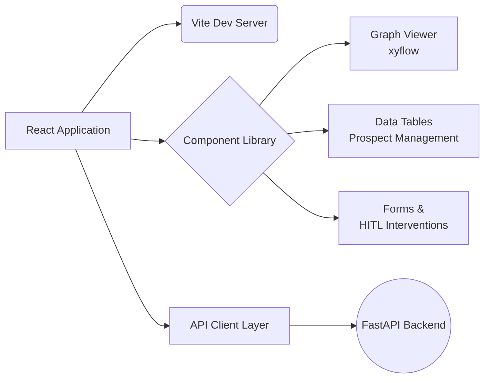

# 🎨 Frontend Engineering: The Face of ICP-X

  
  
  

Welcome to the frontend directory of the ICP-X platform. This isn't just a UI; it's a **high-performance, reactive control center** designed to provide total visibility and control over autonomous agent swarms.

---

## ⚡ Unrivaled User Experience

We built the frontend to be as intelligent as the backend agents it monitors. 

### Key Features
- **Real-Time Agent Visualization**: Powered by `@xyflow/react`, watch in real-time as the LangGraph planner traverses nodes, makes decisions, and routes prospects.
- **Blazing Fast HMR**: Vite ensures that your development experience is instantaneous.
- **Optimized Rendering**: Aggressive memoization and selective state updates using modern React 19 concurrent features ensure 60fps rendering even with thousands of nodes on screen.
- **Flawless Design System**: Styled with utility-first CSS via `clsx` and `tailwind-merge` for perfectly composable and collision-free styling.

---

## 🏗️ Architecture

## 🚀 Quick Start

1. **Install Dependencies**: `npm install`
2. **Start Dev Server**: `npm run dev`
3. **Build for Prod**: `npm run build`

> **Pro Tip**: We enforce strict code quality. Always run `npm run lint` (powered by ultra-fast `oxlint`) before committing!

---
🔙 **[Back to Main Repository](../README.md)** | ⚙️ **[Explore Backend Engineering](../backend/README.md)**
